<!-- .slide: class="cover" -->

<h1>面向高速边缘智能的 模拟 AI 芯片</h1><figure>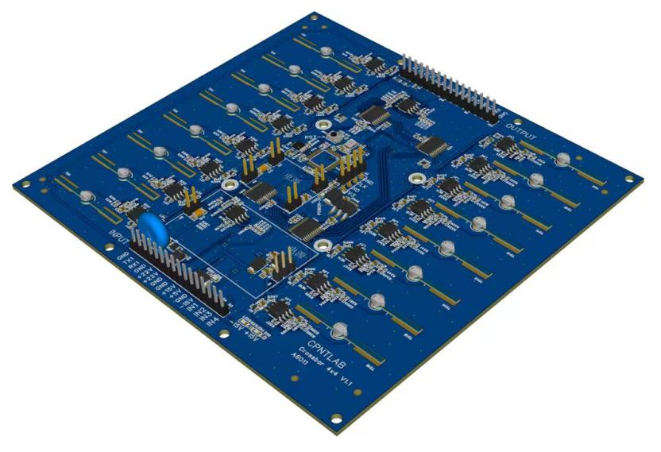</figure>

中山大学 $\times$ 深圳理工大学 $\cdot$  类脑计算团队

技术方案交流 $\cdot$ 2026.09.15

Note:
作者依据 2026-09-11 AI Group Gathering 的 LI Shaun 与 Faculty 信息，中文姓名李颂元；团队称谓为研究方向描述，不表示已成立公司。日期采用本 deck 目录所给 2026-09-15。这里陈述的是研究方向，不是已测得的低功耗/低延迟产品指标。输入 docs/prompt.md 保留原件；其融资及应用范围与本轮用户消息冲突时，以本轮消息为准。所有对外披露的原型、申请材料及知识产权归属仍需团队确认。

===

## 边缘智能：低时延、低功耗

<h3>冯·诺伊曼结构</h3>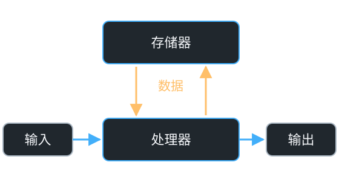
冯·诺伊曼瓶颈

<h3>GB202 GPU 与 32 GB GDDR7</h3>
L2 缓存位于片上，GDDR7 显存位于片外

处理器与存储器之间频繁的数据搬运，是功耗和延迟的主要来源

Note:
分离式路径是概念示意，不代表所有现代处理器的全部层级和数据流；缓存、片上存储与专用加速器都可能缓解搬运。框名统一为处理器、存储器；箭头只表示数据，按本轮要求省略控制模块。
GPU图来源：Tom’s Hardware，2025-01-25，https://www.tomshardware.com/pc-components/gpus/gb202-die-shot-beautifully-showcases-blackwell-in-all-its-glory-gb202-is-24-percent-larger-than-ad102。已下载并核对来源页和原图。原图包括左侧AD102、右侧GB202；新板级示意图嵌入右侧GB202显微照片，并在周围示意GDDR7显存；第2页使用配套紧凑版 images/gb202-gddr7-slide.svg，统一双栏高度及主题配色；照片不改动，点击可打开含来源的完整SVG。RTX 5090配置32 GB GDDR7，产品规格链接：https://www.nvidia.com/en-us/geforce/graphics-cards/50-series/rtx-5090/ 。封装、尺寸、位置与连线均为功能示意，不代表真实PCB布局或布线；完整原图保留在 images/gb202-die-annotated.jpg，未修改图像内容或原有水印。原图署名：Chip by ASUS Tony 俞元麟；Dieshot by 万扯淡；Layout by Kurnal。来源页引述原帖 https://x.com/Kurnalsalts/status/1883153126011892140。图像文件 https://cdn.mos.cms.futurecdn.net/yHur8Bd6teaeLevXSEJSEG.jpg；本地来源快照 docs/evidence/gpu-gb202-source.html。
中央L2 Cache为原图已有的第三方模块标注，不是本团队测量或厂商认证版图；L2缓存是片上存储，不等于外部GDDR显存。只引用图中明确标注的位置，不引用报道中的缓存容量、面积比例或推断功耗。存储面积与数据搬运能耗属于不同证据；具体任务的搬运量、时延分解、系统功耗和客户基线待测。该GPU仅作结构实例，不是客户比较基线。原Pentium照片保留为历史素材，不再用于本页。

==

<!-- .slide: class="synaptic-slide" -->
## 脑启发存内计算：数据存储与计算位于同一阵列

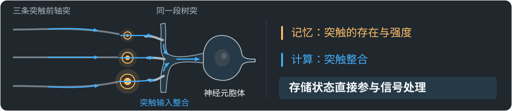

工程启发 ↓ 用模拟的方式让存储单元直接参与计算

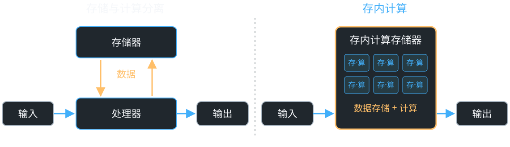

超高速、超低功耗的模拟存内计算为AI专用芯片打开新思路

Note:
本页说明存内计算（in-memory computing），不是将处理器放置在存储器附近的近存计算。右图只保留一个同时执行数据存储与运算的阵列；每个“存·算”符号表示存储单元参与计算，不是相邻的存储芯片与计算芯片。左侧直接复用第2页的处理器、存储器与数据通路结构，输入输出位置保持一致。按本轮要求，图中不展开控制等外围模块；图示范围的省略不表示实际系统不需要接口、数据转换或供电等支持。此图为概念解释，不代表已经完成的芯片，也不据此断言所有任务均无数据传输。
新增示意图 images/synaptic-state-computing.svg 为原创可编辑 SVG，橙色表示相对可保持的突触连接状态与强度，蓝色表示动态信号；三条轴突在同一组突触处传递，再由树突与神经元整合输入。大小仅表达强度差异，不表示解剖尺寸或定量实验结果。所有连接均存在，记忆不是简单的“有无连接”，也不是一个突触存储完整记忆。突触可塑性提供相对持久的状态变化，这些状态影响突触传递；不同突触与细胞机制、时间尺度及网络活动共同参与记忆。此处借鉴的是“存储状态参与计算”的原则，不将人脑等同于存内计算芯片，也不把动作电位画成简单相加。原 images/synaptic-integration.jpg 保留。
来源核对：Purves 等，《Neuroscience》第2版（2001），NCBI Bookshelf，“Long-Term Synaptic Potentiation”，https://www.ncbi.nlm.nih.gov/books/NBK10878/ 。该节描述短时刺激导致持久的突触传递增强、突触后电位响应幅度变化，以及输入特异性，支持可保持状态影响同一突触通路响应；此处不将 LTP 视为所有记忆的完整解释。网页快照：docs/evidence/synaptic-plasticity-source.html。
输入整合依据：同书“Summation of Synaptic Potentials”，https://www.ncbi.nlm.nih.gov/books/NBK11104/ 。该节区分突触后电位的整合与达到阈值后的动作电位产生，并强调兴奋与抑制输入的共同作用。新图省略抑制通路和复杂树突动力学，仅作功能原则示意。网页快照：docs/evidence/synaptic-integration-source.html。

==

## 模拟计算的挑战与神经网络的适用性

<table class="compact"><thead><tr><th>模拟计算的局限</th><th>神经网络提供的适配条件</th></tr></thead><tbody>
<tr><td>通用性有限</td><td>面向特定任务，可采用专用实现</td></tr>
<tr><td>计算精度有限</td><td>许多推理任务可在较低精度下保持有效性能</td></tr>
<tr><td>易受器件差异与噪声影响</td><td>网络冗余与训练机制提供一定容错空间</td></tr>
</tbody></table>
<figure class="experiment"><a href="images/accuracy-against-errors.pdf" target="_blank">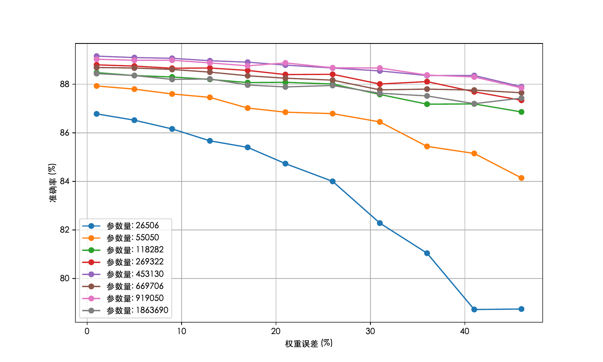</a></figure>

神经网络的容错性，为模拟计算打开应用空间

Note:
原图：用户提供的 images/accuracy-against-errors.pdf，完整保留；PNG由该PDF直接渲染，未修改曲线、坐标或图例。横轴为权重误差（%），纵轴为准确率（%）；图例比较八种参数量（26,506至1,863,690）。在图示范围内，两种最小模型的准确率下降更明显；其余模型的曲线不能说明参数量越大准确率就必然越高。数据集、模型结构、误差注入方式、误差分布、重复次数及实测/仿真属性待补充，不沿用旧图的实验条件或结论。图中未展示误差范围，不能据此推断统计显著性、温漂或老化鲁棒性；规模扩展的面积、功耗和互连代价仍需评估。旧 error-params 文件作为历史素材保留，不再在本页引用。

===

## 器件非线性：模拟域函数实现

<h3>将器件非线性用于计算</h3>
<figure class="paper-detail"><a href="images/kanalogue-framework.pdf"> 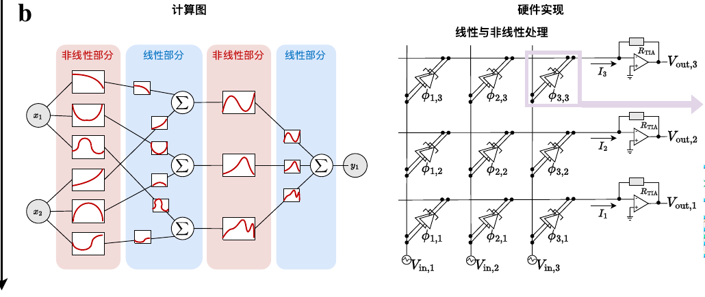</a></figure>

<h3>量子隧穿与器件非线性</h3>

<h3>江崎玲於奈 · Leo Esaki</h3>
1973 年诺贝尔物理学奖
<small>半导体中的隧穿现象</small>

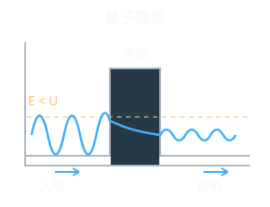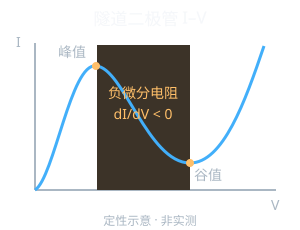

肖像：日本学士院 · <a href="https://creativecommons.org/licenses/by/4.0/" target="_blank" rel="noopener">CC BY 4.0</a>　｜　曲线为原理示意

将物理器件的非线性视作计算资源，实现超高速、超低功耗的模拟计算

Note:
新增左栏：江崎玲於奈（Leo Esaki）肖像来自日本学士院，经 Wikimedia Commons 获取，https://commons.wikimedia.org/wiki/File:Esaki_leo_Gakushiin.jpg ，许可 CC BY 4.0，原图未修改。履历来源：https://www.japan-acad.go.jp/japanese/members/4/esaki_leo.html 。量子隧穿与 I–V 图为原创可编辑 SVG，定性说明有限势垒下非零透射以及隧道二极管正向峰谷之间 dI/dV < 0；不是实验数据，不标实际电压、电流、器件参数或性能。I–V 图仅展示正向部分，负微分电阻不等于静态 V/I 为负。两图与团队已有 KANalogue 器件非线性材料对应，不将诺贝尔奖成果归为团队原创。

来源：团队提供的 images/kanalogue-framework.pdf（显示对比架构）；仓库已有 KANalogue teaser 已复制完整原图至 images/KANalogue-teaser-original.pdf/.png；研究申请书第22页研究基础。展示图仅裁取框架图b部分（计算图与硬件实现），器件物理c部分留在完整图与备注中，不在主页面展开，完整图保留。论文题名 KANalogue: Device-Native Kolmogorov-Arnold Networks for Analogue In-Memory Computing；作者 Songyuan Li, Teng Wang, Jinrong Tang, Ruiqi Liu, Xiangwei Zhu。2026-09-11 组会材料将其列为 NeurIPS'26 Rebuttal；本次未能独立核实公开论文版本，因此不标作已录用。NDR（负微分电阻）及隧道二极管的电流—电压非线性用于构造函数基；原图还展示材料层面的方案，不等于已完成其芯片制造。上方链路只是神经网络通用解释，KANalogue 中非线性函数作用后再求和，具体顺序以原框架图为准。所选基线的线性阵列后接 ADC—数字非线性处理—DAC；方案旨在让部分连续计算留在模拟域，不能据此宣称整机无 ADC/DAC 或无需控制。node efficiency 不是 TOPS/W：若要引用，需要明确是“同任务质量所需节点数”还是“每节点实现的功能/精度”，并给出论文原定义、物理节点/参数的映射、外围计入方式和同精度基线。现有材料不足以核实统一口径，因此不展示节点效率倍数、功耗或时延收益。此页架构收益为设计目标，数值实验与板级证据在相邻页单独标明。

==

## 板级原型与巡线小车演示

<h3>已搭建 神经计算 PCB</h3>

<h3>已演示 巡线小车系统</h3><video controls autoplay data-autoplay loop muted playsinline preload="metadata" poster="video/neuro-car-browser.jpg" aria-label="小车线跟随闭环演示"><source src="video/neuro-car-browser.mp4" type="video/mp4"></video>

Note:
直接素材为本 deck 用户已有 images/pcb.jpg、video/neuro-car-browser.mp4 和 .jpg，原件均保留。研究申请书第20页图12描述自研KAN开发板及测试小车；第26页明确记录基于KANalogue的板卡推理与路径识别/线跟随实验。视频可见小车沿黑色路径运动，说明有系统行为，但单凭视频不能独立识别推理器件、控制算法、是否外部计算或重复成功率。蓝色PCB照片与视频中的绿色板卡外观不同，不声称二者是同一版本；需补充板卡版本、BOM、传感器、模型、权重配置、闭环接线与测试记录。已运行模型的详细层数/节点数/训练数据待补充。延迟需测端到端与计算段并列报告，能耗需计入实际ADC/DAC、控制、存储、接口和供电损耗。闭环演示不证明芯片级性能、制造良率或商业优势。

<small>板级时延 / 系统功耗</small><strong>待补充</strong>

<small>任务误差 / 重复运行</small><strong>待补充</strong>

<small>芯片级 PPA / 良率</small><strong>尚待验证</strong>

===

## 产品路线：PCB、芯片与模块

<h3>未来计划 集成与扩展</h3><ul><li>成熟工艺：兼容性验证</li><li>算法 × 电路：器件误差联合评估</li><li>SiP：互连、供电与测试协同设计</li></ul>

<h3>封装与互连示例</h3>

<a href="images/sip-1.jpg" target="_blank">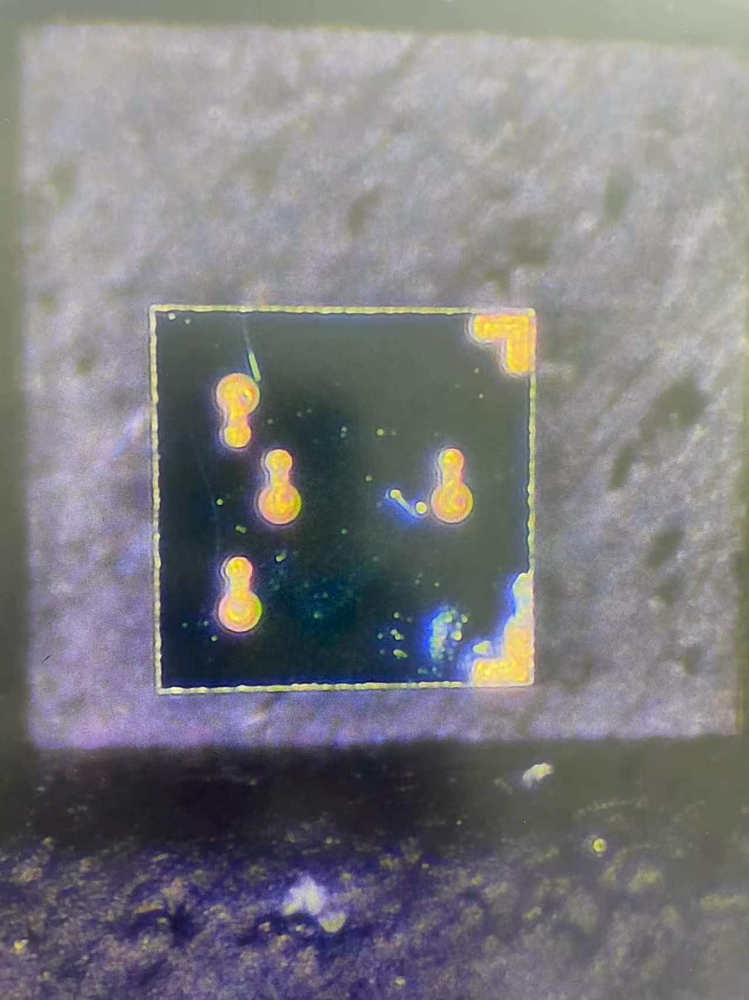</a>
<a href="images/sip-2.jpg" target="_blank">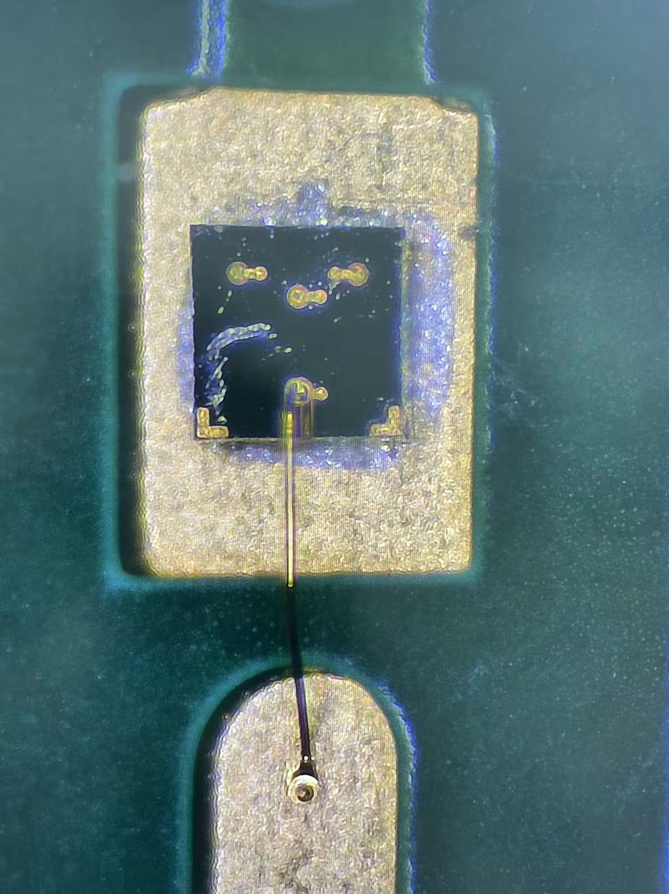</a>
<a href="images/sip-3.jpg" target="_blank">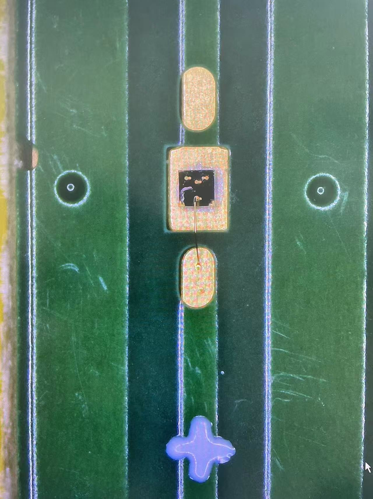</a>

Note:
路线图中的PCB平台有现有证据，其后均为计划，流片、封装与客户验证顺序需根据工艺兼容性结果调整。没有找到40 nm技术可行性或选型依据，所以不列具体工艺节点。需补充器件与CMOS工艺兼容性、PDK、外围电路预算、互连、供电、封装和测试方案。SiP不自动带来性能或成本收益。本页图片为用户提供的 images/sip-1.jpg、images/sip-2.jpg 和 images/sip-3.jpg，可见芯片、焊盘、键合线与基板；具体器件、封装配置和拍摄信息待补充。不沿用旧TI MicroSiL图片的来源、型号或产品归属，也不单凭这些照片认定已完成SiP系统集成。功耗比较应计入模拟核心及实际需要的外围模块，不能将模拟核心与完整数字系统直接比较。

===

## 高速自动对焦：计算性能与系统验证

<h3>消费级相机 · 动态追焦</h3><figure><a href="https://commons.wikimedia.org/wiki/File:Canon_R6_und_RF_85_2%2C0-8065.jpg" target="_blank" rel="noopener">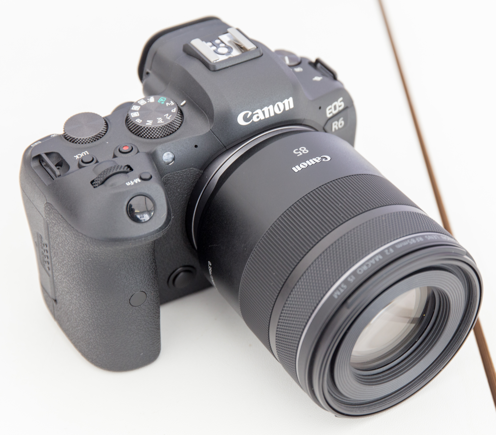</a><figcaption>运动主体：及时合焦，减少失焦画面 GodeNehler · <a href="https://creativecommons.org/licenses/by-sa/4.0/" target="_blank" rel="noopener">CC BY-SA 4.0</a></figcaption></figure>

<h3>高速公路 · 超速抓拍</h3><figure><a href="https://commons.wikimedia.org/wiki/File:100kph_Spd_Lmt_Enforcement_Camera_in_Yeongdong_Expwy_Icheon_IC-Hobeop_JC(Incheon_Dir).jpg" target="_blank" rel="noopener">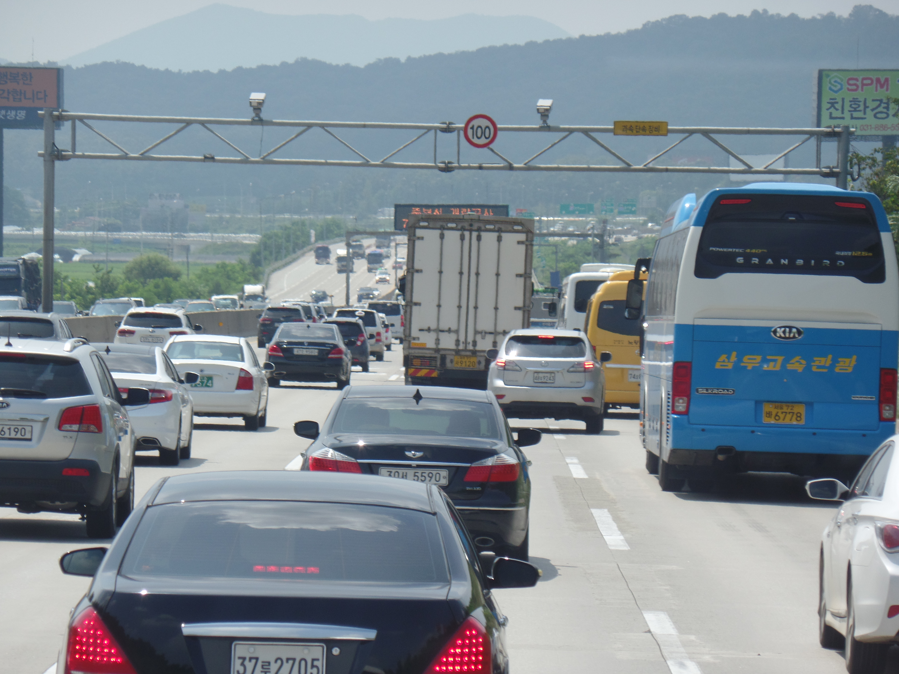</a><figcaption>短时成像窗口：保持车辆与号牌清晰 Jhcbs1019 · <a href="https://creativecommons.org/licenses/by-sa/4.0/" target="_blank" rel="noopener">CC BY-SA 4.0</a></figcaption></figure>

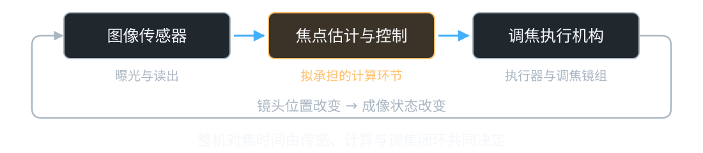

Note:
新增照片为场景示意，不是本团队产品或客户验证。消费级相机：Canon EOS R6 与 RF 85 mm 镜头，作者 GodeNehler，来源 https://commons.wikimedia.org/wiki/File:Canon_R6_und_RF_85_2%2C0-8065.jpg 。高速公路：韩国岭东高速 Icheon IC–Hobeop JC 仁川方向测速摄像头，作者 Jhcbs1019，来源 https://commons.wikimedia.org/wiki/File:100kph_Spd_Lmt_Enforcement_Camera_in_Yeongdong_Expwy_Icheon_IC-Hobeop_JC(Incheon_Dir).jpg 。两图均为 CC BY-SA 4.0（https://creativecommons.org/licenses/by-sa/4.0/），原图保留，页面仅缩放显示；点击图片可查看来源，来源网页保存于 docs/evidence/photo-*.html。高速公路照片不表示图中车辆超速，也不证明该设备采用连续自动对焦。固定抓拍设备可能采用预设焦点或固定焦距；是否需要动态调焦须结合景深、拍摄距离及客户方案确认。清晰抓拍还受曝光时间、照明、传感器读出与触发影响；本方案仅拟优化焦点估计与控制计算环节。

高速自动对焦来自既有组会 Brain-inspired research / Applications 与 Neuro-AutoFocus 方向；现有材料未给出明确目标客户、设备类型、工作距离、传感模式或客户访谈记录。“高速成像设备”是待验证的定位，不是现有客户。首发场景的付费价值必须从客户基线确认：成像质量、焦点估计误差、计算段时延及功耗，是否真正改善整机响应。光学响应是由镜头与系统设计决定的物理过程，并非没有设计参与；本图将其作为“镜头位置改变 → 成像状态改变”的反馈关系表示，不单独画成处理模块。调焦执行机构包括执行器及其驱动的调焦镜组。框表示系统组成，箭头表示信号流或物理作用关系。传感器曝光、读出与镜头运动可能重叠，完整闭环也可能多次迭代；整机对焦时间应通过实际闭环测试确认，不能直接等同于计算时延，也不能把各阶段时间简单相加。需要实际光机系统与现有控制方案、时间戳定义、测试环境及同质量比较。该链路为原创可编辑SVG，突出拟承担环节，不是既有产品架构。

==
## 市场拓展：首发场景与相邻应用

01<h3>高速自动对焦</h3>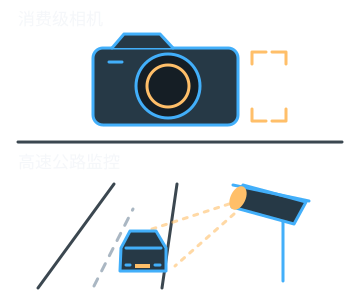

02<h3>制导应用</h3>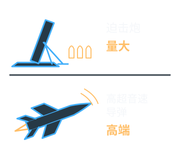

03<h3>触觉 / 柔性机械臂控制</h3>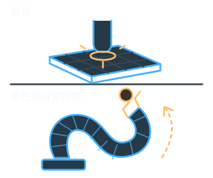

Note:
本页按用户指定列出三个应用方向。三幅图均为原创可编辑SVG概念示意，不是产品照片或实验结果，也不表示本方案已经在这些场景完成适配、验证或形成客户关系。第二幅以迫击炮与高超音速导弹表达制导应用类别，不对应具体型号、结构或性能。“量大 / 高端”为用户指定的应用定位，未核实市场数量、订单或技术优势，不代表已有产品或验证成果。自动对焦之外的客户需求和技术适配性均待确认。市场规模、订单及合作关系均无已核实信息，不作陈述。

==

## 类脑计算：从国家战略到地方产业布局

<article><h3>国家</h3>
2017
<a class="policy-document" href="https://www.gov.cn/zhengce/content/2017-07/20/content_5211996.htm" target="_blank" rel="noopener">《新一代人工智能发展规划》</a>
国务院 国发〔2017〕35号

<strong>类脑理论与芯片</strong>
布局类脑智能计算，研发高能效、可重构类脑计算芯片。

</article>
<article><h3>广东省</h3>
2026
<a class="policy-document" href="https://www.gd.gov.cn/gkmlpt/content/4/4887/post_4887794.html" target="_blank" rel="noopener">《广东省加快推进人工智能全域全时全行业高水平应用行动方案》</a>
省政府办公厅 粤办函〔2026〕50号

<strong>计算架构与神经形态芯片</strong>
开展类脑计算架构与神经形态芯片研究，面向低功耗、高性能系统。

</article>
<article><h3>深圳市</h3>
2022
<a class="policy-document" href="https://www.sz.gov.cn/zfgb/2022/gb1248/content/post_9918806.html" target="_blank" rel="noopener">《关于发展壮大战略性新兴产业集群和培育发展未来产业的意见》</a>
市人民政府 深府〔2022〕1号

<strong>未来产业重点布局</strong>
将脑科学与类脑智能列为未来产业，部署类脑算法与前沿技术研究。

</article>
<article><h3>光明区</h3>
2022–2025 · 历史政策
<a class="policy-document" href="https://www.szgm.gov.cn/xxgk/xqgwhxxgkml/zcfg_116521/qzfgfxwj/content/post_10042566.html" target="_blank" rel="noopener">《关于支持脑科学与类脑智能创新链产业链融合发展的若干措施》</a>
区人民政府 深光府规〔2022〕8号

<strong>科研与成果转化支持</strong>
覆盖技术攻关、概念验证、中试和成果转化；后续适用政策待核实。

</article>

类脑计算正受到国家与地方政策的持续重视

Note:
本页根据官方公开文件概括政策关注方向，不把类脑智能、脑科学或神经形态芯片政策全部等同于对本团队模拟芯片方案的支持，不表示已获得政府资助、客户或商业验证。文件标题链接直达官方来源，页面使用概括表述而非整段摘录。核对日期：2026-09-13。
1. 国家：《新一代人工智能发展规划》，国发〔2017〕35号，国务院2017年7月8日成文、7月20日公开，规划包含2030年目标。正文“三、重点任务”中的前沿基础理论研究、智能计算芯片与系统及专栏2明确涉及类脑智能计算、高能效与可重构类脑计算芯片。来源：https://www.gov.cn/zhengce/content/2017-07/20/content_5211996.htm
2. 广东省：粤办函〔2026〕50号，省政府办公厅2026年4月9日成文、4月22日公开。公开版注明“本文有删减”；“人工智能+”科学研究第2项涉及类脑芯片与新型计算架构，第7项明确研发类脑算法、开展类脑计算架构与神经形态芯片研究、构建低功耗高性能类脑智能计算系统。引用的是政策研发方向，不是本团队已实现的指标。来源：https://www.gd.gov.cn/gkmlpt/content/4/4887/post_4887794.html
3. 深圳市：深府〔2022〕1号，“未来产业重点发展方向”第5项为脑科学与类脑智能，提及类脑算法基础理论、前沿技术及脑解析与脑模拟设施。本页只说明该政策的布局，不把2022文件中的2025发展目标当作当前已完成成果，也不声称这是最新市级政策。来源：https://www.sz.gov.cn/zfgb/2022/gb1248/content/post_9918806.html
4. 光明区：深光府规〔2022〕8号，2022年8月19日成文、8月24日公开。条款涉及研发投入、联合技术攻关、概念验证、中试验证及成果转化基地。原文规定2022年8月30日起施行、有效期三年，原定期限已于2025年届满。本页明确以历史政策布局展示；未核实续期或替代文件，不据此承诺当前申报资格、补贴额度或可获得资助。来源：https://www.szgm.gov.cn/xxgk/xqgwhxxgkml/zcfg_116521/qzfgfxwj/content/post_10042566.html
官方网页原文保存于 docs/evidence/policy-national.html、policy-guangdong.html、policy-sz-policy.html、policy-guangming.html；文档清单与核对范围见 docs/政策来源.md。

===

## 团队基础与产品化能力建设

<h3>基金与知识产权</h3><figure class="grant-proof"><a href="images/nsfc-approval.jpg" target="_blank" rel="noopener">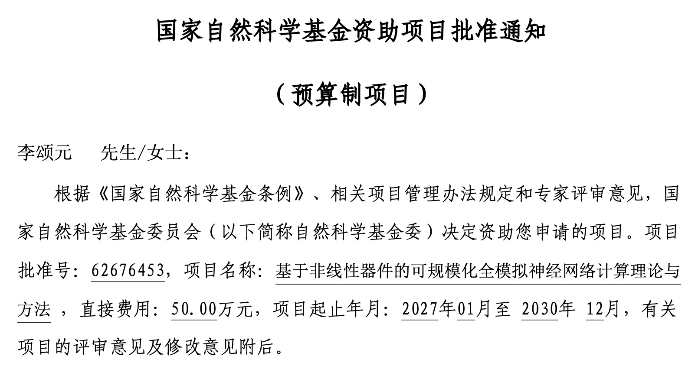</a><figcaption>国自然面上 · 项目批准通知</figcaption></figure>

<a href="images/patents/acceptance-3.png" target="_blank" rel="noopener" style="--i:2" aria-label="查看第3份专利申请受理通知书">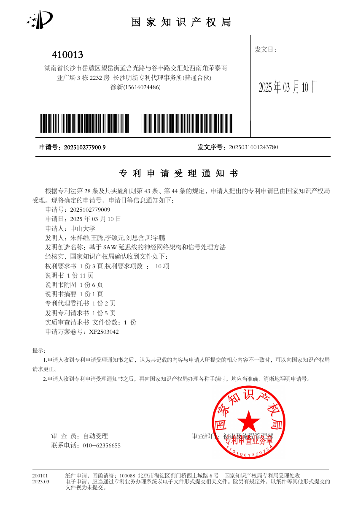</a><a href="images/patents/acceptance-4.png" target="_blank" rel="noopener" style="--i:3" aria-label="查看第4份专利申请受理通知书">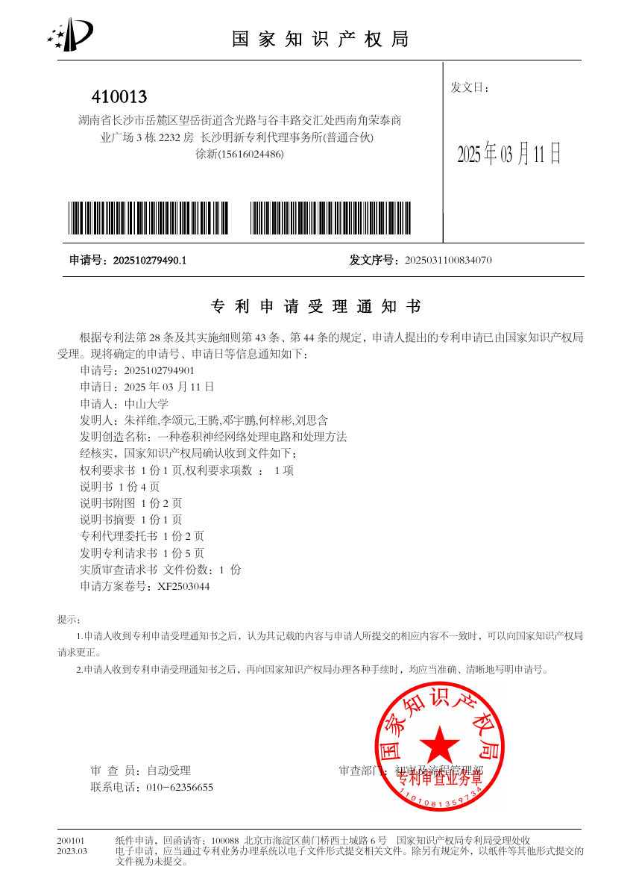</a>

<strong>五项相关专利申请</strong>
专利申请受理通知书

<h3>教师团队与院系基础</h3>
<figure><figcaption>朱祥维</figcaption></figure><figure><figcaption>王腾</figcaption></figure><figure><figcaption>李颂元</figcaption></figure>

Note:
成员姓名及研究方向依据2026-09-11组会Faculty表，不据此认定公司职务、全职承诺或股权关系；其他作者也不自动等于创业团队成员。KANalogue论文共同作者名单见技术页备注，现有组会显示Rebuttal，不能写为已发表/已录用。研究申请书第25页提供申请号202510277700.3、202510277819.0、202510277900.9、202510279490.1、202510279552.9；本次已读取 images/patents 中五份发明专利请求书及配套受理通知书；请求书列申请人为中山大学，发明人包含朱祥维、王腾、李颂元。正文为五项专利申请，不将受理等同于授权，当前审查状态、授权与实施许可仍待核实。叠放图展示五份专利申请受理通知书首页，由对应 PDF 渲染；原 PDF 保留不动，点击可打开通知书预览。仍需权属与实施许可、自由实施分析、团队履历及职责分工。研究申请书的总体论文/专利数量不可直接当商业壁垒；可形成壁垒的是经验证的实现经验、工具、工艺和可用权利。缺失能力清单是工程需求，不代表已有招聘或合作。

本页图片来源：基金批复与教师照片由用户提供。批复可见项目批准号62676453、负责人李颂元及2027–2030年项目期限；未据此推断企业收入或团队商业融资。两院标识分别来自 https://sece.sysu.edu.cn/images/logo.png 和 https://cme.suat-sz.edu.cn/images/logo1121.png ，于2026-09-14从各学院官网取得；标识只说明院系基础，不表示机构对公司投资或商业背书。
