<!-- .slide: class="cover" -->

<h1>面向自主导航的纵置二轮车自动驾驶技术</h1>
技术方案交流

<figure>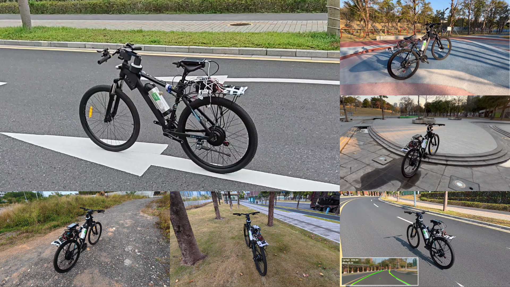</figure>

中山大学 × 深圳理工大学

纵置二轮车智能导航研发团队

李颂元

2026.09.17

Note:
本次报告面向合作企业，报告人李颂元，团队中山大学、深圳理工大学，日期2026-09-17，依据 docs/prompt.md 与用户现有封面。统一使用“纵置二轮车”。封面拼图为用户提供的 media/teaser.png；原始封面文字与团队信息保留，修正旧芯片模板的图片替代文字。图片为已有演示，不代表全场景自动驾驶或量产能力。

===

## 强化学习自平衡：多地形与负载验证

实车演示无反作用轮无陀螺稳定器

<figure class=""><video controls autoplay data-autoplay loop muted playsinline preload="metadata" poster="media/posters/road.jpg" aria-label="道路"><source src="media/road.mp4" type="video/mp4"></video><figcaption>道路</figcaption></figure>
<figure class=""><video controls autoplay data-autoplay loop muted playsinline preload="metadata" poster="media/posters/砾石.jpg" aria-label="砾石"><source src="media/砾石.mp4" type="video/mp4"></video><figcaption>砾石</figcaption></figure>
<figure class=""><video controls autoplay data-autoplay loop muted playsinline preload="metadata" poster="media/posters/草地.jpg" aria-label="草地"><source src="media/草地.mp4" type="video/mp4"></video><figcaption>草地</figcaption></figure>
<figure class=""><video controls autoplay data-autoplay loop muted playsinline preload="metadata" poster="media/posters/坡道.jpg" aria-label="坡道"><source src="media/坡道.mp4" type="video/mp4"></video><figcaption>坡道</figcaption></figure>
<figure class=""><video controls autoplay data-autoplay loop muted playsinline preload="metadata" poster="media/posters/台阶.jpg" aria-label="台阶"><source src="media/台阶.mp4" type="video/mp4"></video><figcaption>台阶</figcaption></figure>
<figure class=""><video controls autoplay data-autoplay loop muted playsinline preload="metadata" poster="media/posters/负载.jpg" aria-label="负载"><source src="media/负载.mp4" type="video/mp4"></video><figcaption>负载</figcaption></figure>

同一策略适应多种地形与工况

CycleRL · IEEE Robotics and Automation Letters, 2026

Note:
用户提供的六段实车视频已逐一检查帧内容，按提纲排序；原文件位于 media/，封面帧位于 media/posters/。同一策略的说法来自用户提纲，不从视频画面独立推断模型版本；仍需模型版本与各段实验日志核对。坡度、台阶高度、负载质量、速度、成功率及重复次数待补充，不根据画面估算。
硬件专利“一种用于自平衡与转向控制的低成本自行车硬件装置”明确包含惯性测量单元及陀螺仪角速度测量，因此将提纲“无陀螺仪”准确写为“无陀螺稳定器”：区分用于感知的陀螺仪和用于产生平衡力矩的陀螺稳定装置。无反作用轮、无陀螺稳定器的方案定位依据用户提纲与硬件方案，不代表无需姿态感知。
论文：Liu, G., Wang, T., Wu, Z., Wu, J., Li, S., & Zhu, X. (2026). CycleRL: Sim-to-Real Deep Reinforcement Learning for Robust Autonomous Bicycle Control. IEEE Robotics and Automation Letters. 仓库综述 docs/review_full.pdf（位于2026-09-10组会目录）参考文献[8]记录11(8):9343–9350，DOI https://doi.org/10.1109/LRA.2026.3704013 ，作者稿 https://arxiv.org/abs/2603.15013v3 。发表信息同时由本次提纲提供；不额外引入未经本 deck 实验条件核实的性能数值。

==

## 虚实迁移：在仿真中训练，在实车上验证

<h3>平坦地形 · 仿真<small>并行训练环境</small></h3><figure class=""><video controls autoplay data-autoplay loop muted playsinline preload="metadata" poster="media/posters/sim-平坦.jpg" aria-label="并行训练环境"><source src="media/sim-平坦.mp4" type="video/mp4"></video></figure>

<h3>台阶地形 · 仿真<small>复杂地形训练环境</small></h3><figure class=""><video controls autoplay data-autoplay loop muted playsinline preload="metadata" poster="media/posters/sim-台阶.jpg" aria-label="复杂地形训练环境"><source src="media/sim-台阶.mp4" type="video/mp4"></video></figure>

用仿真覆盖变化，再以实车检验策略

Note:
提纲中的 media-平坦 对应现有 sim-平坦.mp4，sim-台阶.mp4 为另一仿真素材；画面是仿真训练，不是实车测试。流程图为原创可编辑SVG，只描述现有研究方法，不暗示随机化消除了全部虚实差距。域随机化依据专利“一种基于域随机化的自行车控制策略仿真训练方法和系统”；策略训练与迁移依据用户提供的 CycleRL / CycleX 材料。具体随机化参数、范围、训练预算、训练与测试划分、部署时延和安全介入条件待补充。
已有材料展示了仿真训练与实车部署演示；实车测试发现的偏差与失败案例，可用于修正仿真条件并重新训练策略。返回箭头表示研发迭代，不代表在线学习，也不等同于车辆实时控制回路。系统化整理实测偏差、修正仿真条件并开展新一轮训练与对比验证，作为拟开展工作；已完成的迭代轮次与对应记录待补充，不将该反馈箭头表述为已完成验证的成果。

==

## 从自行车扩展至 E-bike 与电摩

实车演示跨载具空载与载人

<figure class=""><video controls autoplay data-autoplay loop muted playsinline preload="metadata" poster="media/posters/road.jpg" aria-label="自行车 · 道路"><source src="media/road.mp4" type="video/mp4"></video><figcaption>自行车 · 道路</figcaption></figure>
<figure class=""><video controls autoplay data-autoplay loop muted playsinline preload="metadata" poster="media/posters/e-motor-onroad.jpg" aria-label="电摩 · 道路"><source src="media/e-motor-onroad.mp4" type="video/mp4"></video><figcaption>电摩 · 道路</figcaption></figure>
<figure class=""><video controls autoplay data-autoplay loop muted playsinline preload="metadata" poster="media/posters/e-motor-offroad.jpg" aria-label="电摩 · 非铺装路面"><source src="media/e-motor-offroad.mp4" type="video/mp4"></video><figcaption>电摩 · 非铺装路面</figcaption></figure>
<figure class=""><video controls autoplay data-autoplay loop muted playsinline preload="metadata" poster="media/posters/LEQI.jpg" aria-label="E-bike · 展示"><source src="media/e-bike-demo.mp4" type="video/mp4"></video><figcaption>E-bike · 展示</figcaption></figure>
<figure class=""><video controls autoplay data-autoplay loop muted playsinline preload="metadata" poster="media/posters/e-bike-man.jpg" aria-label="E-bike · 载人"><source src="media/e-bike-man.mp4" type="video/mp4"></video><figcaption>E-bike · 载人</figcaption></figure>
<figure class=""><video controls autoplay data-autoplay loop muted playsinline preload="metadata" poster="media/posters/e-motor-man.jpg" aria-label="电摩 · 载人"><source src="media/e-motor-man.mp4" type="video/mp4"></video><figcaption>电摩 · 载人</figcaption></figure>

同一套策略面向多种载具迁移

Note:
六段视频按用户提纲排列；e-bke-man 为提纲笔误，对应 e-bike-man.mp4。e-bike-demo.mp4 的画面为室内展示场景中的车辆，标签为展示而非已核实的客户合作。载人画面仅作为演示，不能证明零人工介入或安全认证；骑乘者输入、远程控制、接管规则及各载具模型版本待补充。同一套策略的主张由用户提纲提供，视频本身不能独立证明参数完全一致；接口适配、动作缩放、底层控制器和传感器配置应结合实验记录确认。全部原视频保留。

==

<!-- .slide: class="bike-comparison-slide" -->
## 纵置二轮车自平衡：技术路线对比

<table class="bike-comparison">
<colgroup><col style="width:16%"><col style="width:28%"><col style="width:28%"><col style="width:28%"></colgroup>
<thead><tr><th scope="col">对比维度</th><th scope="col">清华天机芯自平衡自行车</th><th scope="col">稚晖君 XUAN</th><th scope="col">本团队方案</th></tr></thead>
<tbody>
<tr class="comparison-images"><th scope="row">实物平台</th><td>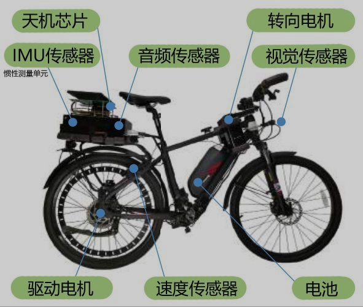</td><td>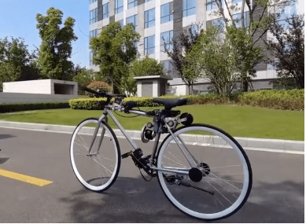</td><td>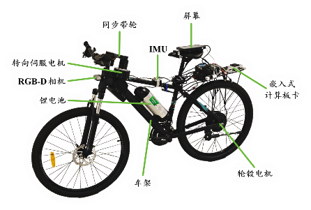</td></tr>
<tr><th scope="row">控制方式</th><td>PID 控制<small>MLP 拟合 · 车把转向</small></td><td>动量轮平衡<small>反作用力矩控制</small></td><td><strong>强化学习</strong><small>协调转向与驱动</small></td></tr>
<tr><th scope="row">建模依赖</th><td>中<small>传统控制方法</small></td><td>高<small>动量轮动力学模型</small></td><td><strong>低</strong><small>策略由仿真训练获得</small></td></tr>
<tr><th scope="row">调参难度</th><td>较高<small>人工整定 PID 参数</small></td><td>较高<small>建模与参数整定</small></td><td><strong>较低</strong><small>强化学习优化控制策略</small></td></tr>
<tr><th scope="row">环境适应性</th><td>中<small>结构化路面</small></td><td>较强<small>支持静止定车</small></td><td><strong>强</strong><small>多地形与负载验证</small></td></tr>
<tr><th scope="row">跨载具适应性</th><td>中<small>需逐车调参</small></td><td>中<small>需逐车调参</small></td><td><strong>强</strong><small>单源训练 · 零样本迁移</small></td></tr>
</tbody>
</table>

Note:
本页依据用户提供的对比页整理，三张配图从原截图裁取，保留原有标注。高、中、低及强弱为技术路线的定性比较，依据用户提供的材料，不是同一测试条件下的量化评级。“调参难度”比较控制器参数的人工整定工作，不包含强化学习奖励设计、仿真环境搭建和训练超参数调优的全部研发成本。
“建模依赖”比较控制策略设计对显式动力学模型的依赖；强化学习方案仍需仿真动力学模型。“支持静止定车”描述其平衡演示能力，不等同于已验证多地形适应性。“零样本迁移”指策略参数冻结，仍可能需要硬件接口与底层控制适配，范围与条件见后续 CycleX 页面。

==

## CycleX：单一源载具训练，冻结策略迁移

<h3>单源训练 → 零样本迁移</h3><a href="media/cyclex/zero-shot-transfer.png" target="_blank">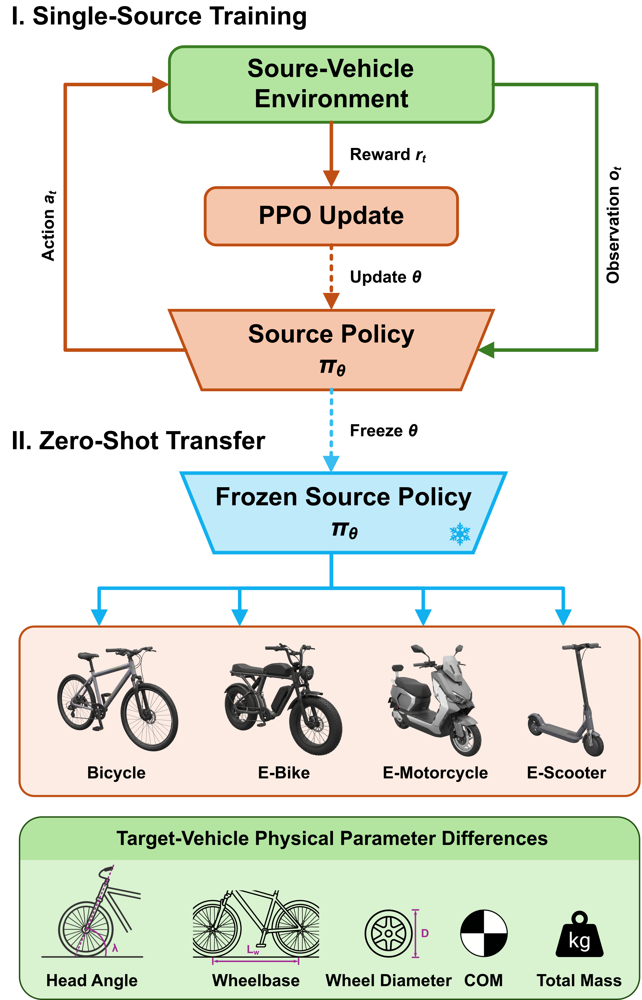</a>

<h3>四类载具 · 仿真环境</h3><a href="media/cyclex/simulation-environment.png" target="_blank">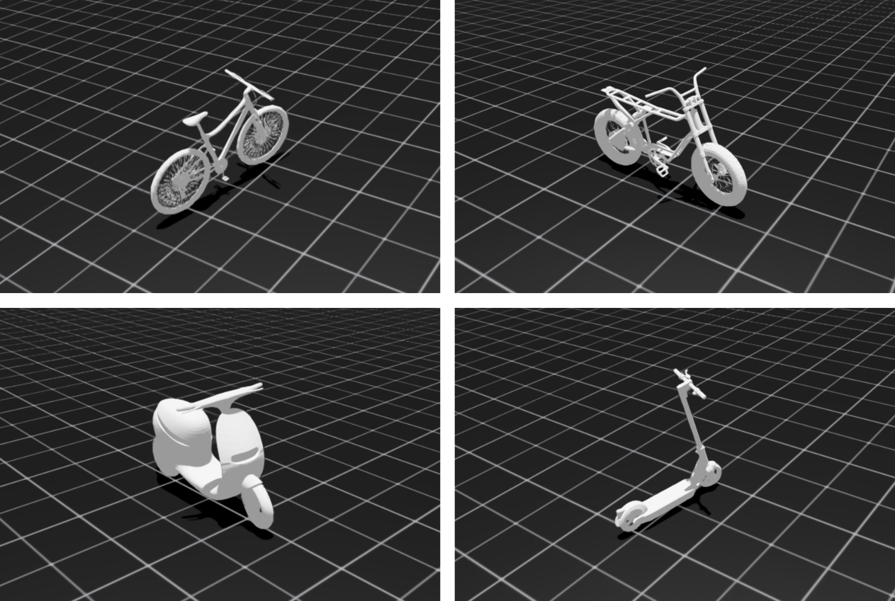</a>
自行车E-bike电摩电动滑板车

车架几何 · 轮径 · 质心 · 质量

CycleX · ICRA 2027 投稿中

Note:
两幅原图均由用户提供，保持原图内容及英文标注；点击图片打开完整图。原图明确源环境中的 PPO 更新与冻结参数后迁移；“零样本”指图示流程中的源策略冻结，不自动意味着整个系统不需要硬件接口或底层控制适配。各平台动力学、质量、轮径等差异在原图中列出，未额外添加参数范围。
论文：Wu et al. CycleX: Cross-Platform Transfer of Balance Policies among Single-Track Vehicles. ICRA'27 (submitted)。投稿状态来自本次提纲，不表述为已录用。完整作者列表、投稿版本和实验配置待补充。提纲中的 simulation-enviroment 对应现有 simulation-environment.png。

==

## CycleX：比较源载具的迁移表现

<a href="media/cyclex/zero_shot_transfer_matrix.pdf" target="_blank">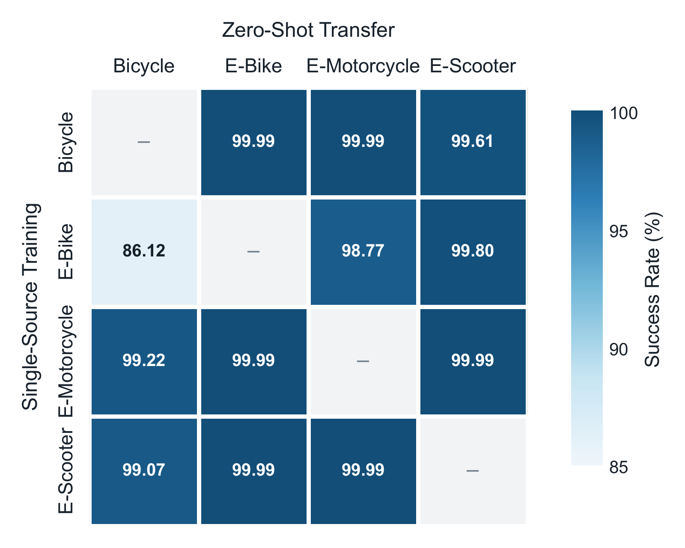</a>
仿真结果<h3>行：训练源 列：迁移目标</h3>
同一行比较 跨载具泛化

本组仿真中，自行车源策略的平均迁移成功率最高

Note:
矩阵来自用户提供 media/cyclex/zero_shot_transfer_matrix.pdf；PNG由PDF首页直接渲染，原图与数值未改动。用户将该图与仿真环境一并提供，按仿真比较展示；仍需实验负责人确认评估环境与版本。行是Single-Source Training，列是Zero-Shot Transfer，对角线为“–”，不填成100%。
按每行三个非对角元素等权计算，自行车约99.86%，E-bike约94.90%，电摩约99.73%，电动滑板车约99.68%。因此将提纲“自行车模型迁移效果最好”限定为本组矩阵的平均迁移成功率，而非逐目标都最好、统计显著优势或实车可靠性承诺。不把不同任务样本量未知情况下的等权均值等同于合并样本成功率。成功判据、每格试验次数、置信区间、训练随机种子、初始状态、任务分布和失败样例待补充。

==

## 从自平衡走向视觉车道保持

<figure class=""><video controls autoplay data-autoplay loop muted playsinline preload="metadata" poster="media/posters/L2.jpg" aria-label="道路车道保持 · 实车演示"><source src="media/L2.mp4" type="video/mp4"></video><figcaption>道路车道保持 · 实车演示</figcaption></figure>

L2 自动驾驶：车道保持演示

参考方法：Ultra Fast Structure-aware Deep Lane Detection

Note:
L2.mp4 为用户提供的实车视频，画面包括外部视角和车道线检测叠加小窗。该演示能展示所录路段的车道跟随行为，不能证明全场景自主导航、障碍物处理、无人监管或标准分级认证。“L2”按用户提纲作为本项目展示标签，不据此宣称满足汽车自动驾驶标准中的L2完整要求；驾驶责任、适用路段、控制权与人工接管方式待补充。
车道检测参考论文：Ultra Fast Structure-aware Deep Lane Detection，https://arxiv.org/abs/2004.11757 。检测算法不是完整驾驶系统，也不是本团队原创论文；实际集成版本、训练数据、相机标定、图像帧率与控制接口待核实。功能链路为原创可编辑SVG，用于概括感知、跟踪与平衡控制之间的分工，不声称实现了全部规划模块。

===

## 团队基础与产品化能力建设

<h3>知识产权</h3>

<a href="media/patents/patent1.jpg" role="button" aria-haspopup="dialog" style="--i:0" aria-label="查看第1份专利">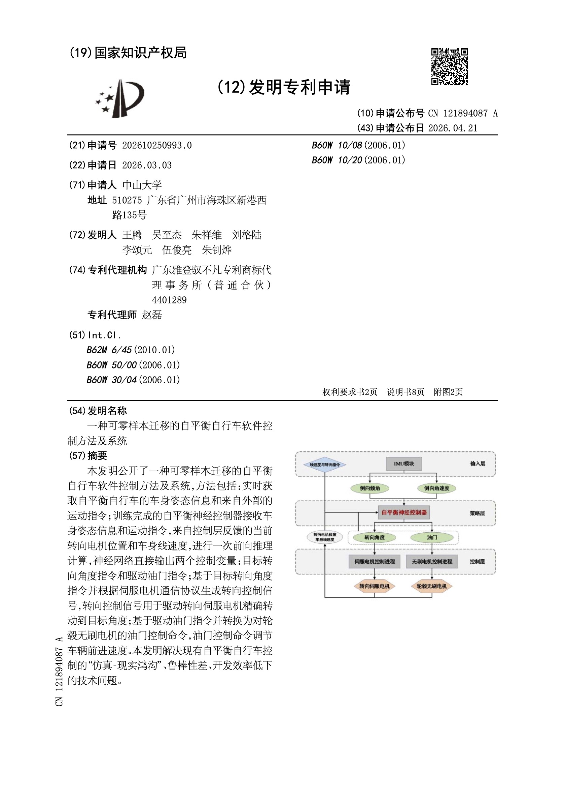</a><a href="media/patents/patent2.jpg" role="button" aria-haspopup="dialog" style="--i:1" aria-label="查看第2份专利">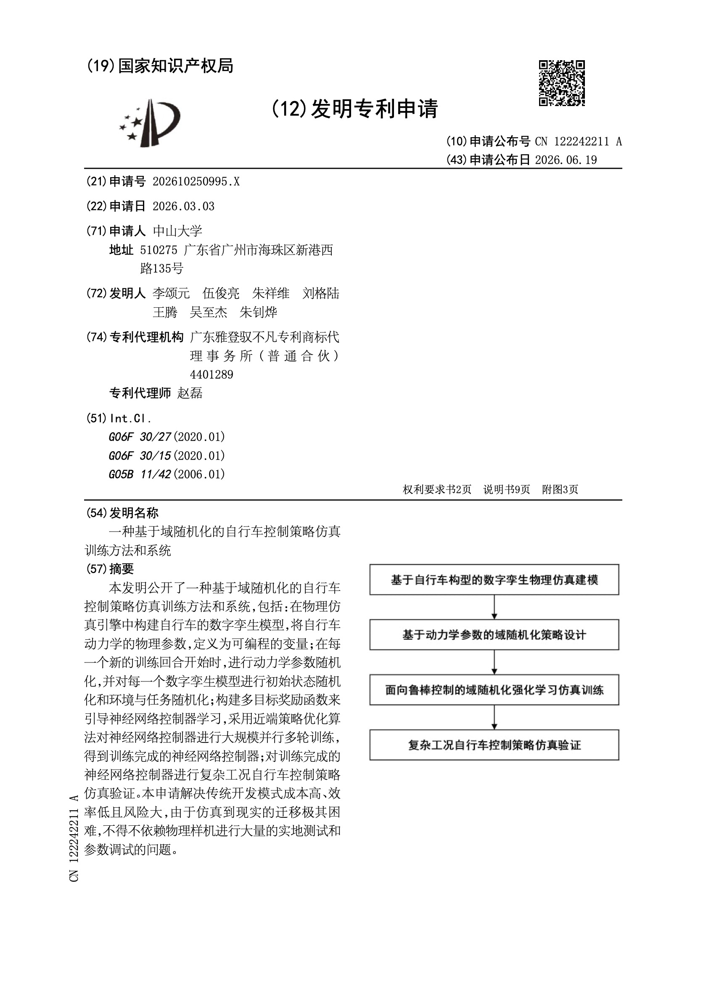</a><a href="media/patents/patent3.jpg" role="button" aria-haspopup="dialog" style="--i:2" aria-label="查看第3份专利">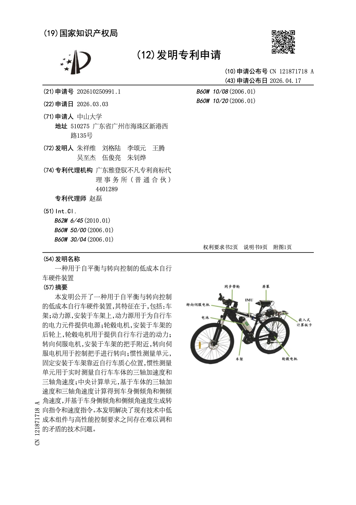</a><a href="media/patents/patent4.jpg" role="button" aria-haspopup="dialog" style="--i:3" aria-label="查看第4份专利">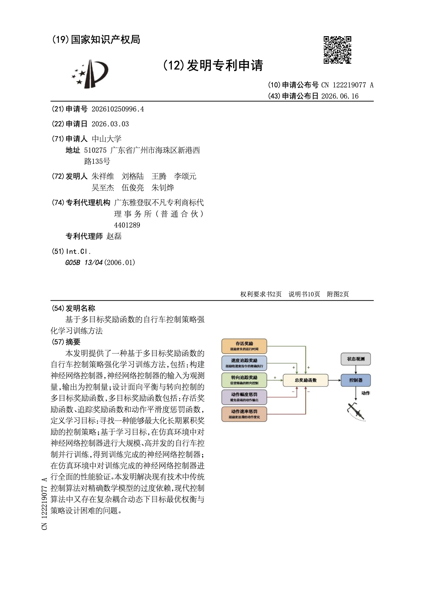</a>

<strong>四项相关专利申请</strong>
发明专利申请公开文本

<h3>教师团队与院系基础</h3>
<figure><figcaption>朱祥维</figcaption></figure><figure><figcaption>王腾</figcaption></figure><figure><figcaption>李颂元</figcaption></figure><figure>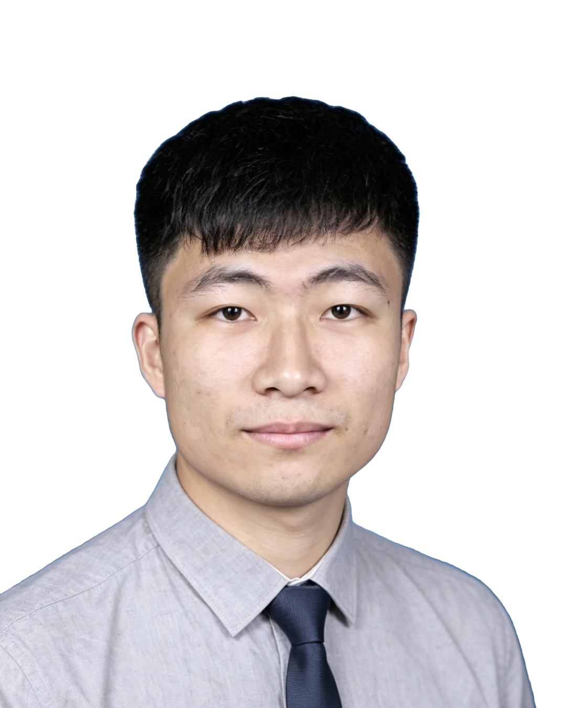<figcaption>翟春磊</figcaption></figure>

Note:
保留用户已有的教师照片、两院标识和四份专利图，并加入用户提供的翟春磊照片。四项材料均为“发明专利申请”公开文本，不作为专利授权证明：一种可零样本迁移的自平衡自行车软件控制方法及系统，申请号202610250993.0，公布号CN121894087A；一种用于自平衡与转向控制的低成本自行车硬件装置，申请号202610250991.1，公布号CN121871718A；基于多目标奖励函数的自行车控制策略强化学习训练方法，申请号202610250996.4，公布号CN122219077A；一种基于域随机化的自行车控制策略仿真训练方法和系统，申请号202610250995.X，公布号CN122242211A。申请人均为中山大学，来源为本deck media/patents/中对应PDF首页。图像与PDF均由用户提供；当前法律状态、可许可范围和企业使用条件待核实。
教师照片对应朱祥维、王腾、李颂元、翟春磊；前三位使用用户提供的透明背景版本，翟春磊使用本地工具处理的 media/profiles/翟春磊-transparent.png 透明背景版本，已裁去底部水印，不据此认定公司职务或专职投入。两院官网：https://sece.sysu.edu.cn/ 、https://cme.suat-sz.edu.cn/ 。标识仅说明院系背景，不表示企业合作已经签署。原页面中关于类脑芯片、KANalogue、国自然批复及五项旧专利的备注与本次主题不符，已移除。

===

<!-- .slide: class="awards-slide" -->
## 竞赛成果：全国总决赛一等奖与创新奖

2025 年（第二十届）海峡两岸暨港澳地区大学生计算机创新作品赛

<figure><a href="media/awards/海峡赛国赛一等奖证书.pdf#page=1" target="_blank" rel="noopener">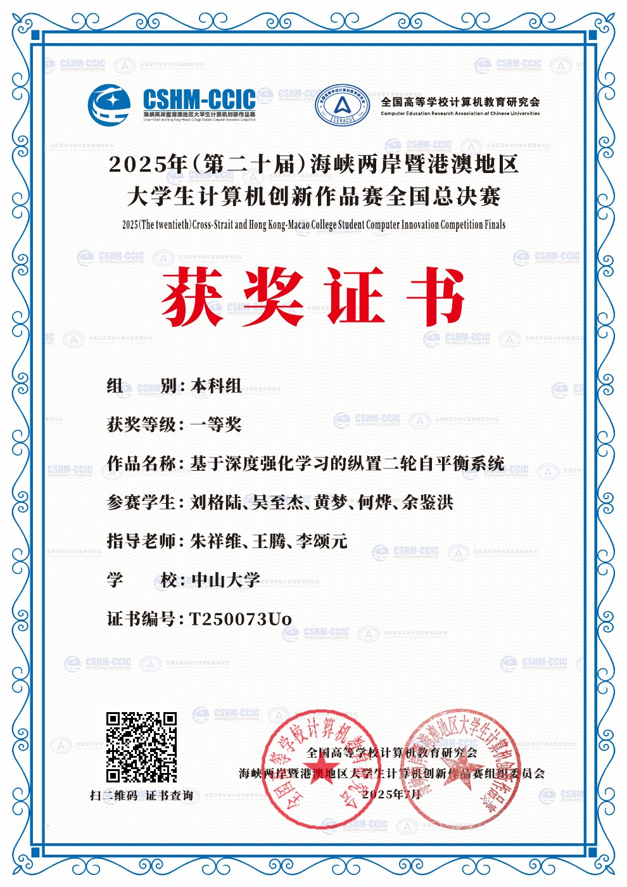</a><figcaption><strong>全国总决赛 · 一等奖</strong></figcaption></figure>
<figure><figcaption><strong>全国总决赛 · 创新奖</strong></figcaption></figure>
<figure><a href="media/awards/海峡赛省赛一等奖证书.pdf#page=1" target="_blank" rel="noopener">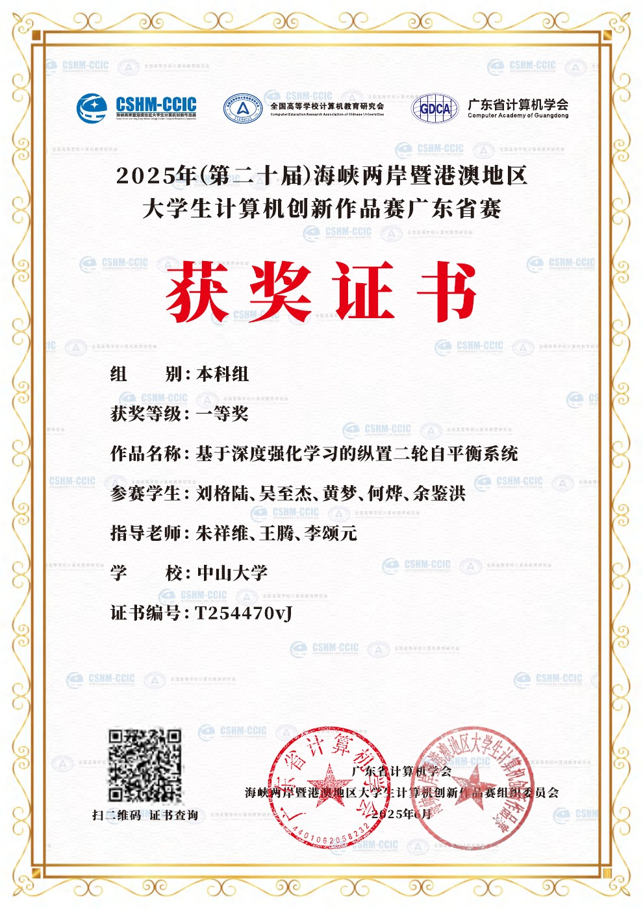</a><figcaption>广东省赛 · 一等奖</figcaption></figure>
<figure><a href="media/awards/海峡赛省赛一等奖证书.pdf#page=2" target="_blank" rel="noopener">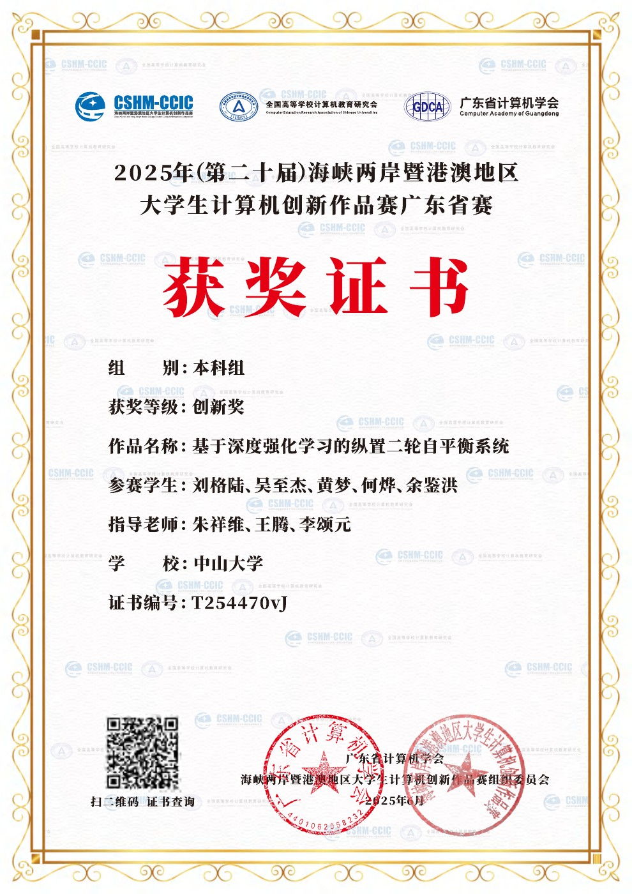</a><figcaption>广东省赛 · 创新奖</figcaption></figure>

<figure><a href="media/awards/一等奖-颁奖.jpg" target="_blank" rel="noopener">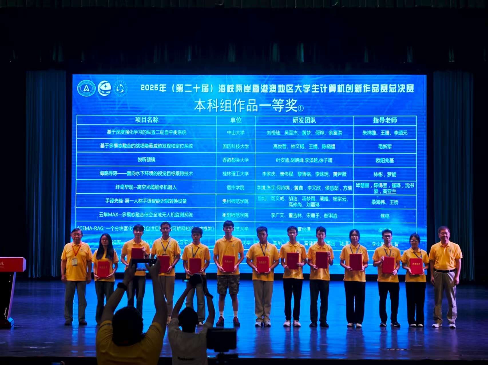</a><figcaption>一等奖 · 颁奖现场</figcaption></figure>
<figure><a href="media/awards/创新奖-颁奖.jpg" target="_blank" rel="noopener">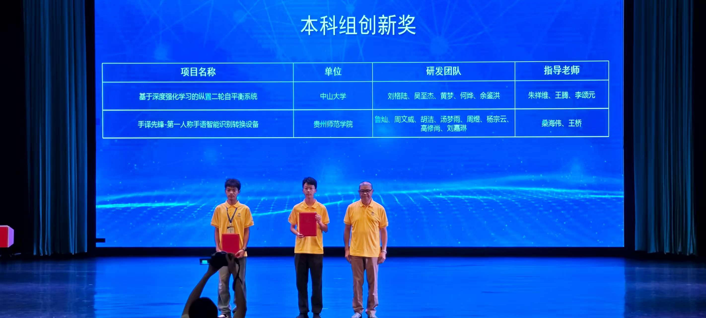</a><figcaption>创新奖 · 颁奖现场</figcaption></figure>

Note:
四份证书来自用户提供的 media/awards/海峡赛国赛一等奖证书.pdf 与 海峡赛省赛一等奖证书.pdf，每份 PDF 各两页，依次为本科组一等奖和创新奖。全国总决赛证书日期为2025年7月，广东省赛为2025年6月。作品名称为“基于深度强化学习的纵置二轮自平衡系统”，学校为中山大学，指导教师为朱祥维、王腾、李颂元。证书图片由原始 PDF 渲染，点击可打开对应原始 PDF 页面。两张颁奖现场照片由用户提供，完整呈现，不裁去人物。奖项反映该参赛作品的竞赛成果。

===

<!-- .slide: class="showcase-slide" -->

<video controls autoplay data-autoplay loop muted playsinline preload="metadata" poster="media/posters/科交会.jpg" aria-label="科交会综合演示视频"><source src="media/科交会.mp4" type="video/mp4"></video>

Note:
按提纲使用 media/科交会.mp4 作为结尾综合演示。视频含仿真与实车片段，按其原始画面展示，不将仿真片段表述为实车实验；不从文件名推断举办方、现场客户或商业合作关系。原视频150秒，保留静音、自动播放、循环和手动控制。讲述时可按需暂停或拖动进度。

