<!-- .slide: class="cover" -->

# 书法生成

Note:
本报告面向混合外部听众，预计20–25分钟。主线从字体补全到书法标注，再到笔的导航与整幅章法。封面按用户要求保留标题，不添加未经提供的日期或活动。

===

<!-- .slide: class="background-merged" data-part="II · 背景" -->

## 给定风格，生成所需文字

<a class="figure-preview" href="media/figures/fontify/whattodo.png" role="button" aria-haspopup="dialog">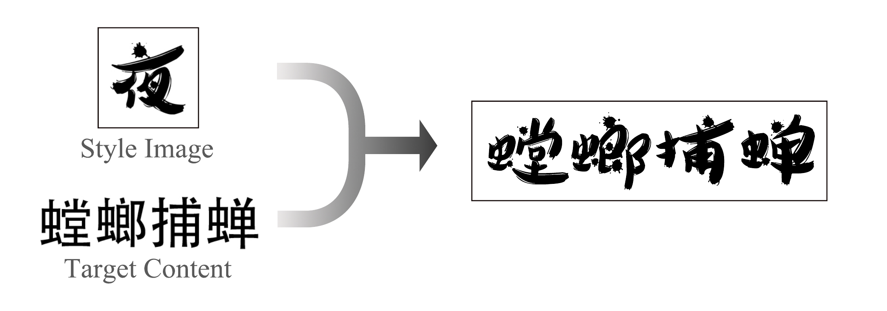</a>
<figure></figure><figure></figure>

<figure class="background-negative"><figcaption>GPT-4o 生成示例</figcaption></figure>

似是而非，先把字写对

Note:
来源：Fontify: One-Shot Font Generation via In-Context Learning；KBS/cas-dc-template.tex、sec/3_method.tex、sec/4_eval.tex。图表与数值以用户指定的KBS稿件为准。
先请听众看任务图：参考“夜”的风格，生成“螳螂捕蝉”。用户提供的两幅院系标识用于说明手写标题与电脑字形混用的实际需求；缺字原因来自用户叙述，不从标识独立推断。长期解决方案是从风格示例生成缺失字形，而不依赖逐字搜集。

用户提供的历史示例：media/figures/background/GPT-negative.png。截图指令包含“龙腾盛世辞旧岁”“蛇舞新春贺丰年”“福满人间”，输出与之不符。它说明当时这一例子的文字约束问题；不将其表述为当前GPT能力评估。可对照提示词与实际图中墨迹，请听众观察文字内容和字形的差异。
截图模型为GPT-4o，由用户确认。新布局将任务、混合字形标识与历史负面示例放在同一页；简短结论强调文字约束和字形正确性。

===

<!-- .slide: data-part="III · Fontify" -->

## 把字体生成变成图像补全

<a class="figure-preview" href="media/figures/fontify/overview3x.png" role="button" aria-haspopup="dialog">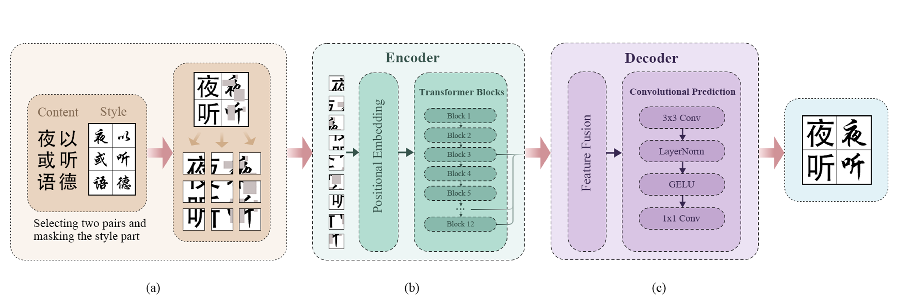</a>
内容—风格配对遮挡风格区域在上下文中重建字形

早期探索：通过“补全”，学习字形与风格之间的关系。

Note:
来源：Fontify: One-Shot Font Generation via In-Context Learning；KBS/cas-dc-template.tex、sec/3_method.tex、sec/4_eval.tex。图表与数值以用户指定的KBS稿件为准。
从左到右讲：成对的同字内容与风格图像构成视觉上下文；遮挡后，经Transformer编码和解码重建目标区域。核心是把生成组织为上下文图像补全。编码器层数与损失细节不在台上逐项展开。

==

<!-- .slide: data-part="III · Fontify" -->

## 从大量字体中学习可迁移的生成能力

<a class="figure-preview" href="media/diagrams/fontify-pretraining.svg" role="button" aria-haspopup="dialog">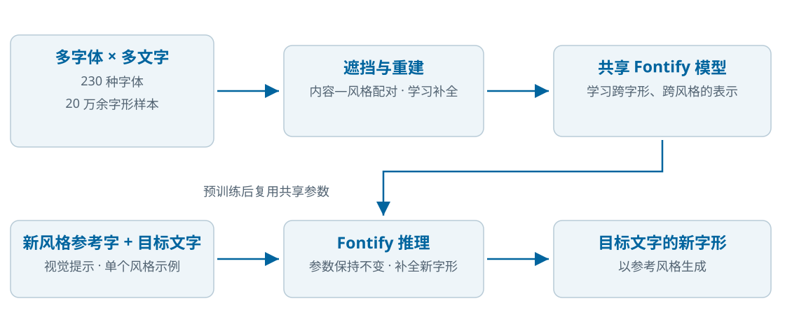</a>

Note:
来源：Fontify: One-Shot Font Generation via In-Context Learning；KBS/cas-dc-template.tex、sec/3_method.tex、sec/4_eval.tex。图表与数值以用户指定的KBS稿件为准。
230种字体来自sec/4_eval.tex；“20万余字形样本”由用户提供，指跨字体的字形图像总量，不是不同汉字身份数量。该图为本报告新绘的解释图，补足论文中缺少的预训练尺度视角。强调先在多字体、多文字上共享训练，再用新风格示例进行视觉提示推理；此处“基础模型”指字体生成领域可迁移的预训练能力，不等同于通用大模型。

==

<!-- .slide: data-part="III · Fontify" -->

## 一个参考字，迁移一种风格

<b>1</b>参考字：内容 + 风格

<b>2</b>目标字：指定文字内容

<b>3</b>补全目标字的风格区域

同一模型，响应不同视觉提示。

Note:
来源：Fontify: One-Shot Font Generation via In-Context Learning；KBS/cas-dc-template.tex、sec/3_method.tex、sec/4_eval.tex。图表与数值以用户指定的KBS稿件为准。
图中的Ic对应参考字的规范内容，Is为风格示例，It为目标字内容，Ipred为输出，Igt为真实字形。用“夜”与“螳”说明这不是把参考字本身复制到输出，而是把风格延伸到另一个文字。论文称one-shot，指单个风格参考；推理并不需要为每个新示例重新训练模型。

==

<!-- .slide: data-part="III · Fontify" -->

## 生成效果：逐字比较

<table class="glyph-table"><tbody><tr class=""><th scope="row">Content</th><td class=""></td><td class=""></td><td class="group-end"></td><td class=""></td><td class=""></td><td class="group-end"></td><td class="">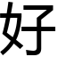</td><td class=""></td><td class="group-end"></td></tr><tr class=""><th scope="row">LF-Font</th><td class=""></td><td class=""></td><td class="group-end"></td><td class=""></td><td class=""></td><td class="group-end"></td><td class=""></td><td class=""></td><td class="group-end">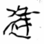</td></tr><tr class=""><th scope="row">FUNIT</th><td class=""></td><td class=""></td><td class="group-end"></td><td class="">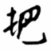</td><td class=""></td><td class="group-end"></td><td class=""></td><td class=""></td><td class="group-end"></td></tr><tr class=""><th scope="row">MX-Font</th><td class=""></td><td class=""></td><td class="group-end"></td><td class="">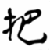</td><td class=""></td><td class="group-end"></td><td class="">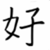</td><td class=""></td><td class="group-end"></td></tr><tr class=""><th scope="row">FontDiffuser</th><td class=""></td><td class=""></td><td class="group-end"></td><td class=""></td><td class=""></td><td class="group-end"></td><td class=""></td><td class=""></td><td class="group-end"></td></tr><tr class=""><th scope="row">MSD-Font</th><td class=""></td><td class=""></td><td class="group-end"></td><td class=""></td><td class=""></td><td class="group-end"></td><td class=""></td><td class=""></td><td class="group-end"></td></tr><tr class="ours"><th scope="row">Fontify</th><td class=""></td><td class=""></td><td class="group-end"></td><td class=""></td><td class=""></td><td class="group-end"></td><td class=""></td><td class=""></td><td class="group-end"></td></tr><tr class=""><th scope="row">GT</th><td class=""></td><td class=""></td><td class="group-end"></td><td class=""></td><td class=""></td><td class="group-end"></td><td class=""></td><td class=""></td><td class="group-end"></td></tr></tbody></table>
未见风格 · 已见文字｜原表前三组风格，每组 3 字；GT 为真实字形。

Note:
来源：Fontify: One-Shot Font Generation via In-Context Learning；KBS/cas-dc-template.tex、sec/3_method.tex、sec/4_eval.tex。图表与数值以用户指定的KBS稿件为准。
来源KBS/tables/comparison_pic.tex。取原始顺序前三个完整风格组（Fang、Font、Hong），每组三个字，共9列，保留Content、LF-Font、FUNIT、MX-Font、FontDiffuser、MSD-Font、Fontify、GT全部行。每个单元格直接使用原始图像，未生成或重绘实验输出。逐列比较笔画完整性、粗细和局部形态；此处是定性示例，不能仅凭样例推断全数据性能。

==

<!-- .slide: data-part="III · Fontify" -->

## 两种泛化场景下的结果

<h3>已见风格 · 未见文字</h3><table class="metric-table"><thead><tr><th>模型</th><th>PSNR ↑</th><th>SSIM ↑</th><th>MAE ↓</th><th>LPIPS ↓</th></tr></thead><tbody><tr class=""><th>FUNIT</th><td>9.0723</td><td>0.4211</td><td>0.1773</td><td>0.1606</td></tr><tr class=""><th>MX-Font</th><td>9.3590</td><td>0.4442</td><td>0.1693</td><td>0.1599</td></tr><tr class=""><th>LF-Font</th><td>10.1580</td><td>0.5049</td><td>0.1475</td><td>0.1457</td></tr><tr class=""><th>FontDiffuser</th><td>10.5195</td><td>0.5342</td><td>0.1382</td><td>0.1164</td></tr><tr class=""><th>MSD-Font</th><td>11.0722</td><td>0.5603</td><td>0.1331</td><td>0.1361</td></tr><tr class="ours"><th>Fontify</th><td>11.3689</td><td>0.6036</td><td>0.1123</td><td>0.0950</td></tr></tbody></table>

<h3>未见风格 · 已见文字</h3><table class="metric-table"><thead><tr><th>模型</th><th>PSNR ↑</th><th>SSIM ↑</th><th>MAE ↓</th><th>LPIPS ↓</th></tr></thead><tbody><tr class=""><th>FUNIT</th><td>8.0741</td><td>0.3200</td><td>0.2214</td><td>0.1767</td></tr><tr class=""><th>MX-Font</th><td>8.4746</td><td>0.3577</td><td>0.2079</td><td>0.1720</td></tr><tr class=""><th>LF-Font</th><td>8.7659</td><td>0.3780</td><td>0.1987</td><td>0.1707</td></tr><tr class=""><th>FontDiffuser</th><td>8.9502</td><td>0.3903</td><td>0.1927</td><td>0.1597</td></tr><tr class=""><th>MSD-Font</th><td>9.3517</td><td>0.4134</td><td>0.1908</td><td>0.1777</td></tr><tr class="ours"><th>Fontify</th><td>9.8720</td><td>0.4940</td><td>0.1577</td><td>0.1170</td></tr></tbody></table>

PSNR / SSIM 越高越好；MAE / LPIPS 越低越好。数值来自 KBS 原表。

Note:
来源：Fontify: One-Shot Font Generation via In-Context Learning；KBS/cas-dc-template.tex、sec/3_method.tex、sec/4_eval.tex。图表与数值以用户指定的KBS稿件为准。
来源KBS/tables/comparison.tex，按原始数值逐项转写。解释两种测试：风格见过但文字未见；文字见过但风格未见。这两个结果表独立于后面CalliPhase的基准，不能跨表直接比较绝对分数。训练230种字体，64×64训练分辨率；完整超参数保留在源稿件中。表格高亮Fontify整行，不重新定义原稿件的实验设置。

==

<!-- .slide: data-part="III · Fontify" -->

## 手写书法打破了规则字形的对应关系

<table class="cursive-table"><thead><tr><th>Content</th><th>LF-Font</th><th>FUNIT</th><th>MX-Font</th><th>FontDiffuser</th><th>MSD-Font</th><th>Fontify</th><th>GT</th></tr></thead><tbody><tr><td></td><td>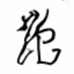</td><td></td><td>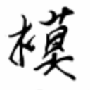</td><td></td><td></td><td></td><td></td></tr><tr><td></td><td>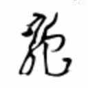</td><td></td><td></td><td></td><td>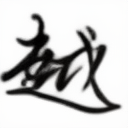</td><td></td><td></td></tr><tr><td>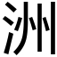</td><td>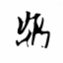</td><td>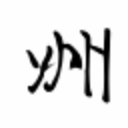</td><td>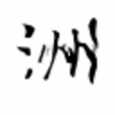</td><td>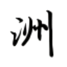</td><td>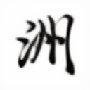</td><td>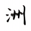</td><td>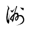</td></tr></tbody></table>
变形、连笔、省笔：内容与风格不再逐笔对应。

Note:
来源：Fontify: One-Shot Font Generation via In-Context Learning；KBS/cas-dc-template.tex、sec/3_method.tex、sec/4_eval.tex。图表与数值以用户指定的KBS稿件为准。
来源KBS/tables/comparison_cursive.tex、sec/4_eval.tex Limitations and Future Directions。原始顺序为mo、yue、zhou三例；保留全部模型与GT，Fontify列使用原稿件的-o文件。所有方法在高度草书化、扭曲的字形上都会遇到困难；强调特定极端字形的局限，而不是声称Fontify对所有手写字都失败。这个结果引出需要显式表示笔法和结体。

===

<!-- .slide: data-part="IV · CalliPhase" -->

## 从书法家的先验出发

<a class="figure-preview" href="media/figures/calliphase/diff-calli.png" role="button" aria-haspopup="dialog">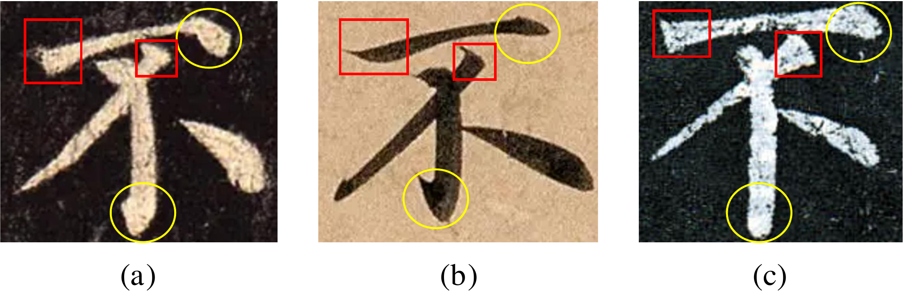</a>
颜真卿 · 多宝塔碑赵孟頫 · 洛神赋柳公权 · 玄秘塔碑

风格落在笔画如何执行，也落在笔画如何相互组织。

Note:
来源：CalliPhase: A Phase-Aware Stroke-Level Dataset for Fine-Grained Chinese Calligraphy Generation；/Users/leizungjyun/Downloads/AuthorKit27-v2/main(15).tex。采用该最新主稿，不沿用旧补充材料的统计。
复用diff-calli.pdf，主稿图注按从左到右为颜真卿《多宝塔碑》、赵孟頫《洛神赋》、柳公权《玄秘塔碑》。红框和黄圈强调对应笔画的起笔与收笔差异。笔法是局部执行形态；结体是字符内部空间关系。提出CalliPhase的贡献是精细标注基础设施，供已有生成模型使用。

==

<!-- .slide: data-part="IV · CalliPhase" -->

## 笔法：起笔、行笔、收笔

<figure><a class="figure-preview" href="media/figures/calliphase/bifa-panel.png" role="button" aria-haspopup="dialog">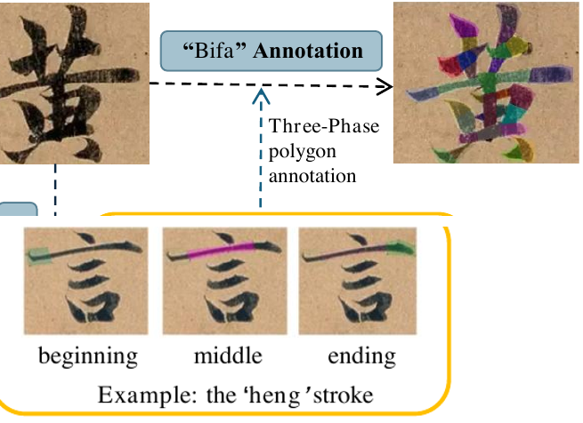</a><figcaption>沿笔画轮廓，标注阶段区域</figcaption></figure><figure><a class="figure-preview" href="media/figures/calliphase/heng-phases.png" role="button" aria-haspopup="dialog">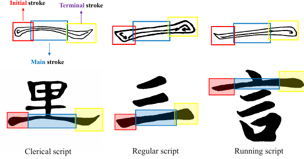</a><figcaption>同一种笔画，书体与写法各异</figcaption></figure>

起笔：入纸与转折行笔：形态与粗细收笔：末端处理

Note:
来源：CalliPhase: A Phase-Aware Stroke-Level Dataset for Fine-Grained Chinese Calligraphy Generation；/Users/leizungjyun/Downloads/AuthorKit27-v2/main(15).tex。采用该最新主稿，不沿用旧补充材料的统计。
左图为Intro3_cropped.pdf局部放大，右图为strokes_grid.pdf横画面板。阶段标签标注的是静态图像中与书写阶段对应的形态区域，并非直接记录的时间轨迹。多边形轮廓避免矩形框包含大量背景。起笔、行笔、收笔的意义来自传统书法先验；实际笔压、速度和笔锋角度尚未作为测量变量收集。

==

<!-- .slide: data-part="IV · CalliPhase" -->

## 结体：笔画之间的空间关系

<figure><a class="figure-preview" href="media/figures/calliphase/replace.png" role="button" aria-haspopup="dialog">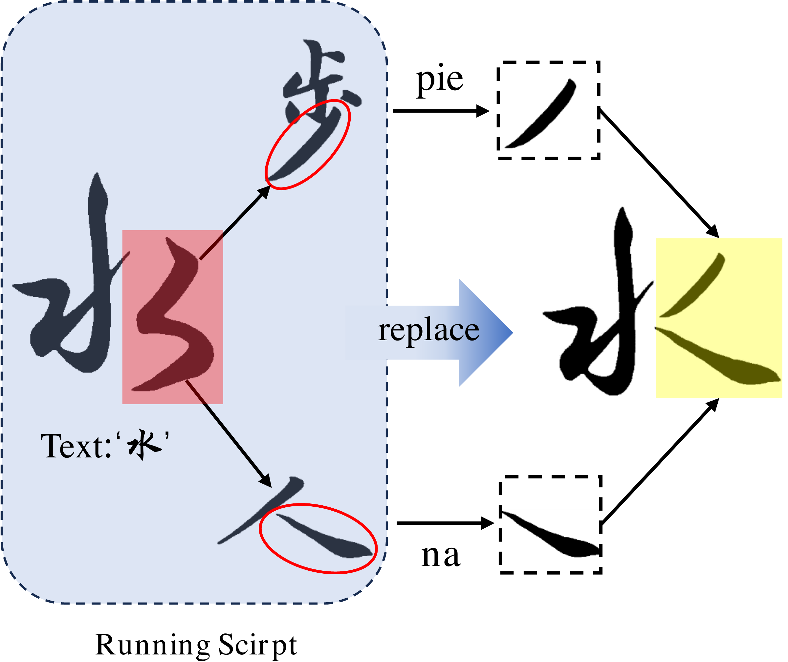</a></figure><figure><a class="figure-preview" href="media/figures/calliphase/jieti-panel.png" role="button" aria-haspopup="dialog">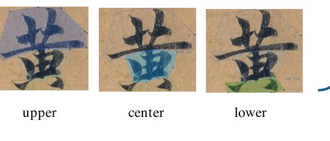</a><figcaption>位置 · 比例 · 呼应 · 间距</figcaption></figure>

单独“写得对”的笔画，组合后未必还是同一种风格。

Note:
来源：CalliPhase: A Phase-Aware Stroke-Level Dataset for Fine-Grained Chinese Calligraphy Generation；/Users/leizungjyun/Downloads/AuthorKit27-v2/main(15).tex。采用该最新主稿，不沿用旧补充材料的统计。
左图来自replace.pdf：以同一书法家其他字中的同类型笔画替换，局部笔画仍成立，但原字的整体风格关系被破坏。右图放大Intro3_cropped.pdf中的空间标签面板。结体把笔画的空间角色明确化，CalliPhase联合标注两个维度。不要将当前空间位置标签夸大为完整的动态交互模型。

==

<!-- .slide: data-part="IV · CalliPhase" -->

## 已完成的标注规模

<figure><a class="figure-preview" href="media/figures/calliphase/scripts-panel.png" role="button" aria-haspopup="dialog">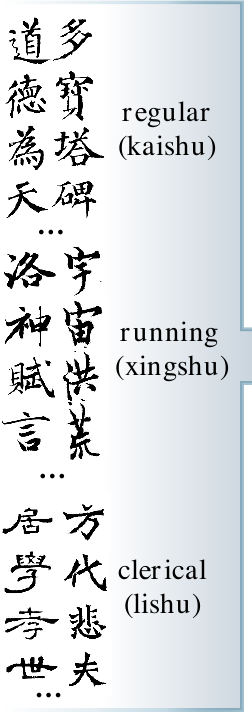</a></figure>

<strong>9</strong>种风格 / 历史来源

<strong>3</strong>类书体

<strong>2,044</strong>张字形图像

<strong>28,850</strong>个多边形标注

50 类笔法阶段 · 18 类结体位置

6 位书法家 + 3 组碑刻来源

Note:
来源：CalliPhase: A Phase-Aware Stroke-Level Dataset for Fine-Grained Chinese Calligraphy Generation；/Users/leizungjyun/Downloads/AuthorKit27-v2/main(15).tex。采用该最新主稿，不沿用旧补充材料的统计。
采用最新主稿的Dataset Statistics：2044高分辨率字形图像，平均1300×1170；28850多边形；50类笔法阶段、18类结体空间位置；18子数据集=9来源×2维度。这里2044是字形图像数，不声称2044个不同汉字身份。书体为楷书、行书、隶书；按主稿统计，6位书法家与3组碑刻来源。每字两名标注员独立标注并由书法专家审核，COCO JSON兼容。旧补充材料的1897和51类不作为当前版本统计。

==

<!-- .slide: data-part="IV · CalliPhase" -->

## 标注如何帮助生成

共享预训练模型<b>→</b>阶段 / 位置感知遮挡<b>→</b>书法数据微调
<a class="figure-preview" href="media/figures/calliphase/fontify-seen.png" role="button" aria-haspopup="dialog">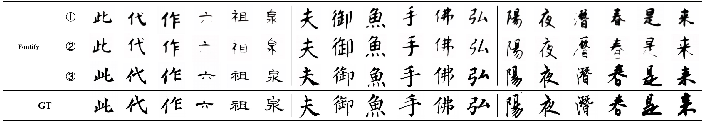</a>
① PO：仅预训练　② Non-Calli：等量普通数据微调　③ CalliPhase：精细书法标注

Note:
来源：CalliPhase: A Phase-Aware Stroke-Level Dataset for Fine-Grained Chinese Calligraphy Generation；/Users/leizungjyun/Downloads/AuthorKit27-v2/main(15).tex。采用该最新主稿，不沿用旧补充材料的统计。
从Table3_cropped.pdf中裁取Fontify的全部三条件与GT行，保留18字原顺序。PO、Non-Calli、Ours共享架构和预训练初始化；Non-Calli与CalliPhase微调数据量、45 epochs等训练预算保持一致。笔法与结体多边形提供语义一致的遮挡单元，结合随机前景遮挡进行重建。它是数据监督接口，不是另提一个生成器。数据条件结果和联合掩码消融是不同实验，不能把消融V5分数替换成主结果Ours。

==

<!-- .slide: data-part="IV · CalliPhase" -->

## 生成收益与泛化边界

<table class="metric-table calli-metrics"><thead><tr><th>模型</th><th>SSIM ↑ PO → CalliPhase</th><th>LPIPS ↓ PO → CalliPhase</th></tr></thead><tbody><tr class="table-section"><th colspan="3">已见风格 · 未见文字</th></tr><tr><th>Fontify</th><td>0.7012 → <b>0.7535</b></td><td>0.2985 → <b>0.2507</b></td></tr><tr><th>FontDiffuser</th><td>0.4486 → <b>0.4607</b></td><td>0.3311 → <b>0.2979</b></td></tr><tr><th>MX-Font</th><td>0.4944 → <b>0.5153</b></td><td>0.3558 → <b>0.3364</b></td></tr><tr class="table-section"><th colspan="3">未见风格 · 已见文字</th></tr><tr><th>Fontify</th><td>0.7275 → <b>0.7258</b></td><td>0.2831 → <b>0.2732</b></td></tr><tr><th>FontDiffuser</th><td>0.6773 → <b>0.6900</b></td><td>0.2853 → <b>0.2734</b></td></tr><tr><th>MX-Font</th><td>0.6626 → <b>0.6860</b></td><td>0.2901 → <b>0.2796</b></td></tr></tbody></table>

<h3>未见风格 · Fontify</h3><a class="figure-preview" href="media/figures/calliphase/fontify-unseen.png" role="button" aria-haspopup="dialog">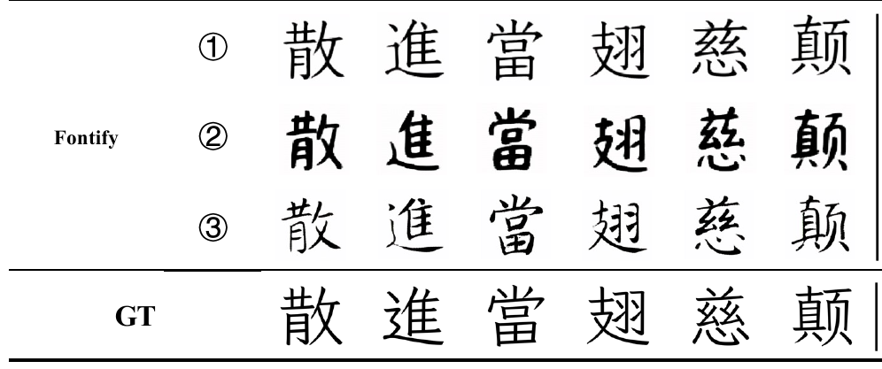</a>
① PO　② Non-Calli　③ CalliPhase　末行 GT｜首组 6 字

感知相似度改善，像素对齐未必同步改善。

Note:
来源：CalliPhase: A Phase-Aware Stroke-Level Dataset for Fine-Grained Chinese Calligraphy Generation；/Users/leizungjyun/Downloads/AuthorKit27-v2/main(15).tex。采用该最新主稿，不沿用旧补充材料的统计。
数字来自main(15).tex主定量表，显示SSIM和LPIPS的PO→CalliPhase变化，完整PSNR、MAE与Non-Calli数值保留于media/data/results.json。已见风格中三个模型SSIM/LPIPS均改善；未见风格Fontify的SSIM 0.7275→0.7258略降，而LPIPS 0.2831→0.2732改善，FontDiffuser/MX-Font两项改善。未见风格PSNR与MAE总体出现下降或恶化的权衡；不能表述所有指标普遍改善。右图裁自Table4_cropped.pdf对应Fontify及GT块的首组6字；说明局部轮廓偏移和书写形态之间的评估差别。

===

<!-- .slide: data-part="V · 下一步" -->

## 继续扩大标注

<figure><a class="figure-preview" href="media/figures/calliphase/fontify_quantity_normalized_performance_line.png" role="button" aria-haspopup="dialog">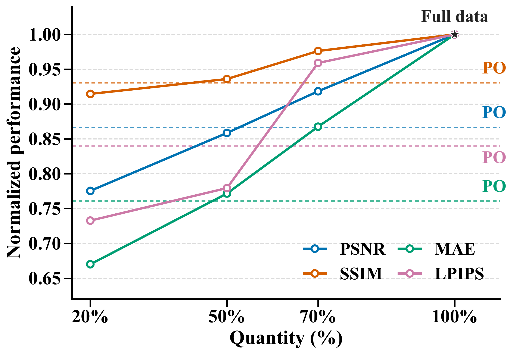</a></figure>
<h3>更多字</h3>
增加文字覆盖与复杂结构
<h3>更多风格</h3>
扩展书体与书法家
<h3>更难的笔法</h3>
连笔、变形与局部细节

Fontify · 20% / 50% / 70% / 100% 数据；归一化后越高越好，虚线为 PO。

Note:
来源：CalliPhase: A Phase-Aware Stroke-Level Dataset for Fine-Grained Chinese Calligraphy Generation；/Users/leizungjyun/Downloads/AuthorKit27-v2/main(15).tex。采用该最新主稿，不沿用旧补充材料的统计。
复用fontify_quantity_normalized_performance_line.pdf，不把归一化曲线称为原始指标或成功率。PSNR/SSIM按完整数据归一化；MAE/LPIPS反向后归一化。主稿按验证集最低loss选checkpoint。图表支持在该实验范围内随着标注量增加性能提升；扩展书体、书法家和难字是未来方向，未承诺具体规模或交付日期。

==

<!-- .slide: data-part="V · 下一步" -->

## 把写字重述为笔的导航

<a class="figure-preview" href="media/diagrams/brush-navigation.svg" role="button" aria-haspopup="dialog">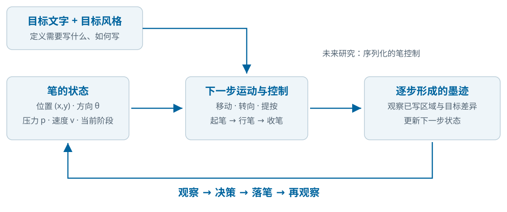</a>

Note:
本报告原创可编辑SVG，明确为未来研究构想。我们希望由输出整字图像走向连续落笔过程：目标字和风格形成约束，笔的状态包括位置方向压力速度，下一步动作更新纸上墨迹，再观察已写内容以修正决策。当前CalliPhase只提供静态阶段形态和位置标注，不测量轨迹或真实压力速度。未来需要考虑状态表示、动作空间以及可获得的监督，不将该概念图当作已有控制系统或机器人演示。

==

<!-- .slide: data-part="V · 下一步" -->

## 从笔法、结体走向章法

<a class="figure-preview" href="media/diagrams/composition.svg" role="button" aria-haspopup="dialog">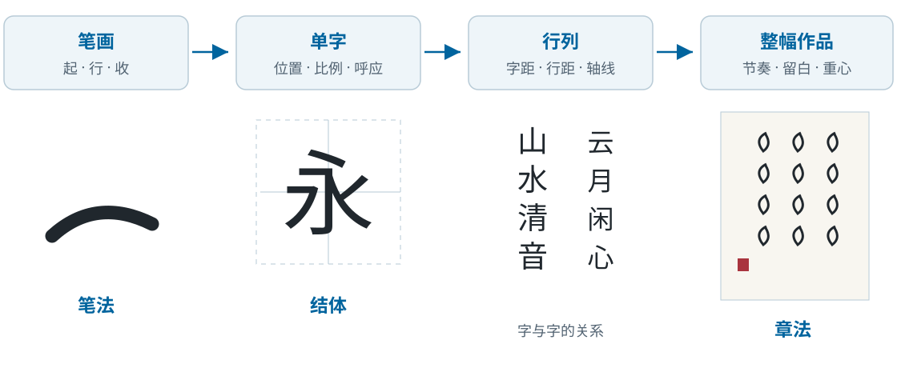</a>
未来工作：让每一笔、每一个字，都服务于整幅作品。

Note:
本报告原创可编辑SVG。前三层逐步从局部阶段、字内结构走向字间和整幅组织。章法包含字距行距、轴线与重心、节奏和留白，画中的墨迹仅为概念示意，不是模型生成结果或历史书法作品。当前数据以单字为主，未来需要面向多字与整幅的材料和标注，让局部生成与整体布局互相约束。

===

<!-- .slide: data-part="VI · 团队" -->
## 团队

<h3>知识产权</h3>

<strong>一项相关专利申请</strong>
一种基于笔法与结体规律的 书法字细粒度标注方法及系统

专利申请已受理 · 202611486408.3

<h3>教师团队与院系基础</h3>
<figure><figcaption>朱祥维</figcaption></figure><figure><figcaption>李颂元</figcaption></figure><figure><figcaption>王腾</figcaption></figure>

Note:
布局、教师照片和院系标识沿用 2026-09-17-single-track 的团队页，仅展示朱祥维、李颂元、王腾。
专利材料为用户提供的《专利申请受理通知书》，原始 PDF 保留于 media/patents/，首页预览位于 media/patents/previews/application-acceptance.png。申请号：202611486408.3；申请日及受理通知日期：2026-09-23；申请人：中山大学；发明人：朱祥维、刘思含、王腾、李颂元、蒙奕名；发明创造名称：一种基于笔法与结体规律的书法字细粒度标注方法及系统。受理通知书不代表专利授权。
