# AI Group Gathering

**Progress · People · Possibilities**

LI Shaun · 2026-09-11

===

# Progress

Papers · Engineering · Funding

===

# Papers

2 accepted · 2 in rebuttal · 2 submitted

===

<!-- .slide: class="paper-slide" -->

Accepted papers

## 宇航学报

### 类脑空间智能导航：从神经机理到空间认知

朱祥维，邓宇鹏，刘祥烁，唐锦荣，翁淇臻，刘格陆，翟春磊，李颂元

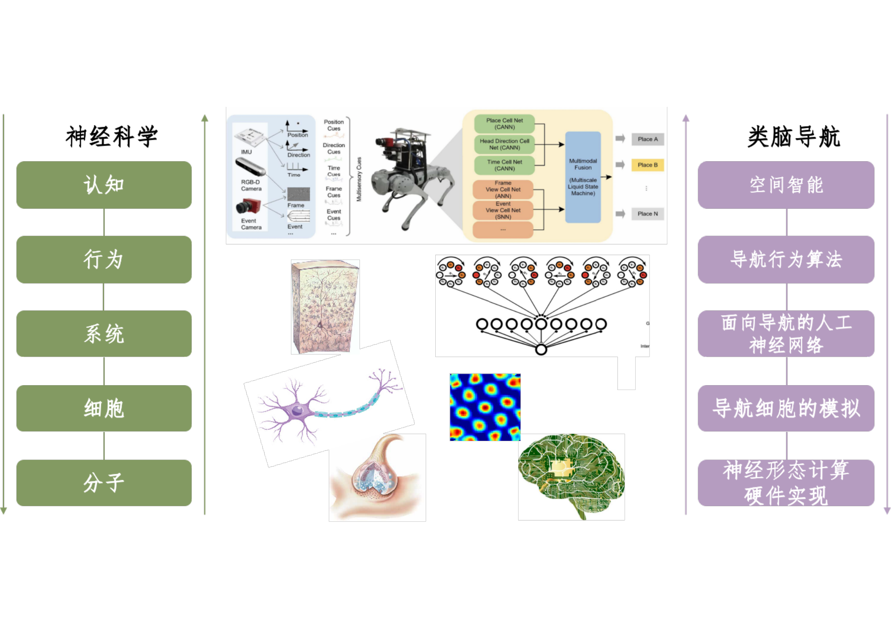

==

<!-- .slide: class="paper-slide" -->

Accepted papers

## INMMiC

### Tunnel Diode-Based Analog Basis-Function Circuits for Nonlinear Function Synthesis

Haoyu Li, Junhan Xie, Jinrong Tang, Jiacheng Peng, Junxiong Liu, Songyuan Li, Teng Wang, Xiangwei Zhu

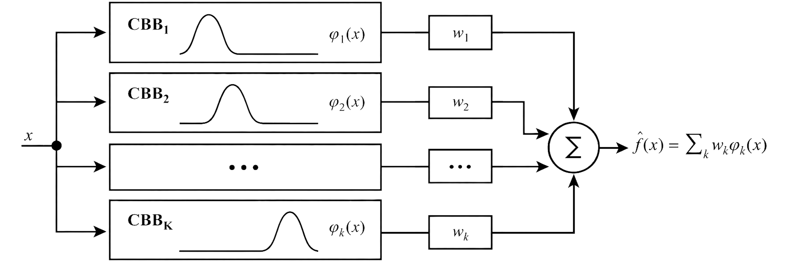

===

<!-- .slide: class="paper-slide" -->

Rebuttal

## NeurIPS'26

### KANalogue: Device-Native Kolmogorov-Arnold Networks for Analogue In-Memory Computing

Songyuan Li, Teng Wang, Jinrong Tang, Ruiqi Liu, Xiangwei Zhu

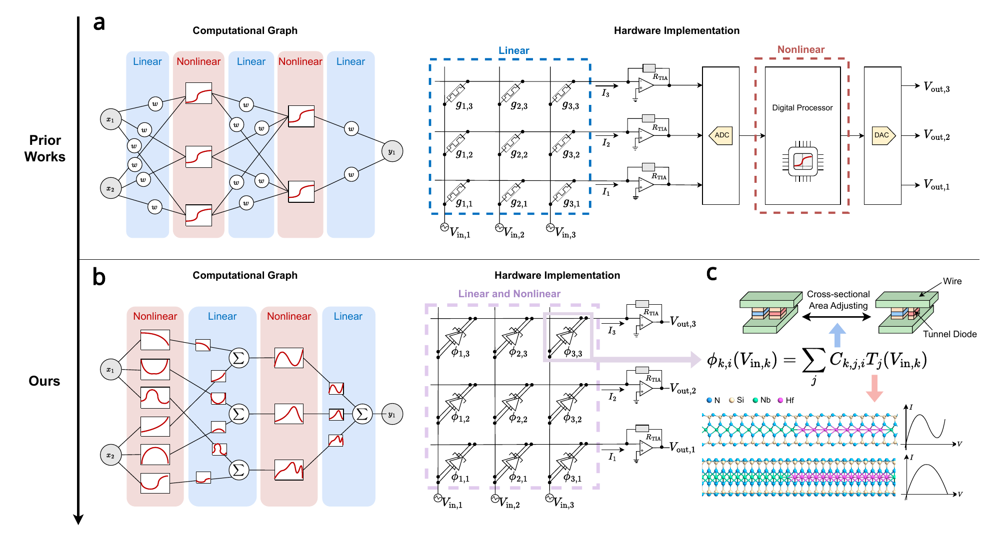

==

<!-- .slide: class="paper-slide" -->

Rebuttal

## NeurIPS'26

### SPIN-UV: A Multimodal Dataset for Unstructured Scene Understanding in Urban Villages

Zirui Zhou, Yan Hao, Yisheng Zheng, Gelu Liu, Jiaxin Lin, Teng Wang, Songyuan Li, Xiangwei Zhu

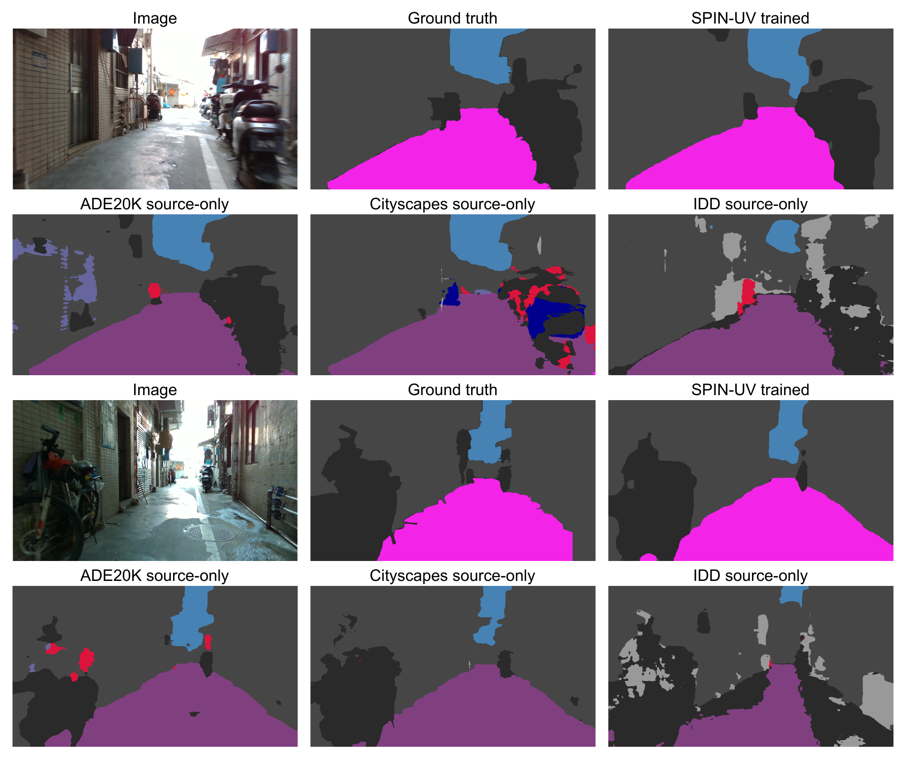

===

<!-- .slide: class="paper-slide" -->

Submitted papers

## AAAI'27

### KELVIN: Physics-Aware Robustness Analysis for Nonlinear Analog Neural Computing

Jinrong Tang, Songyuan Li, Haoyu Li, Teng Wang, Xiangwei Zhu

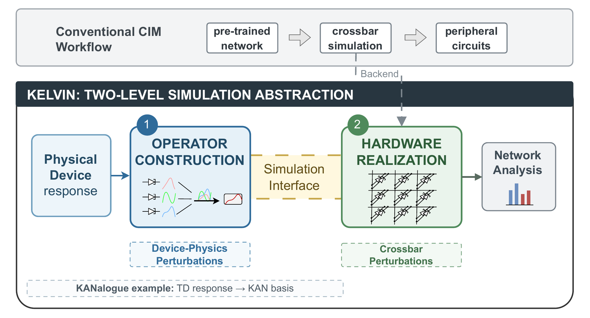

==

<!-- .slide: class="paper-slide" -->

Submitted papers

## AAAI'27

### CalliPhase: A Phase-Aware Stroke-Level Dataset for Fine-Grained Chinese Calligraphy Generation

Sihan Liu, Teng Wang, Yiming Meng, Ying Xu, Xiangwei Zhu, Songyuan Li

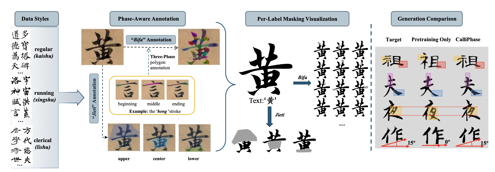

===

<!-- .slide: class="probability-slide" -->
## Probability of at least one acceptance

<i>X</i>n ∼ Binomial(<i>n</i>, <i>p</i>) &nbsp;&nbsp; ⇒ &nbsp;&nbsp; P(<i>X</i>n ≥ 1) = 1 − (1 − <i>p</i>)<i>n</i>

<iframe id="acceptance-chart" src="acceptance-chart.html" title="Interactive acceptance probability chart" loading="eager"></iframe>

===

# Engineering

==

<!-- .slide: class="media-slide" -->
## Single-Track

CycleX: Cross-platform demonstration

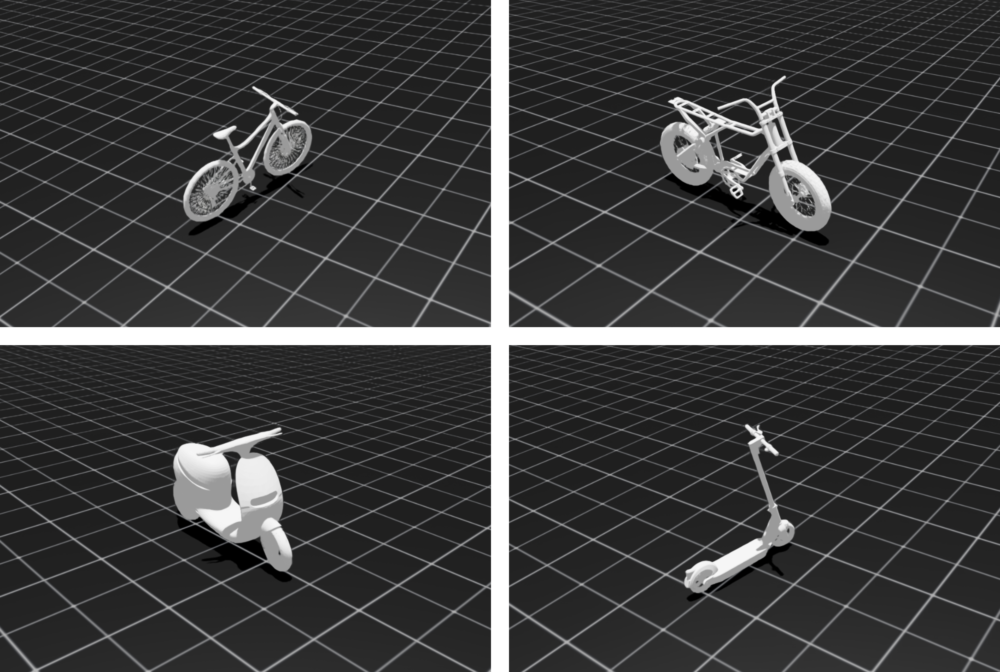

==

<!-- .slide: class="media-slide" -->
## Bingo

All-in-one workflow demonstration

<video controls autoplay data-autoplay loop muted playsinline preload="metadata" poster="videos/bingo-workflow-browser.jpg" aria-label="Bingo: All-in-one workflow demonstration"><source src="videos/bingo-workflow-browser.mp4" type="video/mp4"></video>

==

<!-- .slide: class="media-slide" -->
## Neuro

<video controls autoplay data-autoplay loop muted playsinline preload="metadata" poster="videos/neuro-car-browser.jpg" aria-label="Neuro: Robotic car demonstration"><source src="videos/neuro-car-browser.mp4" type="video/mp4"></video>

==

<!-- .slide: class="media-slide" -->
## CalliPhase

==

<!-- .slide: class="smartrat-slide" -->
## Smart rat

<figure>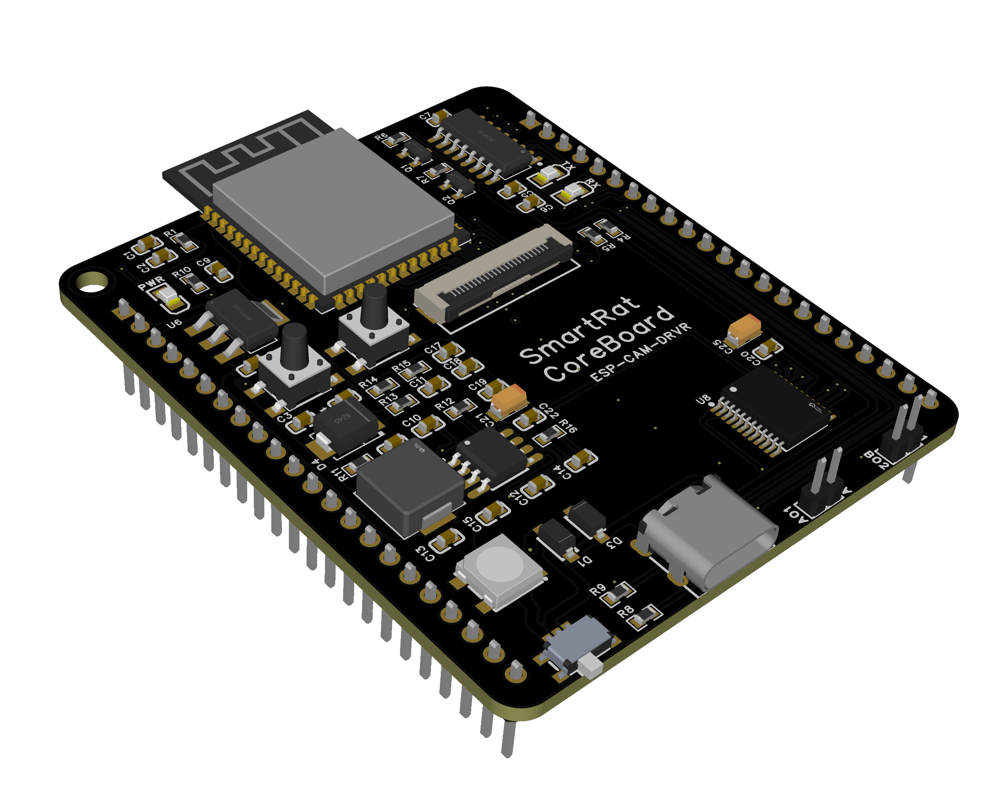<figcaption>Front</figcaption></figure>
<figure>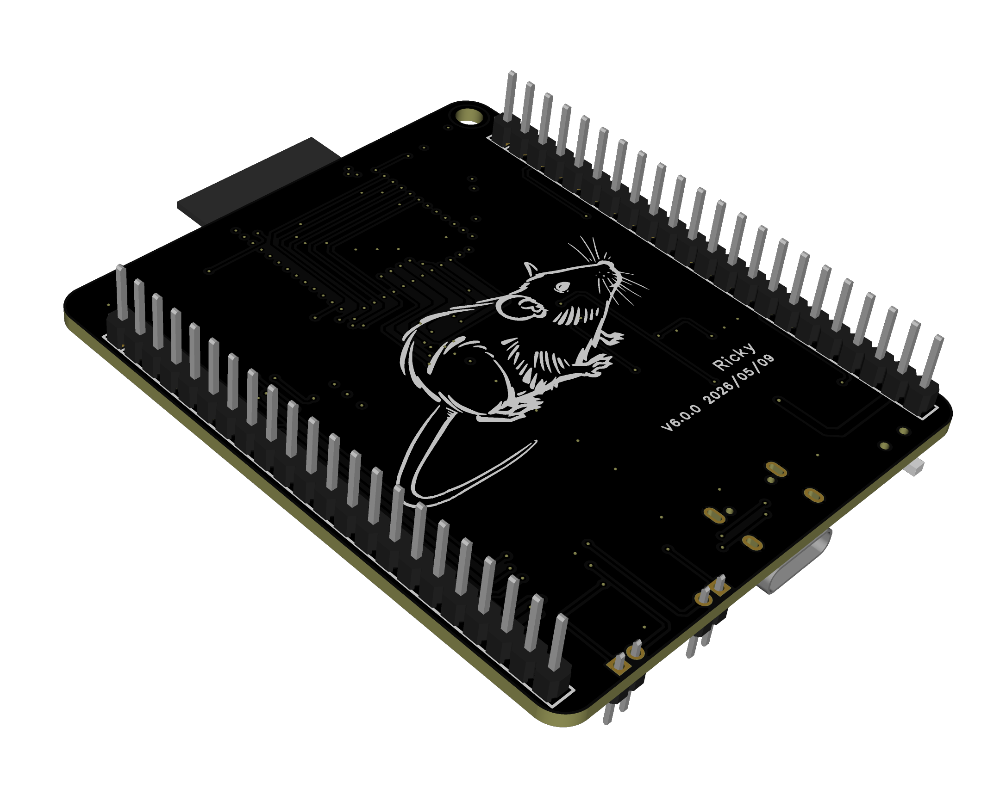<figcaption>Rear</figcaption></figure>
<figure>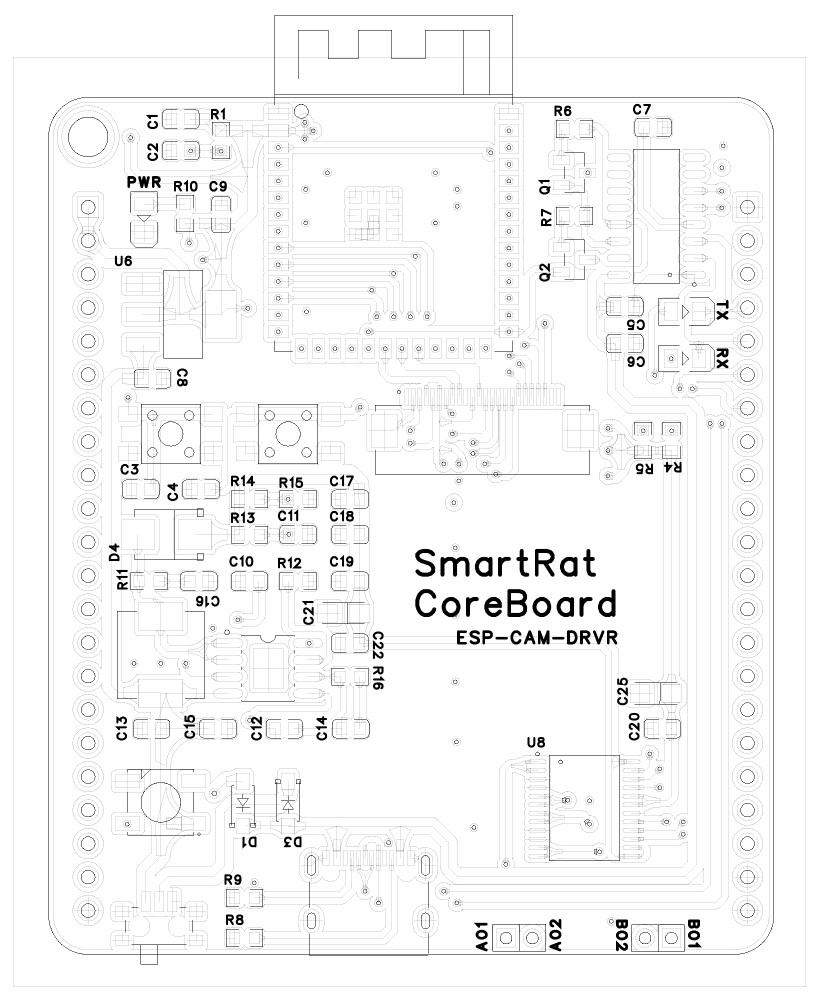<figcaption>Front layout</figcaption></figure>
<figure>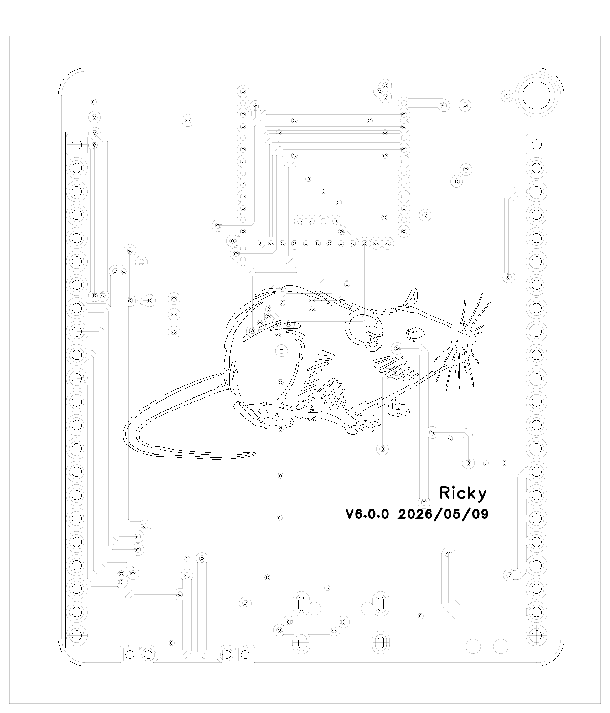<figcaption>Rear layout</figcaption></figure>

==

<!-- .slide: class="media-slide" -->
## JK

Satellite state estimation

<video controls autoplay data-autoplay loop muted playsinline preload="metadata" poster="videos/jk-demo-browser.jpg" aria-label="JK: Satellite state estimation"><source src="videos/jk-demo-browser.mp4" type="video/mp4"></video>

===

<!-- .slide: class="funding-slide" -->
## New research funding

RMB 5.80 million

| Funding source | Amount (RMB million) |
| :--- | ---: |
| Research start-up funding | 3.00 |
| NSFC General Program | 0.50 |
| Three industry-sponsored Single-Track projects | 2.30 |

==

## Research development cycle

<svg class="cycle" viewBox="0 0 1000 470" role="img" aria-label="Start with funding, then faculty, students, devices and materials, then papers and works, then renewed funding">
<defs><marker id="arrow" markerWidth="10" markerHeight="10" refX="8" refY="5" orient="auto"><path d="M0,0 L10,5 L0,10" fill="#42affa"/></marker></defs>
<g fill="none" stroke="#42affa" stroke-width="4" marker-end="url(#arrow)"><path d="M340 85 H650"/><path d="M795 140 V365 H655"/><path d="M345 365 H195 V150"/></g>
<rect x="65" y="25" width="260" height="120" rx="14" fill="#253944" stroke="#ffbf69" stroke-width="3"/>
<text x="195" y="55" fill="#ffbf69" font-family="sans-serif" text-anchor="middle" font-size="21" font-weight="bold">START HERE</text>
<g fill="#fff" font-family="sans-serif" text-anchor="middle"><text x="195" y="100" font-size="38">Funding</text><text x="790" y="76" font-size="29">Faculty / Students /</text><text x="790" y="117" font-size="29">Devices / Materials</text><text x="500" y="380" font-size="38">Papers / Works</text></g>
</svg>

==

<!-- .slide: class="timeline-slide" -->
## Single-Track timeline

<svg class="milestone-timeline photo-timeline" viewBox="0 0 1200 550" role="img" aria-label="Single-Track timeline">
<defs><marker id="single-track-arrow" markerWidth="8" markerHeight="8" refX="7" refY="4" orient="auto"><path d="M0 0 L8 4 L0 8 Z" fill="#42affa"/></marker></defs>
<path d="M50 270 H1160" fill="none" stroke="#42affa" stroke-width="3" marker-end="url(#single-track-arrow)"/>
<path d="M85 270 V240" stroke="#657788" stroke-width="2"/>
<circle cx="85" cy="270" r="8" fill="#42affa"/>
<text x="85" y="184" text-anchor="middle" fill="#ffbf69" font-size="25" font-weight="600">2024.04</text>
<text x="85" y="218" text-anchor="middle" fill="#fff" font-size="23">Initial Idea</text>
<a href="images/Prototype.png" target="_blank"><image href="images/Prototype.png" x="111.714" y="390" width="238" height="150" preserveAspectRatio="xMidYMid meet"><title>Assisted-Wheel Prototype — open image</title></image></a>
<path d="M230.714 270 V290" stroke="#657788" stroke-width="2"/>
<circle cx="230.714" cy="270" r="8" fill="#42affa"/>
<text x="230.714" y="315" text-anchor="middle" fill="#ffbf69" font-size="25" font-weight="600">2025.02</text>
<text x="230.714" y="349" text-anchor="middle" fill="#fff" font-size="23">Assisted-Wheel</text>
<text x="230.714" y="378" text-anchor="middle" fill="#fff" font-size="23">Prototype</text>
<a href="images/1-min.jpg" target="_blank"><image href="images/1-min.jpg" x="257.429" y="10" width="238" height="150" preserveAspectRatio="xMidYMid meet"><title>One-Minute Balance — open image</title></image></a>
<path d="M376.429 270 V240" stroke="#657788" stroke-width="2"/>
<circle cx="376.429" cy="270" r="8" fill="#42affa"/>
<text x="376.429" y="184" text-anchor="middle" fill="#ffbf69" font-size="25" font-weight="600">2025.05</text>
<text x="376.429" y="218" text-anchor="middle" fill="#fff" font-size="23">One-Minute</text>
<text x="376.429" y="247" text-anchor="middle" fill="#fff" font-size="23">Balance</text>
<a href="images/100%25.jpg" target="_blank"><image href="images/100%25.jpg" x="403.143" y="390" width="238" height="150" preserveAspectRatio="xMidYMid meet"><title>100% Balance — open image</title></image></a>
<path d="M522.143 270 V290" stroke="#657788" stroke-width="2"/>
<circle cx="522.143" cy="270" r="8" fill="#42affa"/>
<text x="522.143" y="315" text-anchor="middle" fill="#ffbf69" font-size="25" font-weight="600">2025.08</text>
<text x="522.143" y="349" text-anchor="middle" fill="#fff" font-size="23">100% Balance</text>
<a href="images/lcc.jpg" target="_blank"><image href="images/lcc.jpg" x="548.857" y="10" width="238" height="150" preserveAspectRatio="xMidYMid meet"><title>LCC — open image</title></image></a>
<path d="M667.857 270 V240" stroke="#657788" stroke-width="2"/>
<circle cx="667.857" cy="270" r="8" fill="#42affa"/>
<text x="667.857" y="184" text-anchor="middle" fill="#ffbf69" font-size="25" font-weight="600">2025.11</text>
<text x="667.857" y="218" text-anchor="middle" fill="#fff" font-size="23">LCC</text>
<a href="images/offroad.jpg" target="_blank"><image href="images/offroad.jpg" x="694.571" y="390" width="238" height="150" preserveAspectRatio="xMidYMid meet"><title>Off-Road — open image</title></image></a>
<path d="M813.571 270 V290" stroke="#657788" stroke-width="2"/>
<circle cx="813.571" cy="270" r="8" fill="#42affa"/>
<text x="813.571" y="315" text-anchor="middle" fill="#ffbf69" font-size="25" font-weight="600">2026.01</text>
<text x="813.571" y="349" text-anchor="middle" fill="#fff" font-size="23">Off-Road</text>
<a href="images/e-motor.jpg" target="_blank"><image href="images/e-motor.jpg" x="840.286" y="10" width="238" height="150" preserveAspectRatio="xMidYMid meet"><title>E-Motorcycle — open image</title></image></a>
<path d="M959.286 270 V240" stroke="#657788" stroke-width="2"/>
<circle cx="959.286" cy="270" r="8" fill="#42affa"/>
<text x="959.286" y="184" text-anchor="middle" fill="#ffbf69" font-size="25" font-weight="600">2026.04</text>
<text x="959.286" y="218" text-anchor="middle" fill="#fff" font-size="23">E-Motorcycle</text>
<path d="M1105 270 V290" stroke="#657788" stroke-width="2"/>
<circle cx="1105" cy="270" r="8" fill="#42affa"/>
<text x="1105" y="315" text-anchor="middle" fill="#ffbf69" font-size="25" font-weight="600">2026.08</text>
<text x="1105" y="349" text-anchor="middle" fill="#fff" font-size="23">Sponsorship</text>
</svg>

==

<!-- .slide: class="timeline-slide" -->
## AIMC timeline

<svg class="milestone-timeline photo-timeline" viewBox="0 0 1200 550" role="img" aria-label="AIMC timeline">
<defs><marker id="aimc-arrow" markerWidth="8" markerHeight="8" refX="7" refY="4" orient="auto"><path d="M0 0 L8 4 L0 8 Z" fill="#42affa"/></marker></defs>
<path d="M50 335 H1160" fill="none" stroke="#42affa" stroke-width="3" marker-end="url(#aimc-arrow)"/>
<path d="M100 335 V355" stroke="#657788" stroke-width="2"/>
<circle cx="100" cy="335" r="8" fill="#42affa"/>
<text x="100" y="385" text-anchor="middle" fill="#ffbf69" font-size="25" font-weight="600">2024.10</text>
<text x="100" y="419" text-anchor="middle" fill="#fff" font-size="23">Initial Idea</text>
<a href="images/KANalogue-teaser.png" target="_blank"><image href="images/KANalogue-teaser.png" x="280" y="55" width="280" height="245" preserveAspectRatio="xMidYMid meet"><title>arXiv Preprint — open image</title></image></a>
<path d="M420 335 V355" stroke="#657788" stroke-width="2"/>
<circle cx="420" cy="335" r="8" fill="#42affa"/>
<text x="420" y="385" text-anchor="middle" fill="#ffbf69" font-size="25" font-weight="600">2025.12</text>
<text x="420" y="419" text-anchor="middle" fill="#fff" font-size="23">arXiv Preprint</text>
<a href="images/pcb-validation.jpg" target="_blank"><image href="images/pcb-validation.jpg" x="600" y="55" width="280" height="245" preserveAspectRatio="xMidYMid meet"><title>PCB Validation — open image</title></image></a>
<path d="M740 335 V355" stroke="#657788" stroke-width="2"/>
<circle cx="740" cy="335" r="8" fill="#42affa"/>
<text x="740" y="385" text-anchor="middle" fill="#ffbf69" font-size="25" font-weight="600">2026.02</text>
<text x="740" y="419" text-anchor="middle" fill="#fff" font-size="23">PCB Validation</text>
<a href="images/nsfc-approval.jpg" target="_blank"><image href="images/nsfc-approval.jpg" x="910" y="55" width="280" height="245" preserveAspectRatio="xMidYMid meet"><title>NSFC Funding — open image</title></image></a>
<path d="M1060 335 V355" stroke="#657788" stroke-width="2"/>
<circle cx="1060" cy="335" r="8" fill="#42affa"/>
<text x="1060" y="385" text-anchor="middle" fill="#ffbf69" font-size="25" font-weight="600">2026.08</text>
<text x="1060" y="419" text-anchor="middle" fill="#fff" font-size="23">NSFC Funding</text>
</svg>

===

# People

Students · Faculty 

===

# Student teams

Single-Track · Neuro · AutoFocus · Smart rat · Calli

Bingo · Drone

==

## Single-Track

### Graduate students

刘格陆、吴至杰、李浩宇、伍俊亮、朱钊烨、黄成健

### Undergraduate students

陆梦贤、周子睿、颜昊、郑轶晟、林嘉欣、屈子央、王思佳

==

## Neuro

### Graduate students

李浩宇、唐锦荣、伍俊亮、谢俊涵、黄培轩

### Undergraduate students

刘睿淇、王艺桐、蒙奕名、胡雨轩、赵方正、何梓彬、彭嘉诚、刘骏雄

==

## Neuro - AutoFocus

### Undergraduate student

李宣颐

==

## Smart rat

### Undergraduate students

刘睿淇、王诗琦、冯愿臻、杨雨濛

== 

## Calli

### Graduate student

刘思含

### Undergraduate student

蒙奕名

==

## Bingo

### Graduate students

邓宇鹏、纪智文、刘祥烁 with **an unknown girl**

### Undergraduate students

刘天骄、刘国栋、何至湛、陈泽棠、徐进

==
## Drone

### Graduate student

李钢

### Undergraduate students

徐一鸣、黄建涌

===

## Faculty

| Faculty | Research areas |
| :--- | :--- |
| 李颂元 | Brain-inspired computing; Single-Track |
| 王腾 |  Single-Track ; Brain-inspired computing |
| 翟春磊 | Drones; Bingo; Single-Track |

==

<!-- .slide: class="ra-slide" -->

Research assistant

<h1>史航</h1>

==

<!-- .slide: class="suat-slide" -->
## Shenzhen University of Advanced Technology

### Faculty of Computility Microelectronics

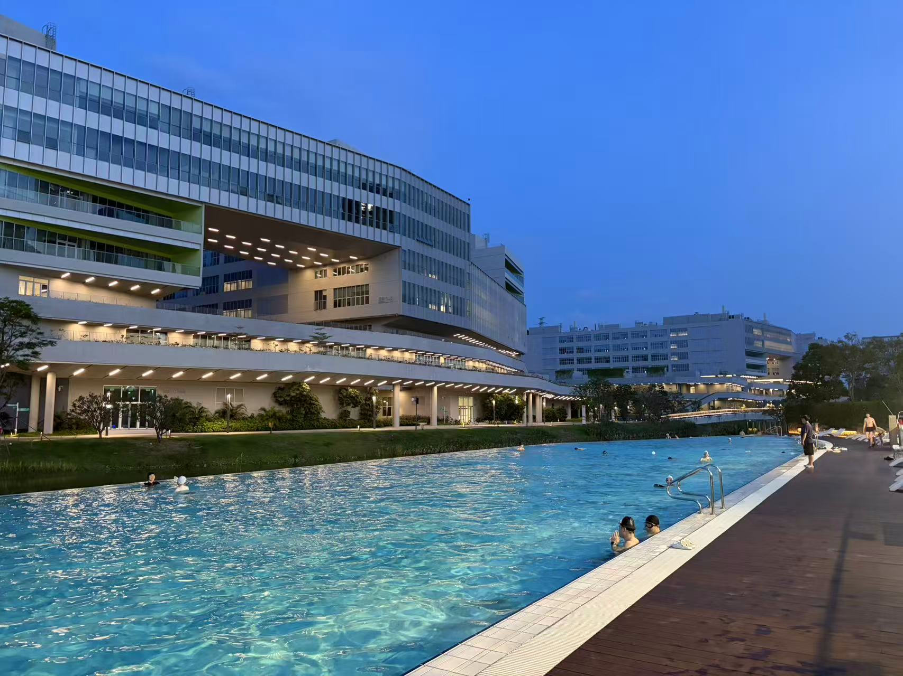

<a class="university-link" href="https://www.suat-sz.edu.cn/" target="_blank" rel="noopener noreferrer">SUAT official website ↗</a>

Note:
School name is a working translation of the source. Institutional details were not supplied; introduce them verbally or add approved material.

===

# Possibilities

Research ideas · Project milestones · Group gatherings

==

## Research possibilities

| Project | Possible directions |
| :--- | :--- |
| Single-Track | Self-balancing and autonomous navigation |
| Neuro | NE, Autofocus, Commercialization |
| Calli | CVPR, ICCV |
| Smart rat | Directions to explore |
| Bingo | Directions to explore |
| Drone | Directions to explore |

==

<!-- .slide: class="research-slide two-column-slide" -->
## Single-Track possibilities

Research ideas to explore

<h3>Self-balancing L0–L2</h3><ul><li>Stationary balance</li><li>High-speed operation</li><li>Generalization</li><li>Robustness</li></ul>

<h3>Autonomous navigation L3</h3><ul><li>Localization and mapping</li><li>Global route planning</li><li>Local obstacle avoidance</li><li>Visual goal navigation</li></ul>

Note:
Possible ideas, using the group's L0–L2 / L3 distinction. Navigation topics draw on review_full.pdf, §7, and cover localization, environment representation, planning and goal-directed visual navigation.

==

<!-- .slide: class="research-slide brain-research-slide two-column-slide" -->
## Brain-inspired possibilities

Research ideas to explore

<h3>Computing hardware</h3><ul><li>Scaling up using SiP</li><li>CNN-like AIMC</li></ul>

<h3>Applications</h3><ul><li>High-speed autofocus</li><li>Commercialization</li></ul>

==

## Next project milestones

Project acceptance: JK · Bingo

==

<!-- .slide: class="gatherings-slide two-column-slide" -->
## Regular group gatherings

<h3>Group lessons</h3>
For beginner students

<h3>Team workshops</h3>
For each research direction

===

<!-- .slide: class="ending-slide" data-state="image-ending" -->

