<!-- .slide: class="cover" -->

NEURO GROUP · 23 SEPTEMBER 2026

# Neuro Group Opening Keynote

Toward low-latency, low-power intelligence

LI Shaun

Note:
The brief leaves the title TBD; retain its working title and use a descriptive subtitle for this opening section. Speaker, date, language, and white theme follow docs/brief.md. The reference deck is collections/external-presentations/2026-09-15-neuro (the user called it 2016-09-15-neuro).

===

<!-- .slide: class="strategic-slide" -->
## AI is the main arena of U.S.–China competition

<h3 class="pillars-heading">Three pillars of AI</h3><a class="figure-link" href="https://hai.stanford.edu/ai-index/2026-ai-index-report" target="_blank" rel="noopener" aria-label="Source: Stanford AI Index 2026">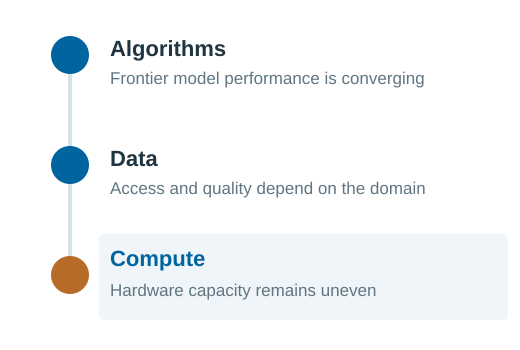</a>
Source: <a href="https://hai.stanford.edu/ai-index/2026-ai-index-report" target="_blank" rel="noopener">Stanford AI Index 2026</a>

<h3>Share of tracked AI-supercomputer performance</h3><a class="figure-link" href="https://arxiv.org/abs/2504.16026" target="_blank" rel="noopener" aria-label="Source: Trends in AI Supercomputers (2025)">

United States
<i class="flag-bar flag-us" style="width:75%"></i><b>~75%</b>

China
<i class="flag-bar flag-china" style="width:15%"></i><b>~15%</b>

Other
<i class="flag-bar flag-other" style="width:10%"></i><b>~10%</b>

025%50%75%100%

</a>
Source: <a href="https://arxiv.org/abs/2504.16026" target="_blank" rel="noopener">Pilz et al., Trends in AI Supercomputers (2025)</a>

<b>United States · ~75%</b>roughly 5× China’s tracked performance<b>China · ~15%</b>

Note:
The brief frames AI as the main arena of U.S.–China competition; the heading states that framing as the brief gives it. It is a strategic claim, not a measurable ranking of all geopolitical arenas. The flags identify the two actors in the comparison; they are the official national flags, not a claim about government involvement in any particular system or company. The bars themselves use a muted blue and a muted brick red rather than either flag's own field colours, so that the chart reads as a chart and the flags stay labels. The three pillars are a conceptual diagram, not quantitative scores. Stanford's 2026 report describes converging model performance; this is not evidence that algorithms or training data are identical or equally accessible. Public information does not establish aggregate data parity.
The right chart redraws the approximate geographic shares reported by Pilz, Sanders, Rahman and Heim, Trends in AI Supercomputers, arXiv:2504.16026v2 (23 April 2025): United States ~75%, China ~15%; other ~10% is the remainder. These are shares of the study's tracked performance, not shares of all chips or all national compute in September 2026. The dataset covers 500 systems over 2019–2025; the paper discusses incomplete coverage and uncertainties in Chinese-system data. The comparison is roughly five to one within that dataset. Do not substitute TOP500 system counts or private investment for AI compute capacity.

==

<!-- .slide: class="compute-slide supercomputer-slide" -->
## AI supercomputers are scaling faster than Moore’s law

<a href="https://computerhistory.org/profile/gordon-moore/" target="_blank" rel="noopener" aria-label="Gordon Moore profile source">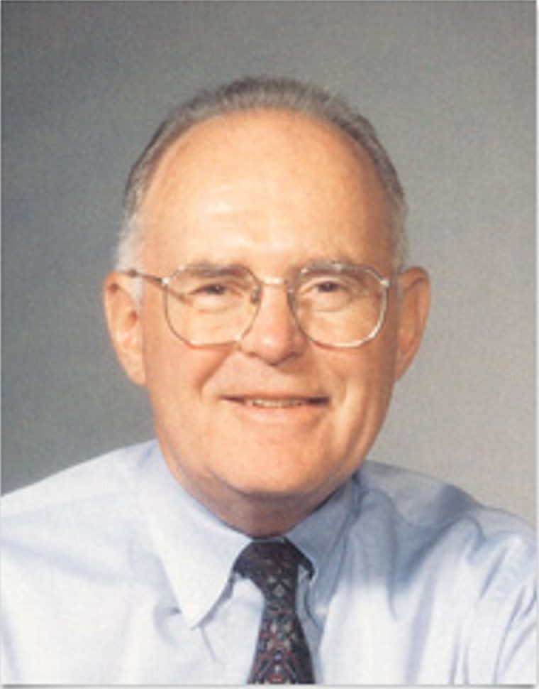</a>
<h3>Gordon Moore</h3>
Fairchild R&amp;D · 1965 Later, Intel co-founder

<a class="law-source" href="https://download.intel.com/newsroom/2023/manufacturing/moores-law-electronics.pdf" target="_blank" rel="noopener" aria-label="Source: Moore, Electronics (1965)">
2× per year

Components per integrated circuit at minimum cost per component.
</a>
Source: <a href="https://download.intel.com/newsroom/2023/manufacturing/moores-law-electronics.pdf" target="_blank" rel="noopener">Moore, Electronics (1965)</a>

<h3>Leading systems · 2019–2025</h3><a class="pp-link" href="https://epoch.ai/publications/trends-in-ai-supercomputers" target="_blank" rel="noopener" aria-label="Source: Epoch AI, Trends in AI Supercomputers (2025)">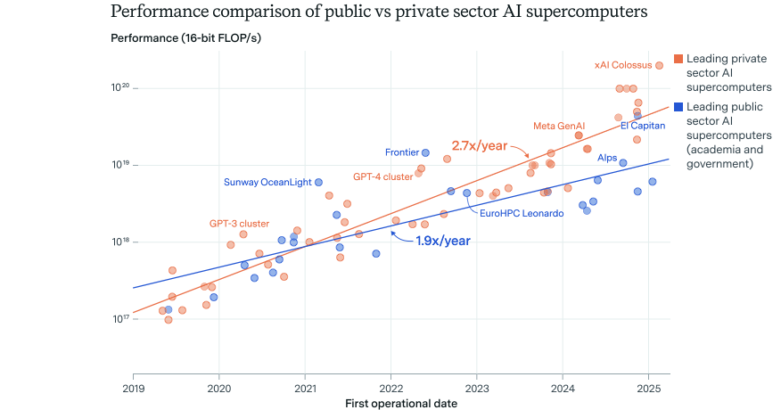</a>
Source: <a href="https://epoch.ai/publications/trends-in-ai-supercomputers" target="_blank" rel="noopener">Epoch AI, Trends in AI Supercomputers (2025)</a>

Leading systems grew <strong>2.5× per year — doubling every 9 months.</strong>

Note:
Start with the hardware supply side. The left column gives Moore's original 1965 benchmark; the right shows the measured growth of leading AI supercomputers. Moore's original observation was roughly annual component-count doubling at minimum cost, while the later formulation commonly uses two years. Neither is a direct law of system performance. The slide uses the benchmark as historical context, not as a like-for-like metric.
The figure is reused as supplied from the Epoch AI study cited on it: performance of leading AI supercomputers owned by industry against those owned by government and academia, 2019 to 2025, in 16-bit FLOP/s. Industry systems grew 2.7× per year (90% CI 2.5–2.9) and public systems 1.9× per year (90% CI 1.6–2.2); the study excludes systems funded by both sectors. The study's headline rate for the leading ten systems is 2.5× per year, a doubling every nine months, driven in roughly equal parts by 1.6× per year more chips and 1.6× per year better chips. The largest public system, El Capitan, is now about 22% of the largest industry system. State the caveats if asked: the trend is a regression on the leading systems in a dataset of about 500 machines, roughly 10–20% of all AI supercomputers, so it is not the growth rate of global compute capacity, not a forecast, and not a TOP500 comparison. Because both lines are fits, the crossing point is approximate. Clicking the figure opens the PDF as supplied. The 2.7× and 1.9× rates are labelled inside the figure itself, so the slide does not repeat them in the figure area: the takeaway states the study's headline rate for the leading ten systems, 2.5× per year, which is not the slope of either fitted line.

==

<!-- .slide: class="compute-slide training-compute-slide" -->
## Model-training demand is rising faster still

<h3>Gordon Moore</h3>
Fairchild R&amp;D · 1965 Later, Intel co-founder

<a class="law-source" href="https://download.intel.com/newsroom/2023/manufacturing/moores-law-electronics.pdf" target="_blank" rel="noopener" aria-label="Source: Moore, Electronics (1965)">
2× per year

Components per integrated circuit at minimum cost per component.
</a>
Source: <a href="https://download.intel.com/newsroom/2023/manufacturing/moores-law-electronics.pdf" target="_blank" rel="noopener">Moore, Electronics (1965)</a>

<h3>Compute used across model generations</h3>

<a class="chart-source" href="https://epoch.ai/data/ai-models" target="_blank" rel="noopener" aria-label="Source: Epoch AI model database">↗</a>

Source: <a href="https://epoch.ai/data/ai-models" target="_blank" rel="noopener">Epoch AI model database</a> · trend lines: <a href="media/imgs/computing-demands.pdf" target="_blank" rel="noopener">supplied reference</a>

<label for="model-select">Inspect model</label><select id="model-select" aria-label="Select a model"></select>

The widening gap makes computing efficiency a first-class constraint.

Note:
Now move from hardware supply to model demand. Even as leading systems scale quickly, the historical training-compute trajectory rises more steeply. This comparison motivates efficient computing; it does not claim that transistor count, system throughput, and training workload are identical measures.
The supplied computing-demands.pdf establishes the chart's historical scope and visual idea. The interactive reconstruction uses independently tabulated Epoch AI training-compute estimates, not pixels digitized from the supplied figure. Dates, estimates, model references, and estimation notes are stored locally in media/data/training-compute.json. Estimates may differ from the reference figure. Training compute is total floating-point operations; 1 PFLOP-day = 8.64e19 FLOP. This is a workload, not a hardware throughput unit. Every point is labelled; hover or use the selector to read a value and open the model paper. The chart is a selected historical sample, not a fitted scaling law or complete model inventory.
Three era trend lines are transcribed from the supplied figure. The flat one is Moore's law, a doubling every two years, spanning about 1986 to 2012. The second covers the deep-learning era at a doubling every 3.4 months, the rate that figure labels and the same rate OpenAI published in 2018 for 2012–2018. The third covers frontier models from 2019 onward. In the supplied figure that line is printed with a two-month label, but the line as drawn there doubles about every 3.5 months, and this deck's selected points show a similar order of growth from BERT-Large to Gemini Ultra. The two-month figure describes the GPT-2 to GPT-3 step alone. Because all three lines are annotations rather than fits to the plotted data, do not quote them as measurements of this dataset or as hardware-throughput trends.

==

<!-- .slide: class="throughput-slide" -->
## Throughput is only half the story

<h3>Frontier AI supercomputers</h3><a class="figure-link visual-frame" href="https://media.x.ai/cdn-cgi/image/fit=scale-down,onerror=redirect,width=2560,f=auto/v1/website/colossussite2-aac5dac3.jpg" target="_blank" rel="noopener" aria-label="Source: xAI Colossus image">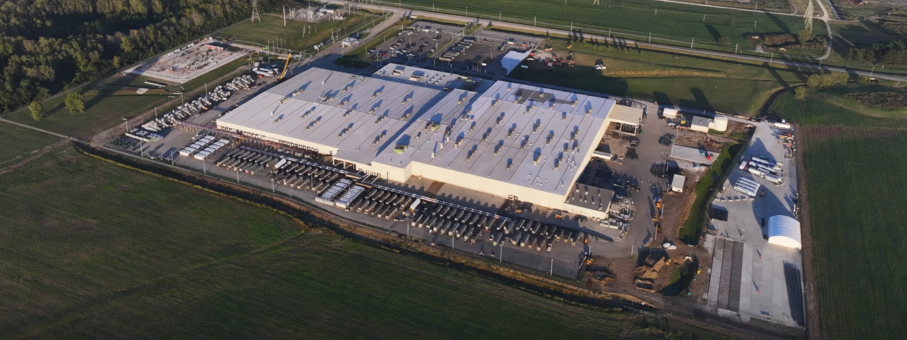</a>
<strong>200 000</strong>NVIDIA H100/H200 GPUs · March 2025

How much work can we finish?

<h3>Intelligence in a feedback loop</h3>
<a href="https://commons.wikimedia.org/wiki/File:Canon_R6_und_RF_85_2%2C0-8065.jpg" target="_blank" rel="noopener" aria-label="Source for consumer camera photo">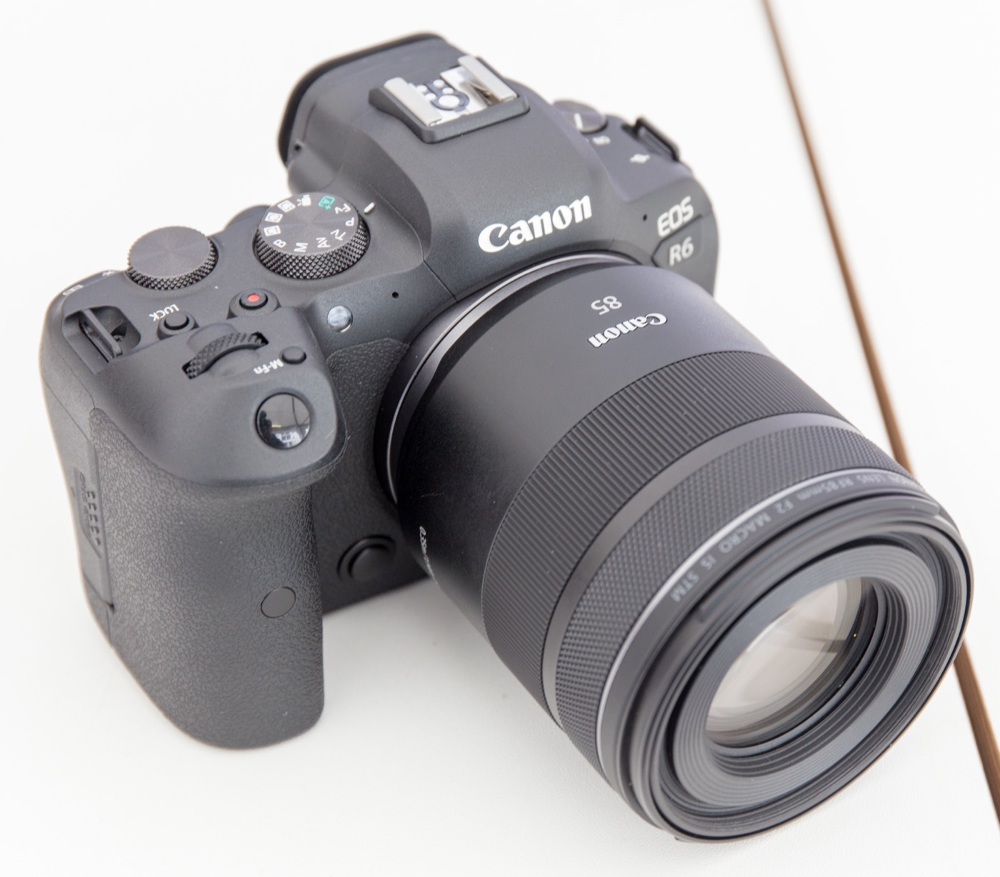</a>

<strong>Demand</strong>Continuous, low-latency autofocus

How soon can we respond?

A fast batch does not guarantee a timely action.

Note:
The left example is xAI's Colossus in Memphis, the leading system in the Epoch AI study as of March 2025: 200,000 NVIDIA H100 and H200 accelerators, an estimated 300 MW of power, about 7 billion US dollars of hardware, and more than 50 times the performance of Summit, the leading system in 2019. The 200,000 figure counts AI chips in the system, not cabinets, nodes or concurrent jobs. It is the top of the scale as of that study, not a claim about which system leads in September 2026, and not a claim about one vendor. The photograph is downloaded from the xAI media URL supplied for this revision; clicking it opens that original.
For edge control, the relevant path includes sensing, preprocessing, inference, communication and actuation. Batching may improve throughput while adding waiting time. Measure the full loop and latency distribution, not just a best-case accelerator kernel. The right column shows two instances of the same always-on perception task, both taken from the reference deck: a consumer camera, where focus must follow a moving subject, and a speed-enforcement camera on the Yeongdong Expressway in South Korea, where a fast-moving vehicle has to be captured legibly in a short window. Neither photo is a measurement of camera performance. Credits: consumer camera by GodeNehler; expressway camera by Jhcbs1019. Both are CC BY-SA 4.0 via Wikimedia Commons, reused here at reduced resolution; each photo links to its source without a visible on-slide credit. The slide compares optimization objectives — peak throughput against end-to-end latency — and does not claim that supercomputers are unusable for latency-sensitive work.

==

## Intelligence must fit a resource budget

<h3>V4.1 Flash · CNY per million tokens</h3><table class="pricing-table"><thead><tr><th>Billing item</th><th class="peak"><strong>梁文峰</strong>09:00–12:00 14:00–18:00</th><th><strong>梁文谷</strong>all other hours</th></tr></thead><tbody><tr><td>Input cache hit</td><td class="peak">0.04</td><td>0.02</td></tr><tr><td>Input cache miss</td><td class="peak">2</td><td>1</td></tr><tr><td>Output</td><td class="peak">8</td><td>4</td></tr></tbody></table>
Same model, same tokens — <strong>2×</strong> at peak hours.

<h3>At the edge, the budget is local</h3>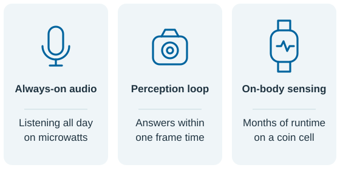
Fast · local · energy-aware

Energy is priced at every scale — from peak-hour service to the edge device.

Note:
The V4.1 Flash prices are supplied for this revision. 梁文峰 is the peak column and now prints first; its window is on the slide as 09:00–12:00 and 14:00–18:00, and 梁文谷 covers all other hours. Peak prices are twice the corresponding off-peak prices in all three rows: cache-hit input, cache-miss input and output. The table illustrates demand-sensitive pricing — the same model at the same token count costs twice as much in the busy window — which is how a service at this scale passes on the cost of the capacity and energy behind it. It does not establish the provider's underlying energy use or capacity constraints, and the price ratio is not presented as a measured energy ratio. The visible source line was removed at the speaker's request; provenance is recorded here and in docs/evidence/sources.md. Confirm the product, currency and effective date before public distribution.
The right illustration names three edge settings by the constraint that binds each rather than by product category: always-on audio, where standby power dominates; a perception loop, where the binding cost is per-frame latency; and on-body sensing, where the budget is the total energy drawn over months. The three lines — on microwatts, within one frame time, months on a coin cell — describe the design target for each class, not a measurement of our prototype or of any named product, and the three classes are not exhaustive: many edge systems sit in more than one. The slide's claim is only that the budget is local, so the constraint is visible at design time.

==

## Moving data costs energy and time

<h3>The von Neumann bottleneck</h3>
<a class="figure-link" href="https://commons.wikimedia.org/wiki/File:JohnvonNeumann-LosAlamos.gif" target="_blank" rel="noopener" aria-label="Source: John von Neumann, Los Alamos identification photograph (Wikimedia Commons)">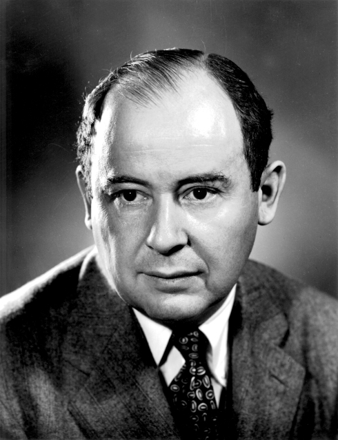</a>
John von Neumann, 1903–1957. The stored-program organization still carries his name.

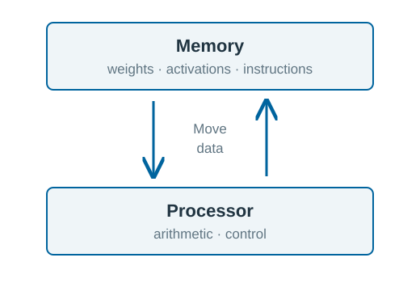

<h3>A modern example: GeForce RTX 5090</h3>
Source: <a href="https://www.nvidia.com/en-us/geforce/graphics-cards/50-series/rtx-5090/" target="_blank" rel="noopener">NVIDIA GeForce RTX 5090 specifications</a>

Is the general-purpose von Neumann architecture the best fit for AI-specific applications?

Note:
The brief's “GTX 5090” is corrected to the product name GeForce RTX 5090. NVIDIA lists 32 GB GDDR7. The left diagram is the von Neumann organization drawn in the same block language as the next slide's comparison: memory above, the processor below, and the narrow path between them that every weight, activation and instruction has to take. Input and output sit on the processor row because that is where data enters and leaves the machine; they are drawn on the same path as everything else. The portrait is the Los Alamos identification photograph of John von Neumann, taken from Wikimedia Commons, where it is credited to LANL under an attribution licence; the credit is recorded in docs/evidence/sources.md and the image links there. Attribution is not printed on the slide. The diagram is conceptual: modern processors have caches, local memories, parallelism, and architectural features that mitigate the von Neumann bottleneck. Data movement is a contributor, not a proof that every workload is memory-bound or that all latency and power arise from this bottleneck. No measured GPU-to-prototype power or speed comparison is implied. The closing question is the slide's point, not a rhetorical one: a general-purpose architecture has to serve every workload, and an AI-specific one is free to trade that generality for locality. Take the question up on the next slide rather than answering it here.
The right SVG reuses the reference deck's GB202 die photograph, with English metadata and a white-theme palette. Original photograph credits: Chip by ASUS Tony 俞元麟; Dieshot by 万扯淡; Layout by Kurnal. The photograph and original watermark remain unchanged. The reference deck sourced it from https://www.tomshardware.com/pc-components/gpus/gb202-die-shot-beautifully-showcases-blackwell-in-all-its-glory-gb202-is-24-percent-larger-than-ad102 and the photographer's original post https://x.com/Kurnalsalts/status/1883153126011892140 . Third-party die labels are illustrative, not our measurement. This slide makes no claim about memory area fractions, cache capacity, or task-specific energy consumption.

==

<!-- .slide: class="brain-slide" -->
## Learn from the brain’s organization

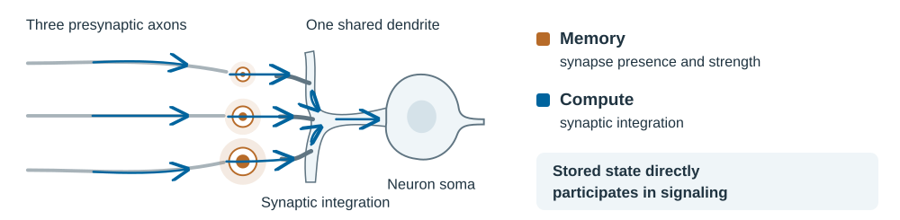

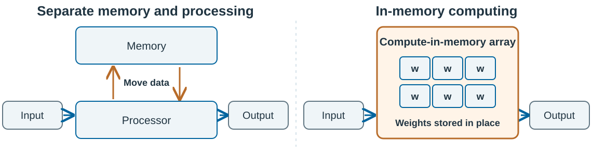

Note:
The top figure is the reference deck's synaptic-state diagram, redrawn in English and laid out as a band across the slide. It is a schematic of biological organization, not an anatomical reconstruction or a measurement. A hairline divides it from the comparison below, so the two are not read as one figure: the top is biology, the bottom is an engineering choice. The slide no longer carries a summary line; make that claim aloud instead — local memory, parallel dynamics, less movement. It carries the brief's point that stored state sits at the contact point and takes part in the integration itself. The brief's approximate 20 W whole-brain metabolic power figure is deliberately not shown on this slide, because it is easily read as a like-for-like comparison with a processor's board power at an unrelated workload; if it is used aloud, attribute it to total human-brain metabolic power, note that it varies with assumptions, and state that the brain is not a literal electronic crossbar. The figure transfers principles — local stored state influencing computation and parallel signal integration — to an engineering design, without implying that biological and artificial mechanisms are identical.
The lower comparison pairs a separated memory/processor architecture with a compute-in-memory array, in the same block language as the previous slide's von Neumann diagram. Peripheral circuits — converters, control, calibration, interconnect — are omitted from both sides, and no measured performance is claimed. Neuromorphic computing includes digital, analog and mixed-signal approaches; analog in-memory computing is one relevant direction, not a synonym for the entire field. Reduced movement and parallel physical computation can lower latency and energy, but the omitted circuits remain. Published silicon supports the potential on specified workloads; this diagram is not a claim of measured performance for our prototype.
Both visible source and credit lines were removed at the speaker's request. The synaptic figure translates the reference deck's images/synaptic-state-computing.svg; the comparison is this deck's own drawing. The Le Gallo et al. (2023) publication, https://research.ibm.com/publications/a-64-core-mixed-signal-in-memory-compute-chip-based-on-phase-change-memory-for-deep-neural-network-inference , supports the in-memory potential but is no longer printed on the slide; it remains in the source register.
The user-supplied wording 神经形态计算是我目前最关心的方向 is carried by the policy slide as its quotation. The name was removed from the bubble at the speaker's request, so the speaker attributes it aloud; it comes from the brief, not from a separately verified public interview. The closing portrait was cropped to drop the account watermark — see the source register.

==

<!-- .slide: class="analog-slide" -->
## Analog imperfections can be a design constraint

<h3>Task accuracy can tolerate weight error</h3><a class="figure-link" href="media/figures/accuracy-against-errors.pdf" target="_blank" rel="noopener" aria-label="Open the supplied measured figure">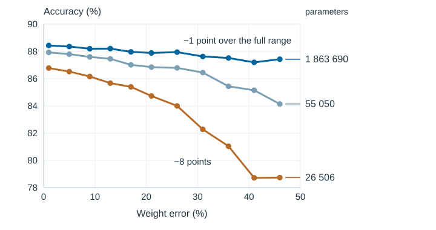</a>
Redrawn from the <a href="media/figures/accuracy-against-errors.pdf" target="_blank" rel="noopener">supplied measured figure (PDF)</a> · three of its eight parameter counts

<h3>The old objections still hold</h3>
Long believedWhy a fixed task can live with it
<a class="source-panel" href="https://www.nature.com/articles/s41467-023-40770-4" target="_blank" rel="noopener" aria-label="Source: Rasch et al., hardware-aware training (2023)">
Imprecise<strong>The application is scored on task accuracy, not on exact arithmetic.</strong>

Noisy and drifting<strong>Errors can be trained around, then calibrated on the deployed part.</strong>

Narrow<strong>One fixed inference workload is the intended use, evaluated end to end.</strong>
</a>
Source: <a href="https://www.nature.com/articles/s41467-023-40770-4" target="_blank" rel="noopener">Rasch et al., hardware-aware training (2023)</a>

Analog is poor at exact arithmetic, not at the accuracy a task needs.

Note:
The left figure is a redrawing of the supplied measured figure, accuracy-against-errors.pdf, which stays linked from the credit line and in the tree with its numerical content unchanged. Every marker in the redrawing was read off that figure — x is weight error (%), y is accuracy (%) — so the curve shapes and the three parameter counts are the supplied data, not an invented illustration. The credit line says so, and says that the supplied figure plots eight parameter counts while this redrawing shows three: the smallest, the second smallest and the largest, chosen because the middle counts overlap at slide scale. The source figure's labels are Chinese (参数量 = parameter count, 权重误差 (%) = weight error).
Read the two annotated drops: the 1 863 690-parameter model loses about one point from 1% to 46% weight error, the 55 050-parameter model about four, and the 26 506-parameter model about eight, most of it after 30%. That is the slide's claim — capacity buys tolerance, and accuracy does not collapse the moment weights are imprecise. It does not establish that more parameters always improve robustness, nor stability in closed-loop control. The supplied figure's dataset, architectures, error-injection procedure, repeat count, and simulated-versus-measured status are still not supplied: treat the shape and the ordering as evidence, and do not quote the absolute accuracies as our own measurements or generalize them to a different task.
The right column now separates the long-standing objections from the reason each one binds less for a fixed inference task: a narrow, stable workload is where approximate hardware has always been strongest, and the metric that matters there is task accuracy rather than bit-exactness. Rasch et al., Hardware-aware training for large-scale and diverse deep learning inference workloads using in-memory computing-based accelerators, Nature Communications 14, 5282 (2023), studies robustness to modeled hardware nonidealities across network topologies; hardware-aware training is a mitigation, not a universal guarantee. In our intended inference and control domains, exact arithmetic may be unnecessary, but accuracy, stability, drift, temperature, energy and end-to-end latency must be evaluated on the actual workload. End here as the brief's opening argument, without inventing a further research program or a generic thank-you slide.

==

<!-- .slide: class="cim-comparison-slide" -->
## ACIM replaces adder trees with physical summation

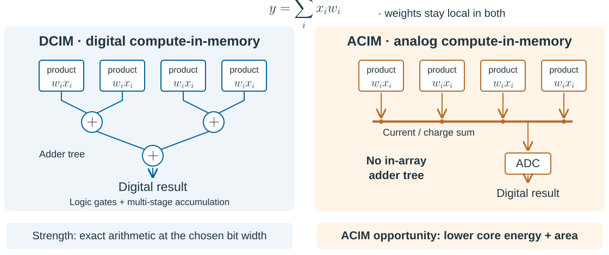

Best fit: moderate precision · high array utilizationSystem costs: input encoding · ADC · noise / variation

Architecture: <a href="https://arxiv.org/abs/2411.06079" target="_blank" rel="noopener">Yoshioka et al., 2024</a> · System comparison: <a href="https://arxiv.org/abs/2405.14978" target="_blank" rel="noopener">Analog or Digital In-memory Computing?, 2024</a>

Note:
ACIM means analog compute-in-memory; DCIM means digital compute-in-memory. This conceptual four-term dot-product diagram compares accumulation mechanisms, not measured chips. Both keep weights local and support parallel multiplication. DCIM forms sums with digital logic; ACIM combines currents or charges, avoiding an in-array digital adder tree. This can reduce core energy and area at moderate precision. Digital implementations can preserve exact fixed-width arithmetic, while analog computation incurs noise and conversion error. Input encoding and control are omitted from the drawing but named on the slide; ADC readout is drawn explicitly. Multibit ACIM can still require bit slices, repeated cycles and digital accumulation outside the array. The figure does not assert one-cycle inference, zero data movement, or a measured speedup.
Sources: Yoshioka et al., A Review of SRAM-based Compute-in-Memory Circuits (2024), https://arxiv.org/abs/2411.06079, sections 2–4; Analog or Digital In-memory Computing? Benchmarking through Quantitative Modeling (2024), https://arxiv.org/abs/2405.14978. The latter's modeled workload comparison found similar system energy efficiency and higher average throughput per area for digital IMC. Hence the slide highlights an architectural opportunity, not universal system superiority. Precision, converter overhead, utilization and dataflow determine the realized advantage. No performance ratio or prototype result is claimed.

==

<!-- .slide: class="policy-slide" -->
## Neuromorphic computing: from national strategy to local industry

<article><h3>国家</h3>
2017
<a class="policy-document" href="https://www.gov.cn/zhengce/content/2017-07/20/content_5211996.htm" target="_blank" rel="noopener">《新一代人工智能发展规划》</a>
国务院 国发〔2017〕35号

<strong>类脑理论与芯片</strong>
布局类脑智能计算，研发高能效、可重构类脑计算芯片。

</article>
<article><h3>广东省</h3>
2026
<a class="policy-document" href="https://www.gd.gov.cn/gkmlpt/content/4/4887/post_4887794.html" target="_blank" rel="noopener">《广东省加快推进人工智能全域全时全行业高水平应用行动方案》</a>
省政府办公厅 粤办函〔2026〕50号

<strong>计算架构与神经形态芯片</strong>
开展类脑计算架构与神经形态芯片研究，面向低功耗、高性能系统。

</article>
<article><h3>深圳市</h3>
2022
<a class="policy-document" href="https://www.sz.gov.cn/zfgb/2022/gb1248/content/post_9918806.html" target="_blank" rel="noopener">《关于发展壮大战略性新兴产业集群和培育发展未来产业的意见》</a>
市人民政府 深府〔2022〕1号

<strong>未来产业重点布局</strong>
将脑科学与类脑智能列为未来产业，部署类脑算法与前沿技术研究。

</article>
<article><h3>光明区</h3>
2022–2025 · 历史政策
<a class="policy-document" href="https://www.szgm.gov.cn/xxgk/xqgwhxxgkml/zcfg_116521/qzfgfxwj/content/post_10042566.html" target="_blank" rel="noopener">《关于支持脑科学与类脑智能创新链产业链融合发展的若干措施》</a>
区人民政府 深光府规〔2022〕8号

<strong>科研与成果转化支持</strong>
覆盖技术攻关、概念验证、中试和成果转化；后续适用政策待核实。

</article>

神经形态计算是我目前最关心的方向

Note:
本页根据官方公开文件概括政策关注方向，不把类脑智能、脑科学或神经形态芯片政策全部等同于对本团队模拟芯片方案的支持，不表示已获得政府资助、客户或商业验证。文件标题链接直达官方来源，页面使用概括表述而非整段摘录。核对日期：2026-09-13。本页标题已译为英文，卡片内的政策标题、发文机关和概要按要求保留中文。
国家：《新一代人工智能发展规划》，国发〔2017〕35号，国务院2017年7月8日成文、7月20日公开。广东省：粤办函〔2026〕50号，省政府办公厅2026年4月9日成文、4月22日公开。深圳市：深府〔2022〕1号，将脑科学与类脑智能列入未来产业重点发展方向。光明区：深光府规〔2022〕8号原定有效期于2025年届满，本页明确作为历史政策展示，未核实续期或替代文件。
本页政策内容与链接复制自 collections/external-presentations/2026-09-15-neuro 的第10页。结尾引语从上一页移至此处，来自用户提供的 brief，不是另行核实的公开采访。引语的署名按要求从气泡中移除，仅在此记录：神经形态计算是我目前最关心的方向，出自朱祥维。肖像已裁去公众号水印，未经其他处理。本页排在原模拟误差页之后；全篇在其后继续进入存储计算（In-SRAM / In-DRAM、忆阻器、完整模拟域）与收官页，故本页不再是全篇最后一页。
===

<!-- .slide: class="sota-slide" -->
## Current state of the art: computing inside the array

<h3>In-SRAM computing</h3>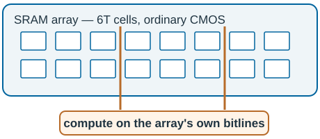
Reuses the chip area and the mature logic process: the same CMOS as the logic beside it, no extra masks. The 6T cell is large, so the array is not dense.

<h3>In-DRAM computing</h3>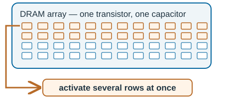
Dense 1T1C cells, but on a specialised process. The arithmetic is coarser and the read is destructive.

Advantage: area already paid for. Disadvantage: coarse arithmetic, and a large cell.

Note:
Both figures are conceptual schematics: the array sizes, cell counts and process nodes are illustrative, not those of a particular chip, and no density, energy or speed figure is claimed anywhere on this slide. The two columns are the two mainstream array-based routes into in-memory computing today, and they differ in which array they borrow.
In-SRAM computing adds computation to a static RAM array. The cell is a 6T latch, built on a standard logic process, so the array can sit on the same die as the logic that uses it and needs no special processing — that is the brief's "leverage the chip area and mature process". Its arithmetic is done with the array's own peripheral circuits: wordlines and bitlines are driven in combinations and the sense amplifiers resolve the result, which in practice means boolean and small-integer operations on the bitlines rather than a multiply per cell. The cost is cell size: a 6T cell is much larger than a DRAM cell, so the brief's "low density" lands here, and a good part of the array's area is spent on storage that cannot compute.
In-DRAM computing borrows the dense 1T1C array instead. A DRAM cell is small and cheap per bit, which is why the array exists at all, but the read is destructive — the charge on the capacitor is consumed by the sense amplifier and has to be written back — and the array needs a specialised process that is difficult to co-integrate with high-performance logic. Its arithmetic typically comes from activating several rows at once and reading the wired combination of their charge on the bitlines, which is why the figure highlights rows rather than bitlines; the operations are coarser still.
The honest summary of the brief's pair is therefore: the advantage — area already paid for on a mature process — holds for both, most cleanly for SRAM; the disadvantage — low density — is the SRAM cell's, and it is a statement about computing density as much as bit density. In both arrays you get roughly one computing site per line, not one per weight. Do not quote cell areas, densities or energy comparison figures for either technology from this slide; they depend on the process and the array design and were not verified here.

==

<!-- .slide: class="crossbar-slide" -->
## A memristor array computes with two circuit laws

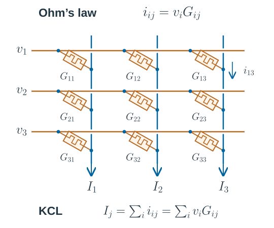

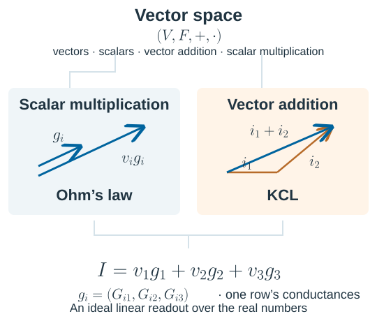

That’s how physics does the math.

Note:
A vector space is the four-tuple (V, F, +, ·): a set of vectors, a scalar field, vector addition, and scalar multiplication, satisfying the vector-space axioms. Here the ideal mathematical model uses real vectors and real scalars. For row i, define the column conductance vector g_i = (G_i1, G_i2, G_i3)ᵀ. Bold symbols denote vectors and the conductance matrix; scalar entries remain italic. Applying scalar voltage v_i gives the current vector i_i = v_i g_i by Ohm’s law. Kirchhoff’s current law adds these vectors componentwise on the columns: I = sum_i v_i g_i. In the row-input convention shown, I = Gᵀv. The circuit implements the two operations; it does not by itself establish the vector-space axioms. Physical ranges are bounded and conductances are nonnegative; arbitrary signed weights require a differential encoding.
The crossbar places each memristor symbol diagonally between a horizontal word-line tap and a vertical bit line. Unmarked row/column crossings are not junctions; dots mark the device’s connections. This is a conceptual 3 × 3 schematic, not a measured array. During readout, conductances are assumed fixed and approximately ohmic, and columns are held near virtual ground. Wire resistance, device variation, drift, nonlinear response and finite readout precision cause departures from the ideal. Peripheral drive and sensing circuits are omitted.

==

<!-- .slide: class="memristor-intro-slide" -->
## A predicted element, found thirty-seven years later

<h3>The fourth two-terminal element</h3><a class="figure-link" href="https://commons.wikimedia.org/wiki/File:Two-terminal_non-linear_circuit_elements.svg" target="_blank" rel="noopener" aria-label="Source: Two-terminal non-linear circuit elements, Wikimedia Commons">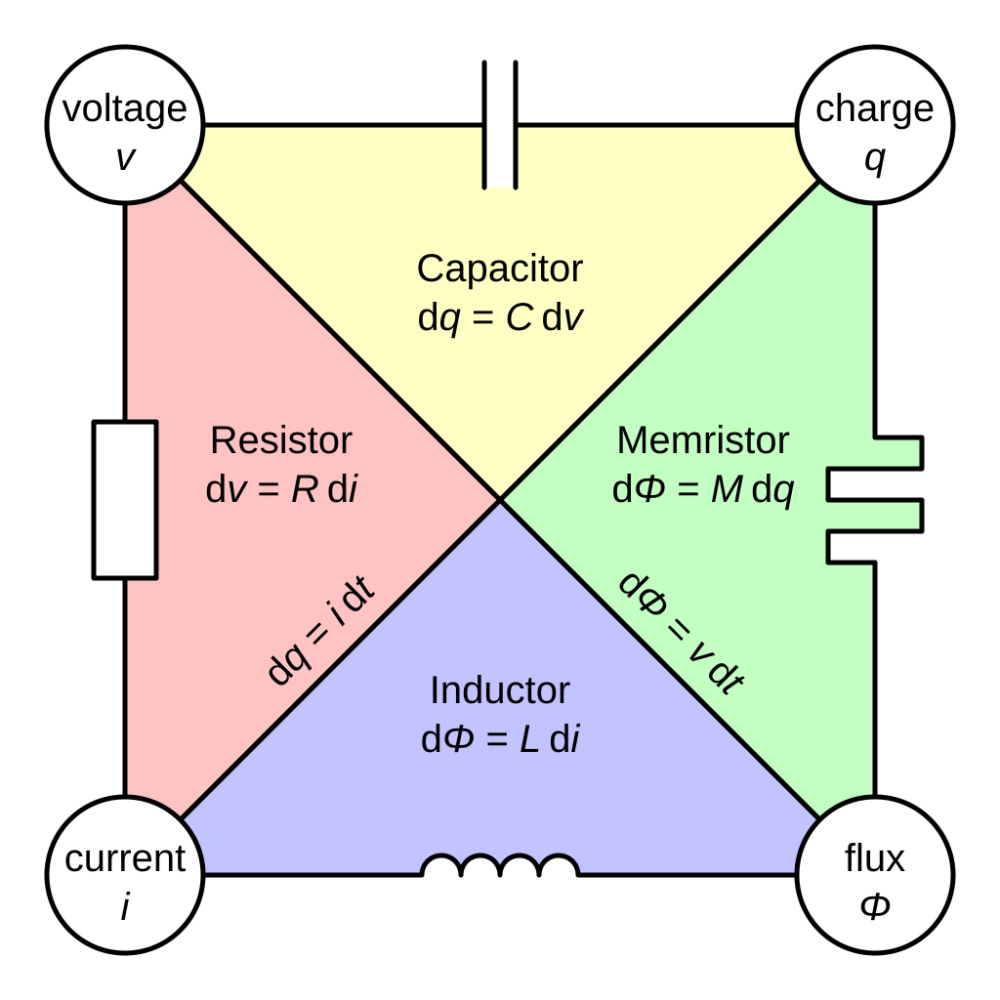</a>
Figure: Parcly Taxel, <a href="https://commons.wikimedia.org/wiki/File:Two-terminal_non-linear_circuit_elements.svg" target="_blank" rel="noopener">Wikimedia Commons</a>, CC BY-SA 3.0 · vectorised from a diagram by Linear77

<h3>Two papers, thirty-seven years apart</h3>
1971
<a href="https://doi.org/10.1109/TCT.1971.1083337" target="_blank" rel="noopener">Memristor — the missing circuit element</a>
Leon Chua (蔡少棠) argued from the symmetry of the four circuit variables that a fourth two-terminal element ought to exist, relating charge to flux. A prediction from circuit theory, not a device.

IEEE Transactions on Circuit Theory 18(5), 507–519

2008
<a href="https://doi.org/10.1038/nature06932" target="_blank" rel="noopener">The missing memristor found</a>
Strukov, Snider, Stewart and Williams reported a nanoscale titanium-dioxide device whose resistance depends on the charge that has passed through it.

Nature 453, 80–83

The device remembers: its resistance depends on the charge that has passed through it.

Note:
The two papers are the brief's two papers, and they are the standard pair for this history. Leon Chua, "Memristor — the missing circuit element", IEEE Transactions on Circuit Theory 18(5), 507–519, 1971: Chua observed that the four fundamental circuit variables — current, voltage, charge and flux — admit six pairwise relations, that five of them were already the resistor, the capacitor, the inductor and the two integral relations, and that the sixth, flux against charge, had no element. He predicted one and named it. 蔡少棠 is Chua's Chinese name; the paper is in English. Dmitri B. Strukov, Gregory S. Snider, Duncan R. Stewart and R. Stanley Williams, "The missing memristor found", Nature 453, 80–83, 1 May 2008, reported a thin-film TiO₂ device showing the predicted pinched hysteresis. The thirty-seven years are 1971 to 2008.
One qualification belongs in the notes, because it is well known in the field and a technical audience may raise it: the identification of the 2008 device with Chua's ideal memristor was contested, and the widely used class is the broader one of memristive systems (Chua and Kang, 1976) or simply resistive switching. What the array needs is not the ideal element but a two-terminal device with a controllable, non-volatile conductance; that is the property the rest of this section relies on, and the history is background to it.
The figure is the four two-terminal elements as a taxonomy, reused unmodified from Wikimedia Commons. It was drawn by Parcly Taxel in 2013 as own work, vectorised from an earlier diagram by Linear77, and it is licensed CC BY-SA 3.0 — an attribution and share-alike licence, so if this figure is ever adapted rather than copied, the adaptation has to carry the same licence. It is a taxonomy diagram: it does not show a fabricated memristor, and the small V–I insets in it are illustrative shapes, not measurement.

==

<!-- .slide: class="fpga-slide" -->
## Do we really need the memristor?

<h3>FPGA — field-programmable gate array</h3>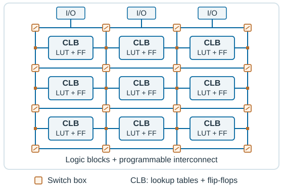
Bitstream → logic functions + routing configuration.

<h3>FPMA — field-programmable memristor array</h3>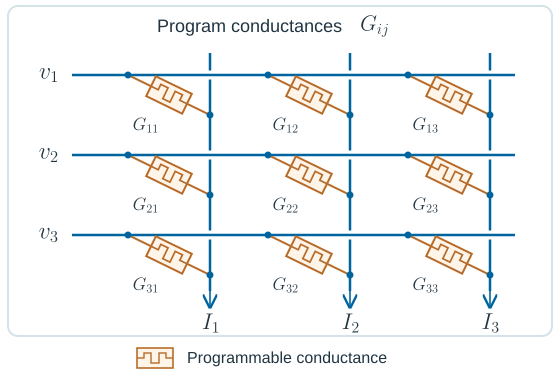
Programming pulses → stored conductances + analog weights.

The memristor array is to analogue computing what the FPGA is to digital logic.

Note:
The brief asks the question in its own words, so the slide asks it too. The answer this slide gives is an analogy, not a proof of need: the FPGA is the established case of hardware that is not specialised to one function yet is not general-purpose either — it is configured once for a design and then runs it, and its value is that the same silicon serves many designs without a fab mask. A memristor array has the same shape of proposition. You write each conductance once for a trained network, and afterwards the array is the network: the weights live in the cells and the computation is whatever the wiring and the input voltages make of them. That is what the brief means by calling it the analogue version of an FPGA, and the two figures are drawn at the same scale and in the same block language so the parallel is visible rather than asserted.
The differences matter as much as the resemblance. The FPGA is digital and exact, and it is reconfigured by rewriting a bitstream — an ordinary, well-understood, high-yield operation — whereas the array is analogue and approximate, and writing it means placing an analogue quantity in each cell, with the variation and drift that the analog slide already discussed. The FPGA's clock rate is not its selling point; neither is the array's. And the FPGA came with a mature design flow and a compiler, which is not something an analogue array has.
FPMA is used here as the presentation’s analogy with FPGA, not as a claim of an industry-standard architecture. The FPGA schematic is a regular 3 × 3 patch of configurable logic blocks (CLBs) with lookup tables (LUTs) and flip-flops (FFs), routing channels, switch boxes, connection boxes and representative I/O. A real CLB contains multiple logic elements, optional registered outputs and additional resources such as carry logic; modern devices also include RAM, DSP resources and clock networks, omitted here. The small amber switches indicate routing programmability; the bitstream also configures the LUT functions and register options. Architecture reference: AMD, UltraScale Architecture Configurable Logic Block User Guide, CLB Overview, https://docs.amd.com/r/en-US/ug574-ultrascale-clb/CLB-Overview . This is a generic conceptual fabric, not an AMD floorplan.
The FPMA schematic places a memristor symbol on each diagonal branch from a horizontal word line to a vertical bit line; dots mark junctions, while unmarked crossings are insulated. Conductance programming sets the analog weights; input voltages produce column currents under the readout assumptions discussed earlier. Peripheral programming, drive and sensing circuits are omitted. Neither diagram specifies an implemented design, array size or measured performance.

==

<!-- .slide: class="split-slide" -->
## Training and inference separate in practice

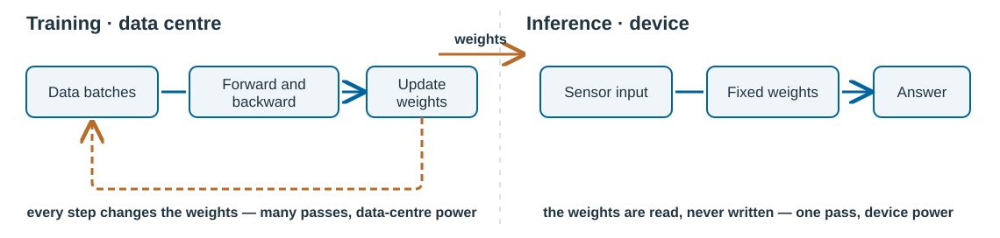

<strong>Training</strong> runs the data through thousands of times and writes the weights at every step, where the power and the data are.

<strong>Inference</strong> runs one pass with weights that do not change, where the signal is.

The weights cross the gap once; the device that runs them only ever reads.

Note:
The brief's key point is that AI applications show a training/inference separation, and the figure is the deck's drawing of it. The left side is a loop: forward pass, backward pass, update, repeat over the dataset, with the weights changing at every iteration. The right side is a chain: an input arrives, fixed weights are applied once, an answer comes out. The one-way amber arrow across the divider is the trained model — the weights — moving from the first setting to the second.
The timing figures on the figure are indicative, not measured: training runs for days to weeks over many passes, and a single inference runs in milliseconds, and both depend on the model, the hardware and the batch. Do not read the figure as a benchmark. The energy argument is the same shape and is also qualitative: the training loop repeatedly moves the whole weight set and the activations, at data-centre scale, while inference touches each weight once per pass.
"Separate in practice" is deliberately weaker than the brief's 必然, inevitably. This separation is the dominant way AI is deployed — a model is trained, then shipped and run — but it is not a law of the field: on-device training, fine-tuning, continual learning and federated learning all put weight updates on the endpoint, and some of them matter. What the slide claims is the common case and the reason a fixed-weight array is a reasonable target: for the applications we are aiming at, the device is the inference side, and the separation is what makes that a small problem rather than a whole training system.

==

<!-- .slide: class="framing-slide" -->
## From memory to compute: change the starting point

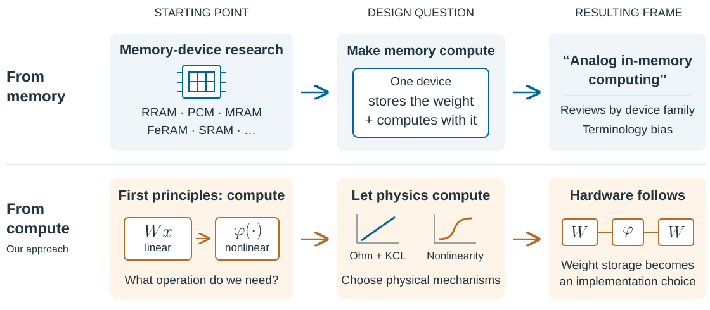

Start from the computation; let physics do the work.

Note:
The top path explains the terminology bias. “Analog in-memory computing” grew largely out of memory-device research. Reviews naturally discuss RRAM, PCM, MRAM, FeRAM, SRAM and related families because their central idea is that a memory device simultaneously stores a weight and participates in computation. These families are examples, not an exhaustive taxonomy or a ranking.
The bottom path restores our first-principles starting point: what we need is computation, both linear and nonlinear. Begin with the required operation, illustrated as a linear transform Wx followed by a nonlinear function φ, and choose physical mechanisms that perform it. Ohm’s law and Kirchhoff’s current law illustrate linear scaling and summation under ideal readout assumptions; a suitable device transfer characteristic can supply a nonlinear function. The curves and hardware chain are conceptual illustrations, not measured responses or a specific architecture. They do not imply every physical nonlinearity is a suitable activation, or that the entire system requires no converters or digital control.
The comparison is about the order of design decisions. Starting from compute makes the mechanism and required function the premise; how weights are held becomes an implementation choice. Weight storage, controllable state, stability, reproducibility and calibration remain engineering requirements. The two paths can converge on similar hardware; the distinction is the framing, not a claim that memory-device research ignores computation.

==

<!-- .slide: class="analogue-slide" -->
## Nonlinearity from the device itself

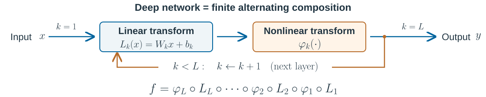

<h3>The nonlinearity is a device</h3>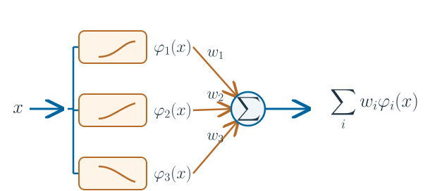

<h3>A controllable mechanism</h3>

<h4>Leo Esaki · 江崎玲於奈</h4>Nobel Prize in Physics · 1973

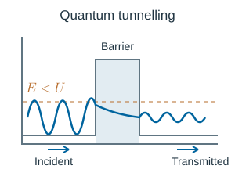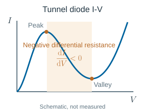

Treat device nonlinearity as a computational resource.

Note:
The full-width transform diagram shows a finite feedforward composition f = φ_L ∘ L_L ∘ … ∘ φ_1 ∘ L_1. The return arrow is shorthand for proceeding to the next layer with k incremented, not recurrent feedback, an infinite iteration or weight sharing. Each layer may use different parameters. The diagram uses the common neural-network term “linear” for the affine map L_k(x) = W_k x + b_k; strictly it is linear only when the bias is zero. Some architectures omit a final activation or include residual branches; this figure expresses the basic alternating feedforward construction.
The device-function basis illustrates weighted nonlinear device responses summed on the wire. The physics illustrations are translated from the reference deck; the new composition diagram is an original editable schematic. Visible explanatory paragraphs and the framework source line were removed at the speaker’s request. The takeaway now states that device nonlinearity is a computational resource. The source framework PDF remains at media/figures/kanalogue-framework.pdf for provenance, without an on-slide link.
The mechanism column is the reference deck's: Leo Esaki shared the 1973 Nobel Prize in Physics for tunnelling in semiconductors, the tunnelling figure shows a particle reaching a barrier it does not have the energy to cross and still emerging with a smaller transmitted amplitude, and the tunnel diode's I–V shows a peak, a region where the current falls as the voltage rises, and a valley. That region is a controlled nonlinearity available from the device physics rather than from a circuit — the point of the brief's 利用器件物理特性实现可控非线性. Two qualifications the reference deck also carried, and which matter: the tunnelling and I–V figures are schematics, not measured data, with no voltages, currents, device parameters or performance marked; and the I–V figure plots the forward branch only, where negative differential resistance means the slope dI/dV is negative in that region, not that the static ratio V/I is negative. The Esaki portrait is the Japan Academy's, obtained through Wikimedia Commons under CC BY 4.0 and not modified; his Nobel work is background, not this group's result, and it is not presented as ours.
The framework is KANalogue: Device-Native Kolmogorov–Arnold Networks for Analogue In-Memory Computing, by Songyuan Li, Teng Wang, Jinrong Tang, Ruiqi Liu and Xiangwei Zhu. It was listed in the team's own material as a NeurIPS 2026 submission under rebuttal; we have not independently verified a public published version, so it is not marked as accepted here. The reference deck's caveats carry over verbatim in substance: the comparison baseline it uses is a linear array followed by an ADC, digital nonlinear processing and a DAC, and the scheme aims to leave part of the continuous computation in the analogue domain, so it must not be claimed that the whole machine needs no converter, no digital logic or no control. "Node efficiency" is not TOPS/W — the two numbers are defined differently, and the reference material does not supply a common definition, so this deck shows no node-efficiency multiple, no power figure and no latency gain. The architectural benefit is a design target; the numerical and board-level evidence is a separate matter and is not on this slide.

==

<!-- .slide: class="applications-slide" -->
## Where we would start

<h3>High-speed autofocus</h3>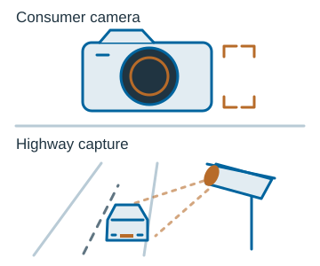

<h3>Guidance</h3>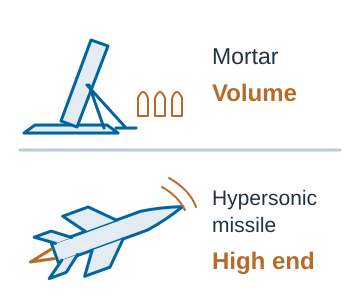

<h3>Touch &amp; soft robotics</h3>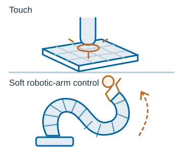

Note:
The three application directions are the reference deck's, with the figures translated into English and nothing else changed about their content. They are the brief's "show our applications". All three figures are our own conceptual schematics, not product photographs and not experimental results, and none of them means that the scheme has been adapted to that setting, verified there, or sold into it. The three are not ordered by maturity: high-speed autofocus is the one with the clearest technical fit, and the other two are directions worth exploring.
Take the second figure carefully, since it is the one most likely to be over-read. The mortar and the hypersonic missile express an application category for guidance, using the reference deck's own imagery; they do not correspond to a specific product, structure or performance, and nothing on the slide claims a capability in that domain. The two labels carried inside the figure, "volume" against "high end", are the proposed positioning of those two sub-categories as the reference deck set them out — they are not verified market sizes, order volumes, technical advantages, or evidence that a product or a customer relationship exists. Outside autofocus, customer requirements and technical fit are all still open questions, and this slide states no market size, no order and no partnership.
The touch and soft-arm panel is two sketches in one frame, contact sensing and control; the reference deck drew it that way and this deck keeps the pairing rather than splitting it, because in both halves the requirement is the same — the response must be produced locally and quickly, which is the constraint the rest of the deck has been building toward.

===

<!-- .slide: class="summary-slide" -->
## The argument in one slide

01 · Pressure<h3>AI demand keeps rising</h3>
More compute alone does not solve latency and energy at the edge.

02 · Bottleneck<h3>Data movement costs</h3>
Moving weights between memory and processors spends time and power.

03 · Approach<h3>Start from the operation</h3>
Use device physics for local summation and useful nonlinearity.

04 · Focus<h3>Fixed-weight inference</h3>
Test the fit in short, local sensing and response loops.

Our research question: which computations can the device perform where the signal arrives?

Note:
This is the logic of the keynote, not a claim that an end-to-end system has already met a power or latency target. Demand and deployment constraints motivate a change in architecture. The von Neumann bottleneck points to local computation; training/inference separation makes fixed-weight inference a tractable first target. The compute-first view asks for the required linear and nonlinear operations before selecting a device or storage technology. The application sketches are candidate tests of that view, with autofocus the clearest fit; they are not validated products. The research question leaves room for converter, control, precision, stability and calibration costs to decide whether a physical mechanism is useful at system level.

===

<!-- .slide: class="ending-slide" data-state="image-ending" -->

Note:
The closing slide reuses the reference deck's ending image, collections/group-meetings/2026-09-10-ai-group-gathering, and it is the same treatment: the photograph runs full-bleed with the controls, the progress bar and the slide number hidden while it is on screen. The image is the group's own asset, carried over unchanged; it is decorative and makes no claim. The preceding slide now gathers the argument before this visual close.
