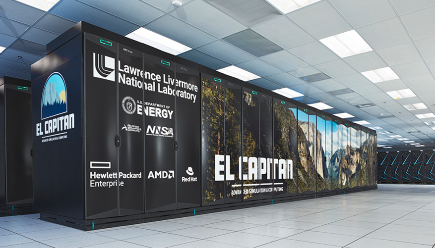
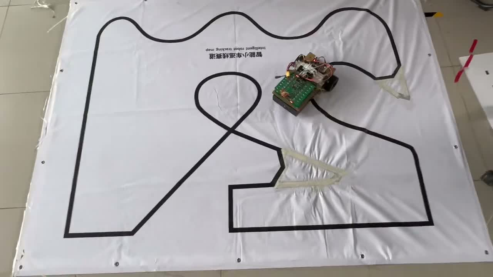
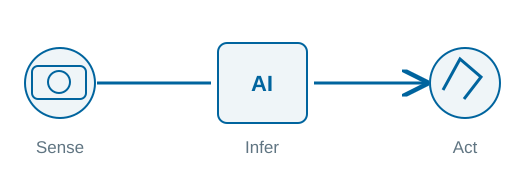
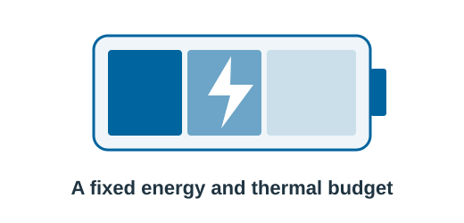
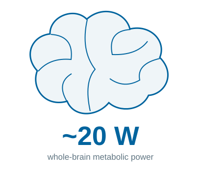
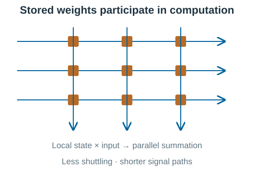

<!-- .slide: class="cover" -->

NEURO GROUP · 23 SEPTEMBER 2026

# Neuro Group Opening Keynote

Toward low-latency, low-power intelligence

LI Shaun

Note:
The brief leaves the title TBD; retain its working title and use a descriptive subtitle for this opening section. Speaker, date, language, and white theme follow docs/brief.md. This deck implements the seven specified content slides; the trailing empty separator in the brief does not create a blank slide. The reference deck is collections/external-presentations/2026-09-15-neuro (the user called it 2016-09-15-neuro).

===

01 · THE COMPUTE QUESTION

## AI is a strategic arena. Compute is uneven.

<h3>Three pillars of AI</h3>
U.S. and Chinese models have traded the lead. Benchmark convergence does not prove data parity.

<h3>Share of tracked AI-supercomputer performance</h3>

2025 research snapshot · 500 systems in the dataset Estimated capacity, not a census of all national compute.

Efficient computing is a strategic research opportunity.

Sources: <a href="https://arxiv.org/abs/2504.16026" target="_blank" rel="noopener">Pilz et al., Trends in AI Supercomputers (2025)</a> · <a href="https://hai.stanford.edu/ai-index/2026-ai-index-report" target="_blank" rel="noopener">Stanford AI Index 2026</a>

Note:
The brief frames AI as the main arena of U.S.–China competition. The heading expresses the strategic framing without asserting a measurable ranking of all geopolitical arenas. The three pillars are a conceptual diagram, not quantitative scores. Stanford's 2026 report describes converging model performance; this is not evidence that algorithms or training data are identical or equally accessible. Public information does not establish aggregate data parity.
The right chart redraws the approximate geographic shares reported by Pilz, Sanders, Rahman and Heim, Trends in AI Supercomputers, arXiv:2504.16026v2 (23 April 2025): United States ~75%, China ~15%; other ~10% is the remainder. These are shares of the study's tracked performance, not shares of all chips or all national compute in September 2026. The dataset covers 500 systems over 2019–2025; the paper discusses incomplete coverage and uncertainties in Chinese-system data. The comparison is roughly five to one within that dataset. Do not substitute TOP500 system counts or private investment for AI compute capacity.

==

<!-- .slide: class="compute-slide" -->

02 · SCALING

## Model demand outruns a simple Moore’s-law story

<h3>Gordon Moore</h3>
Fairchild R&amp;D · 1965 Later, Intel co-founder

2× per year

Components per integrated circuit at minimum cost per component.

The original 1965 observation and forecast. The two-year revision came in 1975.

Component density ≠ training compute ≠ useful performance per watt.

<h3>Training compute across model generations</h3>

<label for="model-select">Inspect model</label><select id="model-select" aria-label="Select a model"></select>

Sources: <a href="https://download.intel.com/newsroom/2023/manufacturing/moores-law-electronics.pdf" target="_blank" rel="noopener">Moore, Electronics (1965)</a> · <a href="https://epoch.ai/data/ai-models" target="_blank" rel="noopener">Epoch AI model estimates</a> · <a href="media/imgs/computing-demands.pdf" target="_blank" rel="noopener">supplied visual reference</a>

Note:
Moore's original 1965 paper, Cramming More Components onto Integrated Circuits, concerns the complexity of an integrated circuit at minimum component cost, with a roughly annual doubling and a forecast to 1975. It is not a promise that clock speed or performance doubles annually. The two-year revision is later. The left text is a paraphrase rather than a quotation.
The supplied computing-demands.pdf establishes the chart's historical scope and visual idea. The interactive reconstruction uses independently tabulated Epoch AI training-compute estimates, not pixels digitized from the supplied figure. Dates, estimates, model references, and estimation notes are stored locally in media/data/training-compute.json. Estimates may differ from the reference figure. Training compute is total floating-point operations; 1 PFLOP-day = 8.64e19 FLOP. This is a workload, not a hardware throughput unit. The plot omits the reference's unsourced two-month doubling line and avoids treating a hardware-density curve as measured compute supply. Open a point's model paper or the dataset to inspect its provenance. The chart is a selected historical sample, not a fitted scaling law or complete model inventory.

==

03 · THE APPLICATION METRIC

## Throughput is only half the story

<h3>High-performance computing</h3>
<strong>1.742 EFLOP/s</strong>HPL · June 2025

How much work can we finish?

TOP500 emphasizes sustained numerical throughput.

<h3>Intelligence in a feedback loop</h3>
How soon can we respond?

End-to-end latency · jitter · missed deadlines

A fast batch does not guarantee a timely action.

Photo and historical HPL result: <a href="https://www.llnl.gov/article/53006/el-capitan-reigns-supreme-" target="_blank" rel="noopener">LLNL (2025)</a> · Edge demonstration: existing neuro deck

Note:
El Capitan is used as an example of a TOP500-class machine, with its documented June 2025 HPL performance. This is not a claim about the current number-one system in September 2026. HPL is a dense numerical benchmark; it is not an AI inference or sensor-to-actuator latency measurement. Supercomputers also have latency-sensitive workloads; the slide compares optimization objectives rather than making the categories exclusive.
For edge control, the relevant path includes sensing, preprocessing, inference, communication and actuation. Batching may improve throughput while adding waiting time. Measure the full loop and latency distribution, not just a best-case accelerator kernel. The right photo is reused from the team's neuro-car-browser.jpg; it demonstrates the application setting, not a measured real-time guarantee.

==

04 · THE ENERGY CONSTRAINT

## Intelligence must fit a power budget

<h3>Data-centre electricity demand is rising</h3>

All data centres, not AI alone · IEA 2026 outlook 2030 is a projection; electricity and grid constraints matter.

<h3>At the edge, the budget is local</h3>
Energy per decision = power × active time

Battery life. Heat. Always-on sensing.

Include sensors, conversion, memory and communication.

Lower energy per useful decision matters at every scale.

Source: <a href="https://www.iea.org/reports/key-questions-on-energy-and-ai/executive-summary" target="_blank" rel="noopener">IEA, Key Questions on Energy and AI (2026)</a>

Note:
The IEA's 2026 update reports global data-centre electricity use of 485 TWh in 2025 and a central projection of 950 TWh in 2030, about 1.96 times the 2025 level. These cover all data centres, not AI workloads alone. The source discusses constraints in electricity supply, grid connections and chip manufacturing; growth in demand alone does not prove a global generation shortfall. The outlined projection bar distinguishes a forecast from a historical estimate. Source accessed 21 September 2026.
The energy equation assumes constant average active power over the decision interval. For continuously operating systems, idle and support power must also be included. No product-specific battery runtime or energy saving is claimed.

==

05 · WHERE THE COST COMES FROM

## Moving data costs energy and time

<h3>Separate memory and processing</h3>
Bandwidth and data movement can limit useful compute.

<h3>A modern example: GeForce RTX 5090</h3>
On-chip L2 cache · 32 GB external GDDR7 Memory placement is schematic, not a PCB layout.

Can stored state participate directly in computation?

Specification: <a href="https://www.nvidia.com/en-us/geforce/graphics-cards/50-series/rtx-5090/" target="_blank" rel="noopener">NVIDIA</a> · GB202 figure adapted from the existing neuro deck; photograph credits in notes

Note:
The brief's “GTX 5090” is corrected to the product name GeForce RTX 5090. NVIDIA lists 32 GB GDDR7. The left diagram is conceptual: modern processors have caches, local memories, parallelism, and architectural features that mitigate the von Neumann bottleneck. Data movement is a contributor, not a proof that every workload is memory-bound or that all latency and power arise from this bottleneck. No measured GPU-to-prototype power or speed comparison is implied.
The right SVG reuses the reference deck's GB202 die photograph, with English metadata and a white-theme palette. Original photograph credits: Chip by ASUS Tony 俞元麟; Dieshot by 万扯淡; Layout by Kurnal. The photograph and original watermark remain unchanged. The reference deck sourced it from https://www.tomshardware.com/pc-components/gpus/gb202-die-shot-beautifully-showcases-blackwell-in-all-its-glory-gb202-is-24-percent-larger-than-ad102 and the photographer's original post https://x.com/Kurnalsalts/status/1883153126011892140 . Third-party die labels are illustrative, not our measurement. This slide makes no claim about memory area fractions, cache capacity, or task-specific energy consumption.

==

<!-- .slide: class="brain-slide" -->

06 · THE NEUROMORPHIC OPPORTUNITY

## Learn from the brain’s organization

An architectural inspiration, not an equal-workload benchmark.

Local memory. Parallel dynamics. Less movement, shorter paths.

<blockquote>“Neuromorphic computing is the direction I care most about right now.”</blockquote>
Xiangwei Zhu · translated from the supplied brief

Brain-power context: <a href="https://www.nature.com/articles/s41467-024-47811-6" target="_blank" rel="noopener">Nature Communications (2024)</a> · AIMC: <a href="https://research.ibm.com/publications/a-64-core-mixed-signal-in-memory-compute-chip-based-on-phase-change-memory-for-deep-neural-network-inference" target="_blank" rel="noopener">Le Gallo et al. (2023)</a>

Note:
The approximate 20 W figure refers to total human-brain metabolic power and varies with assumptions. It is not directly comparable to a GPU's board power at an unrelated workload. The brain is not a literal electronic crossbar. The diagram transfers principles—local stored state influencing computation and parallel signal integration—to an engineering design, without implying that biological and artificial mechanisms are identical.
Neuromorphic computing includes digital, analog and mixed-signal approaches. Analog in-memory computing is one relevant direction, not a synonym for the entire field. Reduced movement and parallel physical computation can lower latency and energy, but converters, interconnect, control, calibration, and peripheral circuits remain. Published silicon supports the potential on specified workloads; this diagram is not a claim of measured performance for our prototype.
Xiangwei Zhu's portrait is copied from the reference deck. The quotation is an English translation of the user-supplied wording: 神经形态计算是我目前最关心的方向. It is attributed to the brief, not to a separately verified public interview.

==

<!-- .slide: class="analog-slide" -->

07 · CHOOSING THE RIGHT DOMAIN

## Analog imperfections can be a design constraint

<h3>Task accuracy can tolerate weight error</h3>
Axes: accuracy (%) vs weight error (%) Legend: parameter count · supplied example, conditions pending

<h3>Match the hardware to the task</h3>
Limited generality<strong>Specialize a stable inference workload.</strong>

Finite precision<strong>Optimize task accuracy, not exact arithmetic.</strong>

Noise and device variation<strong>Train with hardware errors; calibrate and validate.</strong>

Tolerance has limits: drift, out-of-distribution inputs, and closed-loop stability still need testing.

Our opportunity: useful accuracy within tight time and energy budgets.

Figure: supplied neuro-deck material · Supporting approach: <a href="https://www.nature.com/articles/s41467-023-40770-4" target="_blank" rel="noopener">Rasch et al., hardware-aware training (2023)</a>

Note:
The curve image and linked PDF are reused without changing their numerical content. The English caption translates the original Chinese axis and legend labels. The plot compares eight parameter counts from 26,506 to 1,863,690; the smallest two models degrade more strongly in this displayed example. It does not establish that more parameters always improve robustness, nor does it establish stability in closed-loop control.
As recorded in the reference deck, dataset, architectures, error distribution/injection procedure, number of repeats, and whether the results are simulated or hardware-measured are not supplied. Therefore this is illustrative supplied evidence, not a validated quantitative result to generalize. No error bars or significance claims are added. The source PDF is available by clicking the image.
Rasch et al., Hardware-aware training for large-scale and diverse deep learning inference workloads using in-memory computing-based accelerators, Nature Communications 14, 5282 (2023), studies robustness to modeled hardware nonidealities across network topologies. Hardware-aware training is a mitigation, not a universal guarantee. In our intended inference and control domains, exact arithmetic may be unnecessary, but accuracy, stability, drift, temperature, energy and end-to-end latency must be evaluated on the actual workload. End here as the brief's opening argument, without inventing a further research program or a generic thank-you slide.
