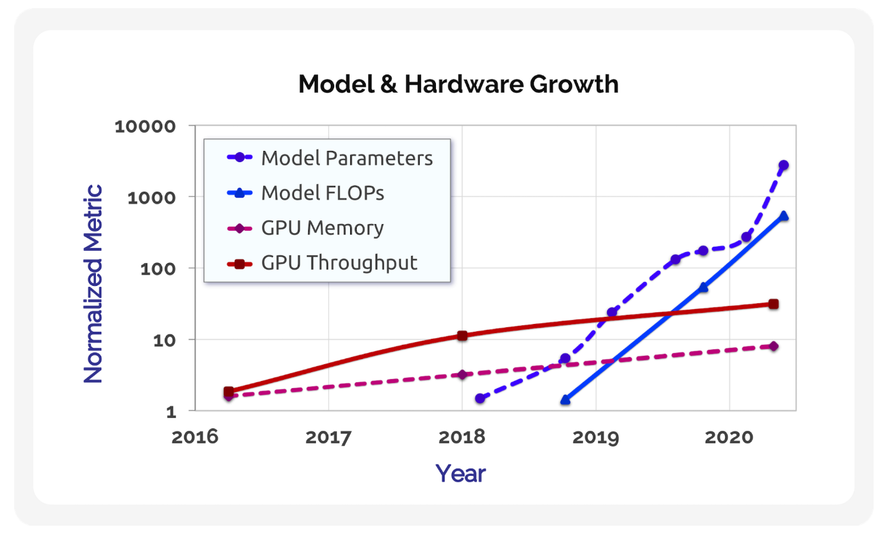
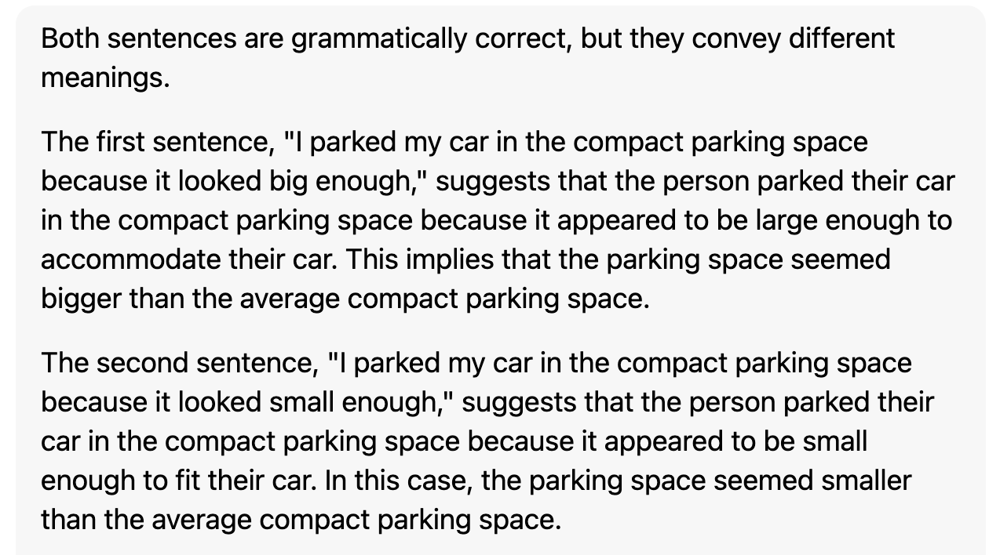

[//]: # (
    Webinar Trailer

    Recent years have witnessed the sparks of artificial general intelligence. Impressive progress has been made in areas such as natural language processing and computer vision by large-scale pre-trained models. However, mounting evidence suggests that the robustness of these models are still far from the level of intelligent creatures, and AI researchers doubt that merely scaling up the models will overcome the current limitations. This makes AI researchers reflect on the essence of intelligence and seek new research directions.
    
     Meanwhile, embodied intelligence is gaining traction among AI scholars. Different from prevailing approaches that focus on computation, embodied AI emphasizes the importance of physical interaction with the environment. Is embodied intelligence a gimmick or a glimpse of the future?  In this webinar, we will discuss the history of embodied cognition, the recent progress in embodied AI and its implications for the future of AI research.
    
    线上研讨会预告

    近年来，人工智能研究领域涌现出了通用人工智能的火花。大规模预训练模型在自然语言处理和计算机视觉等领域取得了惊人的进展。然而，越来越多的证据表明，这些模型的鲁棒性仍远远不及智能生物的水平，研究人员认为仅仅扩大模型的规模并不能克服当前的局限。这让我们反思智能的本质以及寻求新的研究思路。

    与此同时，具身智能越来越受到人工智能学者们的关注。与目前主流的侧重于计算的方法不同，具身智能强调与环境的物理交互的重要性。具身智能是一个噱头还是人工智能的下一个风口？在本次研讨会中，我们将讨论具身认知的历史、具身智能的最新进展及其对人工智能研究未来的影响。
    
    )

#### Embodied Intelligence with Foundation Models

 Towards Artificial General Intelligence

LI Shaun, 2023-09-29
<!-- .element: style="font-size:20pt" -->

=== 

### Foundation Models: a paradigm shift 

explicitly constructed $ \rightarrow $ implicitly induced

feature engineering, training engineering, prompt engineering
<!-- .element: style="font-size:20pt" -->

Ref: *[On the Opportunities and Risks of Foundation Models](https://arxiv.org/abs/2108.07258)*
<!-- .element: style="font-size:20pt;vertical-align:text-bottom;" -->

== 

#### Foundation models: critically central (foundation) yet incomplete (need adaptation)

Previous terms: LLM, pretrained model, self-supervised model 
<!-- .element: style="font-size:20pt;" -->

Ref: *[On the Opportunities and Risks of Foundation Models](https://arxiv.org/abs/2108.07258)*
<!-- .element: style="font-size:20pt;" -->

Note: previous terms fail to capture the paradigm shift,
research direction: adaptation 

===

<h2 class="r-fit-text">What makes foundation models happen?</h2>
<h2 class="r-fit-text">SCALE</h2>

==

#### What makes large-scale possible?

- Improvements in hardware 
- Development of model architecture
- Availability of much more data

==

Hardware

==

Model architecture: Transformer (high-capacity, parallelizable)

==

Data: Cake analogy at NIPS 2016 by Yann LeCun

==

Self-supervised learning

==
### Self-supervised learning
"无"中生"有"

Paradigm shift: supervised pretraining $ \rightarrow $ Unsupervised pretraining 
<!-- .element: style="font-size:25pt" -->

Note:
research direction: self-supervised learning

===

### Case Studies
BERT, GPT, MAE, Painter

==

==

.png?generation=1673970817283108&alt=media)

BERT: Fine-tuned to solve a wide range of down-stream tasks

==

- No fine-tuning (perhaps too large to fine-tune)

- Formulate any task as a generative task 

- In-context learning

==

Masked Autoencoder

==

Painter: [Images Speak in Images](https://arxiv.org/abs/2212.02499)

===

### Scalable? Diminishing returns

[//]:# (generate a markdown table for the following data)

| Model   |      Size      |  Acc |
|----------|:-------------:|------:|
| GPT-2 |  1.5B | 63.24 |
| GPT-3 |    175B   |   76 |

Accuracy on the LAMBADA dataset

==

Diminishing returns

== 

### Scalable? Moravec's Paradox

Hard problems are easy; easy problems are hard.

*It is comparatively easy to make computers exhibit adult level performance on intelligence tests or playing checkers, and difficult or impossible to give them the skills of a one-year-old when it comes to perception and mobility* (1988)
<!-- .element: style="font-size:25pt" -->

==

Example: The reversal curse

Ref: [LLMs trained on “A is B” fail to learn “B is A”](https://arxiv.org/pdf/2309.12288)

===

===

## Embodied Artificial Intelligence
*Systems which engage in a purposeful exchange of energy and information with a physical environment.* ([Roy et al., 2021, p. 2](http://arxiv.org/abs/2110.15245)) 

==

## embody

em-/en- : to make something have a particular quality
<!-- .element: style="font-size:20pt" -->

Compare: empower

word family: embody (v.), embodied (adj.), embodiment (n.)
<!-- .element: style="font-size:20pt" -->

==

<pre data-id="code-animation">
<code class="txt" data-trim data-line-numbers="1-2|3-6|7-8|9-10">
Many people think that a very abstract activity, 
like the playing of chess, would be best.
It can also be maintained that 
it is best to provide the machine with 
the best sense organs that money can buy, 
and then teach it to understand and speak English. 
This process could follow the normal teaching of a child. 
Things would be pointed out and named, etc. 
Again I do not know what the right answer is, 
but I think both approaches should be tried.

</code>
</pre>

[//]: # (Grounding)

Alan Turing, *Computing Machinery and Intelligence* (1950)
<!-- .element: style="font-size:18pt" -->

Note: (1912-1954)
<!-- .element: style="font-size:18pt" -->

==
### Embodied vs Disembodied 

*Both approaches should be tried.*

Note:( 思维 vs 行为)

==
<!-- .element: width="350" -->

*The Imitation Game* (2014)
<!-- .element: style="font-size:18pt" -->

==

## Embodied AI $\overset{?}{=}$ Robotics

==

    
    

===

Classic experiment by Held and Hein (1963)

==

- Visually-guided paw placement
- Avoidance of a visual cliff
- Blink to an approaching object

Ref: [Held and Hein](http://doi.apa.org/getdoi.cfm?doi=10.1037/h0040546)

#### Movement is the key to understanding the vision.

==

*We are told that vision depends on the eye, which is connected to the brain.
I shall suggest that natural vision depends on the eyes in the head on a body supported by the ground, the brain being only the central organ of a complete visual system.*

James J. Gibson, *The Ecological Approach to Visual Perception* (1979)
<!-- .element: style="font-size:18pt" -->

==

## Vision is inherently embodied.

==

### Hard coreference problem

    
    

==

### *You can't learn language from the radio.*
Similar metaphor in NLP

==

### Language is inherently embodied.
===

不闻不若闻之，闻之不若见之，见之不若知之，知之不若行之。

——《荀子·儒效》
<!-- .element: style="font-size:18pt;text-align:right" -->
 

纸上得来终觉浅，绝知此事要躬行。

—— 陆游 《冬夜读书示子聿》
<!-- .element: style="font-size:18pt;text-align:right" -->  

 

知之愈明，则行之愈笃；行之愈笃，则知之益明。

—— 朱熹 《朱子语类》
<!-- .element: style="font-size:18pt;text-align:right" -->

<!-- .slide: style="font-size:24pt" -->

==

卢策吾

==

### *Elephants don't play chess* (1990)
Rodney Brooks

Embodied AI is a necessity to artificial general intelligence.
<!-- .element: style="font-size:25pt" -->

==
## Embodied Turing Test

Ref: [Zador et al.](https://www.nature.com/articles/s41467-023-37180-x)

===

## AI Beliefs
- Symbolism
- Connectionism
- Actionism

Symbolism and connectionism are both computationalism.

"Intelligence in vivo is computation in silico."

"碳基的智能是硅基的计算"

==

Embodied AI is trending

===

Li Fei-Fei et al.
===

### Future 

AI will no longer be the pure application of computer science.

- Orthogonally multimodal
- Aligned multimodal
- Embodied multimodal

Note: diverse task, diverse benchmark

==

Embodied AI is extremely interdisciplinary

===

Note:

How qrcode is made
https://twitter.com/i/status/1706203883624956345

the right way to fold your clothes
https://twitter.com/i/status/1706723949458211216

刺绣的马

纸书比电子书

黑猩猩 关于 的认知
“我”