[//]: # (
 
    
    )

### Ornithopter
Design and Implementation

 <!-- .element: width="500" -->

LI Shaun, WANG Phil
<!-- .element: style="font-size:20pt" -->
2024-07-11
<!-- .element: style="font-size:20pt" -->
===

### Intro to Ornithoptor

The Flapping Wing Air Vehicles

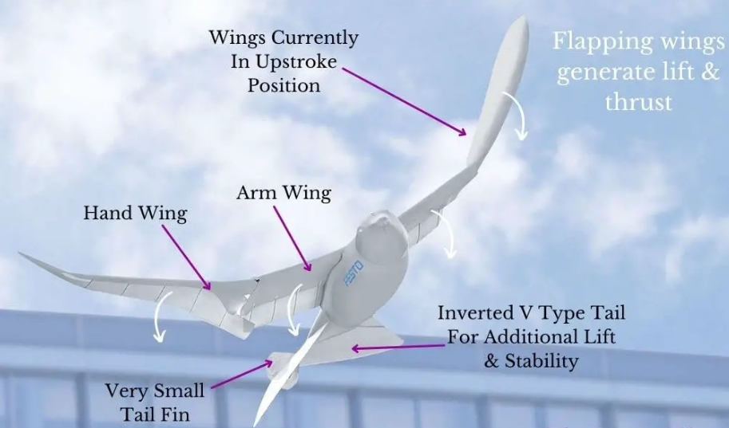 <!-- .element: width="750" -->

==

#### The wing shape

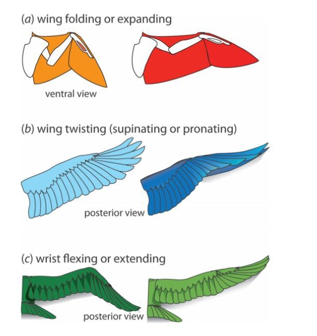 <!-- .element: width="550" -->

==

#### Tech potentials

* Advantages
    * much more efficient than other types of UAVs
    * typically very safe
    * capable of hovering in place during flight
    * simple mechanical complexity
    * expanding the capabilities and applications

==

#### tech potential - example

* Pterosaurs
    * wing span > 10m
    * glide ratio > 10

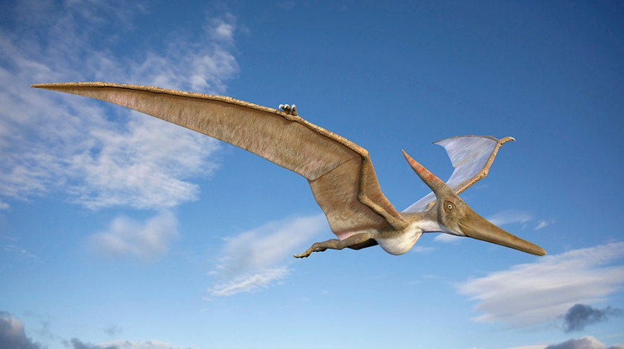 <!-- .element: width="750" -->

===
### State of the Art

* Dimensions
    * Macro vs Micro
    * Mechanical design 

== 

#### current research

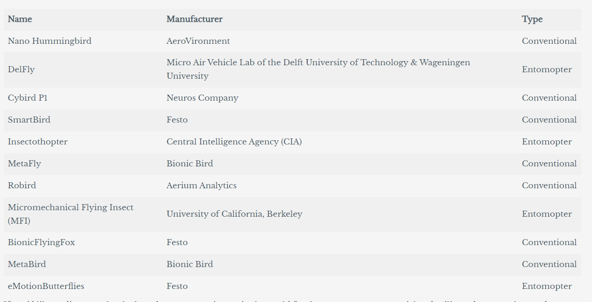 <!-- .element: width="750" -->

==
#### wing design techmap

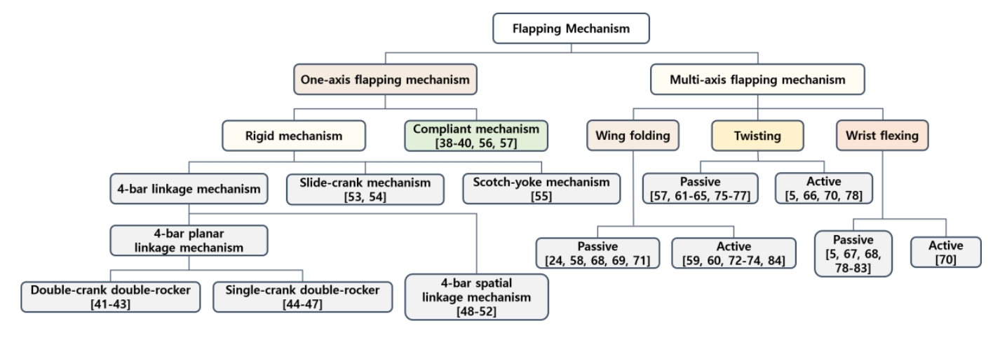 <!-- .element: width="1050" style="filter:invert(93%)" -->

==
####  wing flapping structure

* single axis

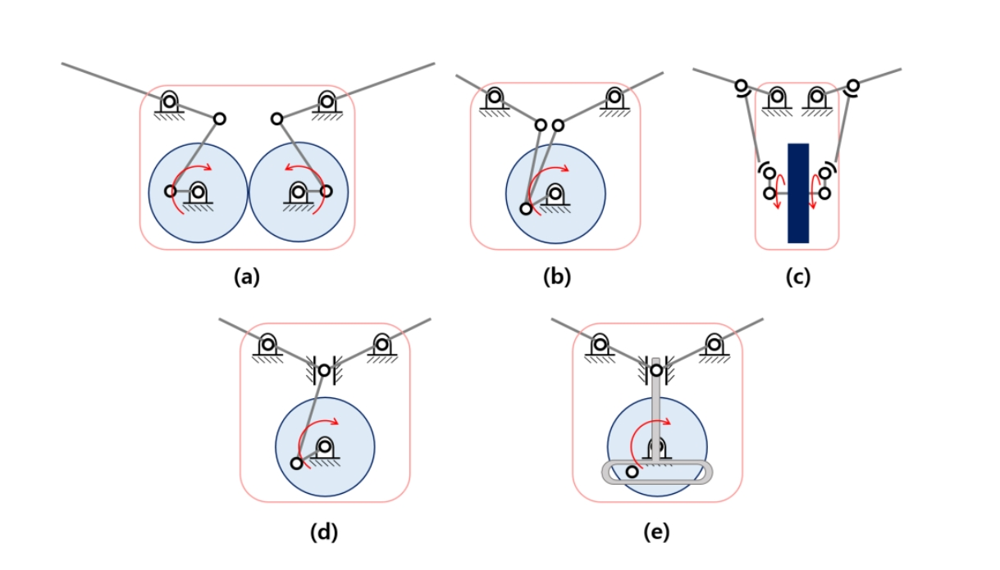 <!-- .element: width="750" style="filter:invert(93%)"-->

==
#### wing flapping structure

* multi-axis

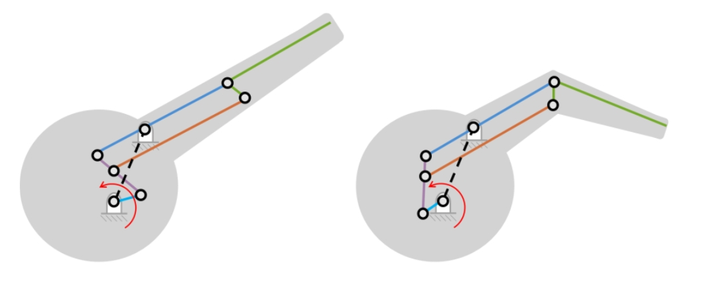 <!-- .element: width="750" style="filter:invert(93%)"-->

==
#### Perspective

* Recent
    * simplized wing design
    * few Aerodynamic consideration
    * traditional control theory
    * difficulty in take-off and landing

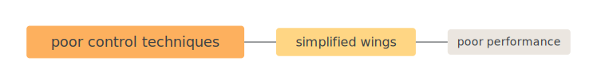<!-- .element: width="750" style="filter:invert(93%)"-->

*证明哥德巴赫猜想，需要新的数学方法* 

===
### Research Targets

* Methodology
    * Flying oriented mechanics desgin
    * Constructure oriented controlling design

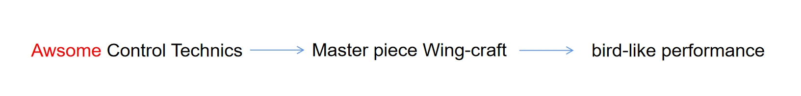 <!-- .element: width="750" -->

===
### in Engineering

* implementation 
    * Evolutionary Design Procedure
    * Embodied Foundation model for Flapping control

== 
#### Evolutionary Design Procedure

State Description

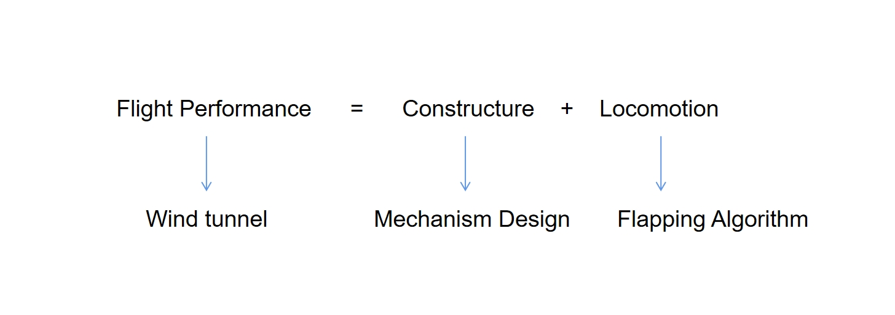 <!-- .element: width="750" -->

==
#### Evolutionary Design Procedure

State Transition

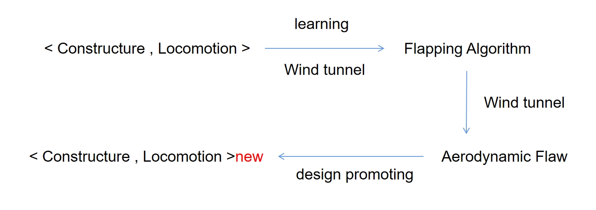 <!-- .element: width="750" -->

===
### Training
===

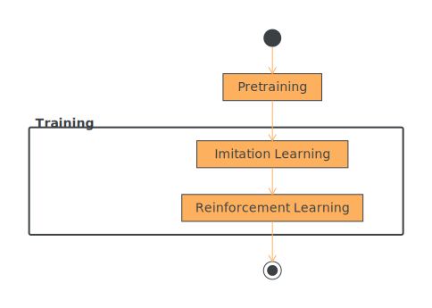
<!-- .element: style="filter:invert(93%)" -->
The training process

==
 <!-- .element: height="200" --> 
 <!-- .element: height="200" style="filter:invert(93%)"-->
 <!-- .element: height="200" -->

Task-specific model or general-purpose model?
==

*Increasingly,*

*the most effective way to tackle a given narrow task*

*is to adapt a general-purpose model.*

-- *[Open X-Embodiment](https://robotics-transformer-x.github.io/)*

==
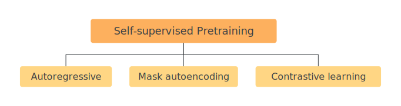
<!-- .element: style="filter:invert(93%)" -->

===
### Autoregressive
==

<!-- .element: style="filter:invert(93%)" -->

Auto-regressive
==

<!-- .element: style="filter:invert(93%)" -->

Auto-regression in language models

==

<!-- .element: style="filter:invert(93%)" -->
==

<!-- .element: style="filter:invert(93%)" -->

Token-wise in practice

==

<!-- .element: style="filter:invert(93%)" -->

Self-supervised Pretraining

===
### Mask autoencoding
==

<!-- .element: style="filter:invert(93%)" -->
Maksed language modeling

==

<!-- .element: style="filter:invert(93%)" -->

Maksed language modeling

==

Masked autoencoder (MAE)

==
 <!-- .element: style="filter:invert(93%)" height="400"-->

Autoencoder (2006)
===

#### Pretraining for embodied agents

==

<video loop="" autoplay="" muted="" playsinline="" preload="metadata">
                <source src="https://robotic-pretrained-transformer.github.io/assets/method_animation_v4.m4v" type="video/mp4">
            </video>
            Pretraining: Mask autoencoding

==

<video loop="" autoplay="" muted="" playsinline="" preload="metadata">
                <source src=" https://robotic-pretrained-transformer.github.io/assets/inference_animation.mp4" type="video/mp4">
            </video>

Inference: Autoregressive
===

 ### LET'S FLY!
