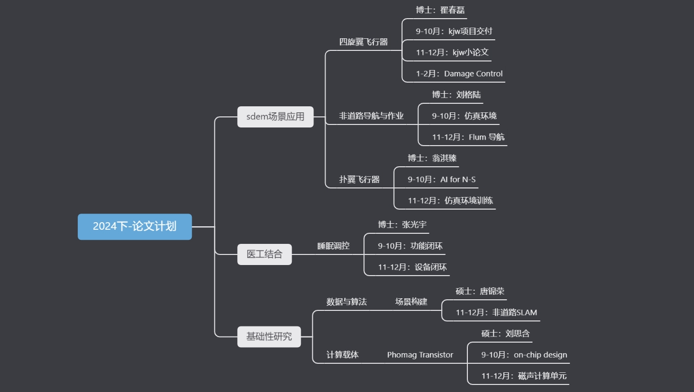

[//]: # (
 
    
    )

### Semester Openning

CPNT Branch-AI

 <!-- .element: width="300" style="filter:invert(91%)" -->

Wang Phil, Li Shaun

2024.9.14

===

### Outline

* Part 1: Orientation
    * Induction
    * Onboarding
* Part 2: Semester Strategy
    * Cultivation
    * Research Map
* Part 3: KAN 2

===

### Orientation

#### Induction 

 <!-- .element: width="700" -->

==

### Orientation

#### Onboarding

* Discipline
    * Attendance
    * Confidential
    * no-politics
* Being academic
    * Evidence-based
    * Honor Knowledge

===

### Semester Strategy

#### Cultivation

In conceptual - Three in One

* Publication
    * Research
* Delivery
    * Project
* Study
    * Course

==

### Semester Strategy

#### Cultivation

* Personal
    * Course Study
    * Independent Study
* In band
    * Research skill
    * Technical skill
    * Delivery skill
* Supervision
    * Knowledge tutor
    * Research advisor
    * One-one mentor

==
### Semester Strategy

#### Cultivation

#### Personal
#### e.g.

* Course Study
    * Data Structure
    * Linear Algebra
    * Machine Learning
* Independent Study
    * LaTex / Typst
    * Cutting-edge articles

==
### Semester Strategy

#### Cultivation

#### In band
#### e.g.

* Research skill
    * how to reason a research topic
* Techical skill
    * how to tune MLP
* Delivery skill
    * how to truely communicate

==
### Semester Strategy

#### Cultivation

#### Supervision 

* Knowledge tutor
    * Seminar
        * Weekly
        * Knowledge Sharing
    * Branch Course: Dive into Research 
        * Weekly
        * Open session, mandatory for freshmen

==
### Semester Strategy

#### Cultivation

#### Supervision 

* Research advisor
    * Research Guidance
        * no mandatory
        * no cap
            * PhD: sub-ncs
            * Master: top
    * Branch Course: NCS Review
        * Monthly
        * Final Examination

==
### Semester Strategy

#### Cultivation

#### Supervision 

* One-one mentor
    * Catch-up
        * bi-weekly
    * short-course

===

#### Semester Strategy

#### Research Map

Overview

* Sep-Oct: Preparing
* Nov-Dec: Research Camp

==

### Semester Startegy

#### Research Map

 <!-- .element: width="800" -->

===

### Kolmogorov-Arnold Network 2.0

An AI + Science Paradigm

LI Shaun, 2024-09-14

<!-- .element: style="font-size:20pt" -->

=== 

AlphaFold, AI for Science

==

 <!-- .element: height="150" --> 
 <!-- .element: height="150" style="filter:invert(91%)"-->
 <!-- .element: height="150" -->

Astronomy $\quad\quad\quad\quad\quad$ Astronautics

==

#### Different Sciences

|      | **Application-Driven**               | **Curiosity-Driven**              |
|----------------|----------------------------------------------|-------------------------------------------|
| **Objective**  | Clear, practical goals                       | Gaining understanding         |
| **Approach**   | Optimized by black-box AI                    | Exploratory |
| **Focus**      | Predictions          | Underlying theories   |
| **Outcome**                       | Solutions for specific problems                         | Foundation for future technology|
| **AI Role**    | Works well with current AI | Needs interpretability and interaction|

<!-- .element: style="font-size:20pt" -->
==

### Incompatible?
| **Today's AI**                                      | **Science**                                         |
|:---------------------------------------------------:|:---------------------------------------------------:|
| Connectionism                                      | Symbolism                                           |

==

### AI + Science

===

## Outline
- KAN 1.0 (Review)
    * 1900 - 2024
- KAN 2.0
    * New Operator
    * New Paradigm
    * New Applications

===

#### Hilbert's 13th Problem, 1900

*Impossibility of the solution of the general equation of 7th degree by means of functions of only two arguments.*
<!-- .element: style="font-size:30pt" -->
==

 <!-- .element: height="250" --> $\quad$
 <!-- .element: height="250" -->

#### Kolmogorov-Arnold Representation Theorem (KART), 1957
<!-- .element: style="font-size:28pt" -->
$$f(x_1, \dots, x_n) = \sum_{q=1}^{2n+1} \Phi_q \left( \sum_{p=1}^n \phi_{q,p}(x_p) \right)$$

==

#### Shallow KAN, Robert Hecht-Nilsen, 1975

==

Compare Shallow MLP with Shallow KAN

==
UAT, KART: Theoretical, Existence

Deep Learning: Empirical, Constructive

==

#### Define a KAN layer
 <!-- .element: height="350" -->

$$\Phi = \(\phi_{q,p}\), \quad p = 1, 2, \dots, n_{\text{in}}, \quad q = 1, 2, \dots, n_{\text{out}}$$

==
#### Deep KAN, 2024.04
 <!-- .element: height="350" -->
$$\text{KAN}(\mathbf{x}) = (\Phi_3 \circ \Phi_2 \circ \Phi_1)(\mathbf{x})$$
==

#### Learnable activation functions
 <!-- .element: height="350" -->
==

===

### What KAN you say?
Symbolic Regression

==

#### Kepler's Laws, 1605

==

KAN for symbolic regression

==

Train and Prune

==
 <!-- .element: height="500" -->
===

===

#### Is symbolic regression necessary/sufficient?
==
#### Is symbolic regression always feasible?
== 
#### Can we incorporate scientific knowledge to KAN?
Science to KAN

===
### KAN 2.0

===
### MultKAN: KAN with Multiplication
==

===
#### Science to KAN: 
I. Feature Engineering
==

Goal: $y=f(x_1,x_2,\cdots, x_n)$

Auxiliary feature: $a = a(x_1,x_2,\dots, x_n)$

$$y=f(x_1,\cdots, x_n, a)$$

==

==
#### Science to KAN: 
II. Building Modular Structures
==

==
#### Science to KAN: 
III. Compiling symbolic formulas (kanpiler)

==

===

### Discussion

==

<!-- .element:  style="filter:invert(91%)" -->
==

===
