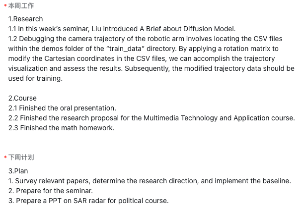
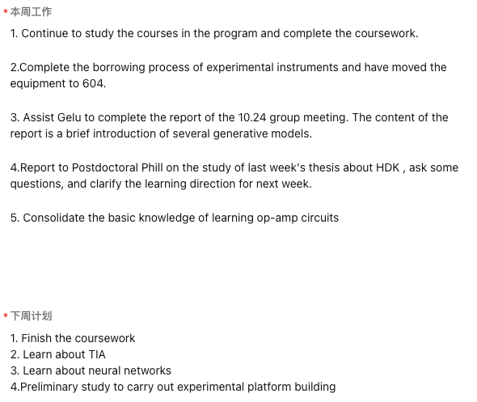
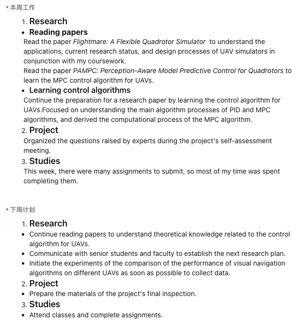
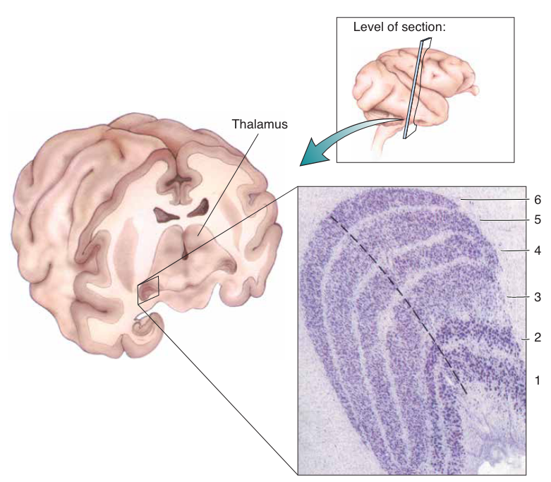
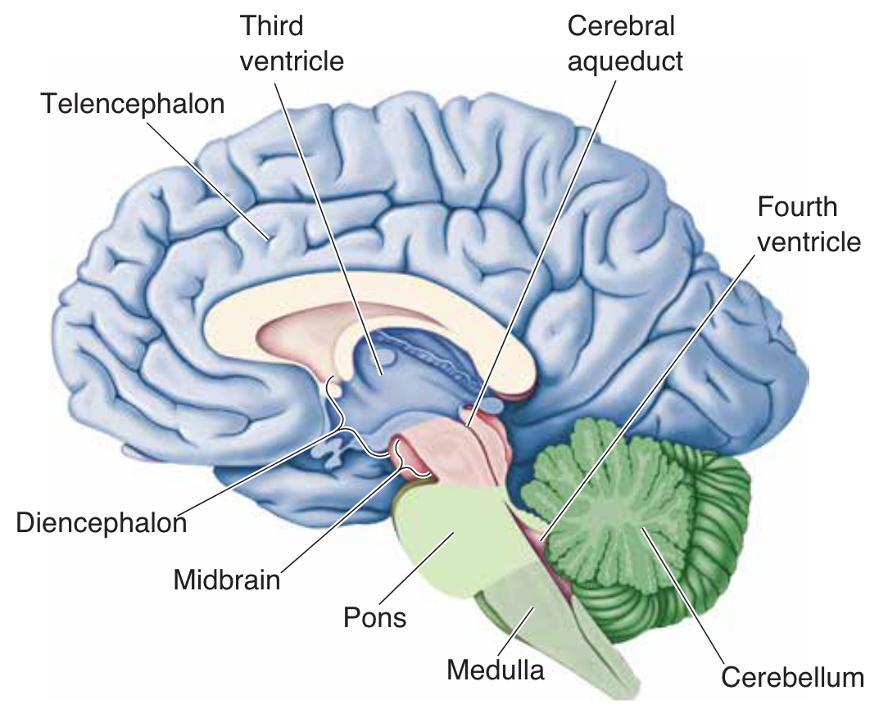

[//]: # (
 
    
    )

### Verbal for Science, II

Vocabulary

LI Shaun, 2024-10-30

<!-- .element: style="font-size:20pt" -->

===

#### Review of the last session
Why, Who, What, How

==

### What

- **Vocabulary**
- Grammar <!-- .element: style="color:gray" -->
- Pronunciation<!-- .element: style="color:gray" -->
- Culture<!-- .element: style="color:gray" -->

=== 

#### Mastering English $\overset{?}{=}$ Building Vocabulary?

A common misconception among Chinese students

==

A very ___ history of English

==

A common misconception ___ Chinese students

===

#### Building Vocabulary $\overset{?}{=}$ Memorizing Words?
Another common misconception 

== 

Embodied Agents

(Let's look them up in the dictionary)

===

#### Memorizing Words $\overset{?}{=}$ Learning Translations?
Yet another common misconception 

 <!-- .element: height="150" -->
 <!-- .element: height="150" -->

==

Continue the preparation for the thesis by reading the book *Flight Dynamics of Aircraft*

--- Excerpt from a weekly progress report <!-- .element: style="font-size:25pt;text-align:right" -->
==

Report to Postdoctoral Phill on the study of last week's thesis about HDK

--- Excerpt from another weekly progress report <!-- .element: style="font-size:25pt;text-align:right" -->

==

What is harmony?
- By translations?
- Let's play some music

==

## Grounding
You don't even know how to translate the word

===

## What you will learn today

- Ground the words
- Use the words
- Build your vocabulary

===

## Ground your words

==

Can you learn a foreign language from radio?

==

Can you learn a foreign language from TV?
==
<iframe width="1038" height="584" src="https://www.youtube.com/embed/ijQDxwUGIOg?start=63" title="Grocery Store Vocabulary: shop in English" frameborder="0" allow="accelerometer; autoplay; clipboard-write; encrypted-media; gyroscope; picture-in-picture; web-share" referrerpolicy="strict-origin-when-cross-origin" allowfullscreen></iframe>

Grocery Store Vocabulary: shop in English

==

<iframe width="1038" height="584" src="https://www.youtube.com/embed/7vt5Lt5VUH4?start=144" title="The SECRET To Stop Blundering Your Pieces In Chess" frameborder="0" allow="accelerometer; autoplay; clipboard-write; encrypted-media; gyroscope; picture-in-picture; web-share" referrerpolicy="strict-origin-when-cross-origin" allowfullscreen></iframe>
The SECRET To Stop Blundering Your Pieces In Chess

==
<iframe width="1038" height="584" src="https://www.youtube.com/embed/yxa-DJuuTBI" title="Python Tutorial: Pathlib - The Modern Way to Handle File Paths" frameborder="0" allow="accelerometer; autoplay; clipboard-write; encrypted-media; gyroscope; picture-in-picture; web-share" referrerpolicy="strict-origin-when-cross-origin" allowfullscreen></iframe>
Python Tutorial: Pathlib - The Modern Way to Handle File Paths

==

Can you learn a foreign language from experience?
===

### Try your best to ground your words
Google Image, operating systems, YouTube, ...

===

## Use your words

==

 <!-- .element: height="250"  -->
 <!-- .element: height="250"  -->
<!-- .element: height="250"  -->

Weekly reports

==

Google using English

==

 <!-- .element: height="550"  -->

[Languages used on the Internet](https://en.wikipedia.org/wiki/Languages_used_on_the_Internet)
==

### Chat with [ChatGPT](https://chatgpt.com/?model=gpt-4o).

You don't need to be a prompt master. 

===

## Build your vocabulary

==

### How many words do you have?
Ref: CET6, 5500-6000

===

### How many words are there in English

| Dictionary  | #Entries |
|-------------|----------|
| Oxford English Dictionary     | 273,000  |
| American Heritage | 350,000  |
| Webster's Third  | 470,000  |
| English Wiktionary  | 755,865  |

==

### How many words do you need to know?
Most adult fluent English speakers have around 20,000–35,000 words in their vocabulary.

==

### You always have new words to learn

<!-- .element: height="350"  -->

e.g., geniculocortical

==

How GPT works?

 <!-- .element: height="350" style="filter:invert(93%)"  -->

A token is not a word.

==

GPT: Words are infinite, but tokens are finite.

Human: Words are infinite, but morphemes are finite

==

### Morphemes
prefix, root, suffix

==

### Morphology

electroencephalogram

==

<!-- .element: height="350"  -->

Germanic for Germanic, Greek for Greek, Latin for Latin <!-- .element: style="font-size:28pt" -->

==

- overfit
- supervise
- hypernym

==

### Etymology
The origin of words 

==

 <!-- .element: height="550" style="filter:invert(93%)"  -->

==

- Proto-Indo-European
- Proto-Germanic
- Old English
- Middle English (since 1066)
- Early Modern English (Renaissance)
- Modern English (since 17th, sci. rev.)

==

| **Origin**      | **Period of Influ.**            | **Source of Influ.**                        | **Examples**                              |
|-----------------|--------------------------------|-------------------------------------------------|-------------------------------------------|
| **Germanic**    | Prehistoric to Present        | Core vocabulary as English is a Germanic language| House, Friend, Night, Sky                 |
| **French**      | Norman Conquest (1066)        | Norman rule introduced French vocabulary         | Cuisine, Court, Ballet, Parliament        |
| **Latin**       | Middle Ages to Renaissance    | Language of religion, law, and scholarship       | Manual, Radius, Subpoena, Aqua            |
| **Arabic**      | Middle Ages                   | Trade and scientific exchange                    | Algebra, Alcohol, Lemon, Cotton           |
| **Italian**     | Renaissance (14th-17th c.)    | Cultural terms in art, music, and architecture   | Piano, Sonnet, Opera, Balcony             |
| **Greek**       | Renaissance to Modern Era     | Foundations in science, medicine, and philosophy | Biology, Democracy, Physics, Telephone    |

<!-- .element: style="font-size:20pt" -->
===

### Germanic origin
==
| **Germanic Root** | **Meaning**           | **Examples**                                 |
|-------------------|-----------------------|----------------------------------------------|
| **house**         | Dwelling              | House, Household, Housework                 |
| **hand**          | Hand                  | Handshake, Handle, Handwriting              |
| **folk**          | People, Community     | Folklore, Folk tale                   |
| **night**         | Night                 | Nightfall, Midnight, Nightmare              |
| **word**          | Speech, Word          | Wordsmith, Wording, Password                |
| **man**           | Human, Man            | Mankind, Manpower, Manhood                  |
| **stone**         | Rock                  | Stonework, Stonewall, Cornerstone           |
| **land**          | Earth, Territory      | Landscape, Landlord, Mainland               |
| **king**          | Ruler                 | Kingdom, Kingship, Kingly                   |
| **strong**        | Strength, Sturdy      | Strengthen, Stronghold, Strongman           |
| **water**         | Water                 | Waterfall, Waterproof, Watershed            |
| **earth**         | Soil, Ground          | Earthquake, Earthen, Earthbound             |
| **deep**          | Depth                 | Deepen, Deeply, Deepwater                   |
| **cold**          | Cold                  | Coldness, Coldhearted, Ice-cold             |
<!-- .element: style="font-size:20pt" -->

==

| **Germanic Prefix** | **Meaning**           | **Examples**                               |
|---------------------|-----------------------|--------------------------------------------|
| **be-**             | Around, Affecting     | Befriend, Belittle, Bewilder              |
| **for-**            | Away, Off, Against    | Forbid, Forgo, Forget                     |
| **fore-**           | Before, Front         | Foresee, Forehead, Foretell               |
| **mid-**            | Middle                | Midway, Midnight, Midpoint                |
| **over-**           | Excessively, Above    | Oversee, Overcome, Overload               |
| **out-**            | Beyond, External      | Outrun, Outgoing 
| **under-**          | Beneath, Insufficient | Underestimate, Undergo, Underwater        |
| **up-**             | Higher, Upright       | Uphold, Upbringing, Upside                |
| **with-**           | Against, Back         | Withdraw, Withhold, Withstand             |

<!-- .element: style="font-size:20pt" -->

==

| **Germanic Suffix** | **Meaning**              | **Examples**                               |
|---------------------|--------------------------|--------------------------------------------|
| **-dom**            | State, Domain            | Freedom, Kingdom, Wisdom                  |
| **-hood**           | State, Condition         | Childhood, Brotherhood, Likelihood        |
| **-ness**           | State, Quality           | Kindness, Darkness, Weakness              |
| **-ship**           | State, Rank, Condition   | Friendship, Leadership, Fellowship        |
| **-ful**            | Full of                  | Joyful, Wonderful, Careful                |
| **-less**           | Without                  | Hopeless, Fearless, Endless               |
| **-ly**             | Characteristic of        | Friendly, Lovely, Quickly                 |
| **-wise**           | In relation to, Like     | Otherwise, Likewise, Clockwise            |
| **-en**             | Made of, To Make         | Wooden, Strengthen, Darken                |

<!-- .element: style="font-size:20pt" -->

===

## Latin origin

==
| **Latin Root** | **Meaning**          | **Examples**                                |
|----------------|----------------------|---------------------------------------------|
| **aqua**       | Water                | Aquarium, Aquatic, Aqueduct                 |
| **aud**        | Hear                 | Audio, Audience, Auditorium                 |
| **bene**       | Good, Well           | Benefit, Benevolent, Beneficial             |
| **cent**       | Hundred              | Century, Percent, Centimeter                |
| **dict**       | Say, Speak           | Dictate, Dictionary, Predict                |
| **duc/duct**   | Lead                 | Conduct, Educate, Deduct                    |
| **form**       | Shape                | Form, Transform, Formation                  |
| **fort**       | Strong               | Fortify, Fortress, Effort                   |
| **ject**       | Throw                | Eject, Project, Injection                   |
| **lumin**      | Light                | Illuminate, Luminous, Luminary              |
| **mal**        | Bad, Evil            | Malfunction, Malicious, Malcontent          |
| **mater**      | Mother               | Maternal, Maternity, Matriarch              |
| **mort**       | Death                | Mortal, Immortal, Mortuary                  |
| **port**       | Carry                | Transport, Import, Export                   |
| **scrib/script** | Write              | Scribble, Manuscript, Prescription          |
| **sect**       | Cut                  | Section, Dissect, Intersection              |
| **sent/sens**  | Feel                 | Sense, Sensitive, Sentiment                 |
| **terr**       | Earth                | Territory, Terrain, Terrestrial             |
| **vid/vis**    | See                  | Video, Vision, Invisible                    |
| **voc**        | Call, Voice          | Vocal, Advocate, Invocation                 |
| **volv/volut** | Roll, Turn           | Revolve, Evolution, Involve                |
<!-- .element: style="font-size:13pt" -->
==
| **Latin Prefix** | **Meaning**             | **Examples**                             |
|------------------|-------------------------|------------------------------------------|
| **a- / ab-**     | Away from               | Absent, Abduct, Abnormal                 |
| **ad-**          | To, Toward              | Advance, Admit, Address                  |
| **ante-**        | Before                  | Antechamber, Antecedent, Antenatal       |
| **circum-**      | Around                  | Circumference, Circumnavigate, Circumspect |
| **com- / con-**  | With, Together          | Combine, Connect, Consensus              |
| **contra-**      | Against, Opposite       | Contradict, Contrast, Contraband         |
| **de-**          | Down, Away              | Descend, Decline, Detach                 |
| **dis-**         | Apart, Not              | Disagree, Disappear, Disconnect          |
| **ex- / e-**     | Out of, From            | Exit, Eject, Extract                     |
| **extra-**       | Outside, Beyond         | Extraordinary, Extraterrestrial, Extract |
| **in- / im-**    | In, Into, On            | Insert, Include, Illuminate              |
| **inter-**       | Between, Among          | International, Interact, Intervene       |
| **in- / il- / im- / ir-** | Not (Negation) | Incorrect, Illegal, Impossible, Irregular |
| **mis-**         | Wrongly, Badly          | Misunderstand, Misjudge, Misuse          |
| **non-**         | Not                     | Nonsense, Nonprofit, Nonexistent         |
| **post-**        | After                   | Postgraduate, Postpone, Postmortem       |
| **pre-**         | Before                  | Prepare, Predict, Precede                |
| **pro-**         | For, Forward            | Proceed, Promote, Proactive              |
| **re-**          | Again, Back             | Return, Rebuild, Reconsider              |
| **sub-**         | Under, Below            | Submarine, Subtract, Submerge            |
| **super-**       | Above, Over             | Supernatural, Supervise, Superior        |
| **trans-**       | Across, Through         | Transfer, Transmit, Transport            |
| **ultra-**       | Beyond, Excessive       | Ultramodern, Ultrasonic, Ultra-thin      |

<!-- .element: style="font-size:12pt" -->

==

| **Latin Suffix** | **Meaning**               | **Examples**                              |
|------------------|---------------------------|-------------------------------------------|
| **-able / -ible** | Capable of, Able to       | Reliable, Edible, Visible                |
| **-ance / -ence** | State or Quality of       | Resistance, Independence, Persistence    |
| **-ant / -ent**  | Performing or Causing     | Assistant, Dependent, Resident           |
| **-ary**         | Related to, Place for     | Library, Secretary, Military             |
| **-ate**         | To Make, Act              | Generate, Create, Formulate              |
| **-ation**       | Action or Process         | Education, Celebration, Formation        |
| **-cy**          | State or Condition        | Privacy, Accuracy, Agency               |
| **-er / -or**    | One Who Does              | Teacher, Creator, Inspector              |
| **-fy**          | To Make or Cause          | Simplify, Clarify, Fortify               |
| **-ic / -ical**  | Related to                | Historic, Logical, Musical               |
| **-ile**         | Capable of, Suited for    | Fragile, Juvenile, Fertile               |
| **-ion / -tion / -sion** | Action or Process | Operation, Vision, Decision             |
| **-ive**         | Having the Nature of      | Creative, Active, Supportive             |
| **-ment**        | State, Process, Act       | Government, Development, Management      |
| **-or**          | State or Quality          | Honor, Valor, Terror                     |
| **-ory**         | Place for, Related to     | Laboratory, Dormitory, Sensory           |
| **-ous / -ious** | Full of, Characterized by | Curious, Gracious, Dangerous             |
| **-ty / -ity**   | State or Quality          | Activity, Clarity, Reality               |
| **-ure**         | Action, Condition         | Exposure, Culture, Closure               |

<!-- .element: style="font-size:15pt" -->
===

### Greek origin

==
| **Greek Root** | **Meaning**           | **Examples**                                 |
|----------------|-----------------------|----------------------------------------------|
| **aero**       | Air                   | Aerobic, Aerodynamics, Aerospace            |
| **anthrop**    | Human                 | Anthropology, Philanthropy, Misanthrope     |
| **arch**       | Chief, Ruler          | Monarch, Anarchy, Architect                 |
| **auto**       | Self                  | Automatic, Autonomy, Autograph              |
| **bio**        | Life                  | Biology, Biography, Biodegradable           |
| **chron**      | Time                  | Chronology, Chronic, Synchronize            |
| **dem**        | People                | Democracy, Demographic, Epidemic            |
| **geo**        | Earth                 | Geography, Geology, Geometry                |
| **graph**      | Write                 | Autograph, Graphic, Biography               |
| **hydr**       | Water                 | Hydration, Dehydrate, Hydroelectric         |
| **log/logy**   | Word, Study           | Dialogue, Logic, Biology                    |
| **meter/metr** | Measure               | Thermometer, Barometer, Geometry            |
| **micro**      | Small                 | Microscope, Microorganism, Microchip        |
| **phon**       | Sound                 | Telephone, Symphony, Phonetic               |
| **photo**      | Light                 | Photograph, Photosynthesis, Photon          |
| **psych**      | Mind, Soul            | Psychology, Psychotherapy, Psychic          |
| **therm**      | Heat                  | Thermometer, Thermal, Thermostat            |
| **zo**         | Animal                | Zoology, Protozoa, Zoo                      |

<!-- .element: style="font-size:15pt" -->
==

| **Greek Prefix** | **Meaning**           | **Examples**                               |
|------------------|-----------------------|--------------------------------------------|
| **a- / an-**     | Without, Not          | Atypical, Anemia, Anonymous               |
| **anti-**        | Against               | Antidote, Antisocial, Antibody            |
| **hyper-**       | Over, Excessive       | Hyperactive, Hyperbole, Hypertension      |
| **hypo-**        | Under, Below          | Hypothermia, Hypothesis, Hypodermic       |
| **mono-**        | One, Single           | Monologue, Monogamy, Monochrome           |
| **pan-**         | All                   | Pandemic, Panorama, Panacea               |
| **para-**        | Beside, Near          | Parallel, Paramedic, Paralegal            |
| **peri-**        | Around, Surrounding   | Perimeter, Periscope, Peripheral          |
| **syn- / sym-**  | Together, With        | Synthesis, Symmetry, Symbol               |

<!-- .element: style="font-size:20pt" -->
==

| **Greek Suffix** | **Meaning**            | **Examples**                                 |
|------------------|------------------------|----------------------------------------------|
| **-ism**         | Belief, Doctrine       | Optimism, Polytheism, Criticism             |
| **-ist**         | One who practices      | Scientist, Biologist, Psychologist          |
| **-ite**         | Native of, Follower    | Hermite, Israelite, Graphite               |
| **-logy**        | Study of               | Biology, Geology, Anthropology             |
| **-meter**       | Measure                | Thermometer, Barometer, Diameter           |
| **-phobia**      | Fear of                | Claustrophobia, Hydrophobia, Xenophobia    |
| **-phone**       | Sound                  | Telephone, Microphone, Homophone           |
| **-scope**       | Instrument for viewing | Microscope, Telescope, Periscope           |
| **-graph**       | Writing                | Autograph, Photograph, Telegraph           |
| **-cracy**       | Rule, Government       | Democracy, Aristocracy, Bureaucracy        |
| **-pathy**       | Feeling, Disease       | Sympathy, Apathy, Neuropathy               |
| **-gen**         | Producer, Origin       | Oxygen, Pathogen, Hydrogen                 |
| **-phile**       | Lover of               | Bibliophile, Anglophile, Hydrophile        |

<!-- .element: style="font-size:20pt" -->

===

### analytic vs synthetic

物理化学

Physics and Chemistry

Physical Chemistry

==

## Irregular plural?
phenomenon / phenomena

fungus / fungi

formula / formulae

==
gyrus / gyri
sulcus / sulci

==

| **Singular** | **Plural** | **Origin** | **Examples** |
|---------------------|-------------------|------------|--------------|
| **-us**             | **-i**            | Latin      | Cactus → Cacti, Focus → Foci, Radius → Radii, Alumnus → Alumni |
| **-a**              | **-ae**           | Latin      | Formula → Formulae, Larva → Larvae, Antenna → Antennae, Vertebra → Vertebrae |
| **-um**             | **-a**            | Latin      | Curriculum → Curricula, Datum → Data, Medium → Media, Bacterium → Bacteria, Stratum → Strata |
| **-ex** / **-ix**   | **-ices**         | Latin      | Index → Indices, Matrix → Matrices, Appendix → Appendices, Codex → Codices, Vertex → Vertices |
| **-us**             | **-era / -ora**   | Latin      | Corpus → Corpora, Genus → Genera |

<!-- .element: style="font-size:24pt" -->

==

| **Singular** | **Plural** | **Origin** | **Examples** |
|---------------------|-------------------|------------|--------------|
| **-is**             | **-es**           | Greek      | Thesis → Theses, Crisis → Crises, Hypothesis → Hypotheses, Analysis → Analyses, Diagnosis → Diagnoses |
| **-on**             | **-a**            | Greek      | Phenomenon → Phenomena, Criterion → Criteria, Ganglion → Ganglia |
| **-ma**             | **-mata**         | Greek      | Soma → Somata, Stigma → Stigmata, Dogma → Dogmata, Schema → Schemata, Trauma → Traumata |
| **-nx**             | **-nges**         | Greek      | Phalanx → Phalanges, Larynx → Larynges, Sphinx → Sphinges |

<!-- .element: style="font-size:25pt" -->

===
## Make your own tables

===
## Summary

- Ground your words
    - as many ways as possible
- Use your words
    - GPT
    - Weekly report
- Build your vocabulary
    - Morphology + Etymology
    - Make your own tables
===
