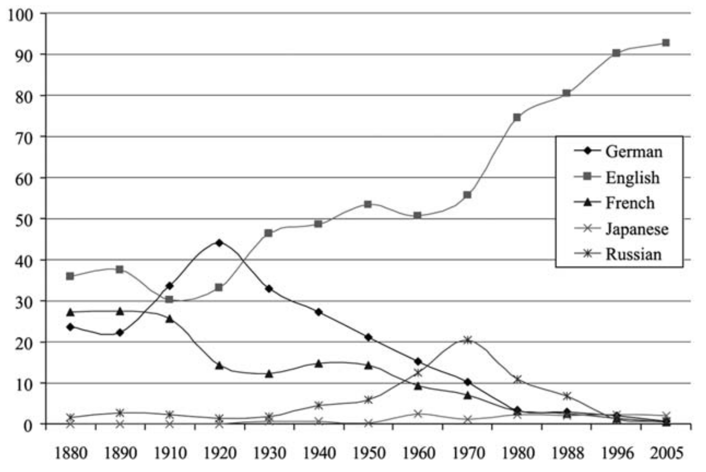

[//]: # (
 
    
    )

### Verbal for Science, II

Vocabulary

LI Shaun, 2024-10-30

<!-- .element: style="font-size:20pt" -->

===

#### Review of the last session
Why, Who, What, How

==

### What

- **Vocabulary**
- Grammar <!-- .element: style="color:gray" -->
- Pronunciation<!-- .element: style="color:gray" -->
- Culture<!-- .element: style="color:gray" -->

=== 

#### Mastering English $\overset{?}{=}$ Building Vocabulary?

A common misconception among Chinese students

==

A very ___ history of English

==

A common misconception ___ Chinese students

==

#### Building Vocabulary $\overset{?}{=}$ Memorizing Words?
Another common misconception 

== 

Embodied Agents

(Let's look them up in the dictionary)

==

#### Memorizing Words $\overset{?}{=}$ Learning Translations?
Yet another common misconception 

 <!-- .element: height="150" -->
 <!-- .element: height="150" -->

==

Continue the preparation for the thesis by reading the book *Flight Dynamics of Aircraft*

==

Report to Postdoctoral Phill on the study of last week's thesis about HDK

==

Harmony

==

Grounding

===

## What you will learn today

English proficiency in 2023

==
inverse order

Nixon appointed as czar of drug abuse research Dr. Jerome Jaffe, a psychiatrist who had pioneered in methadone treatment for heroin addicts.
==
city proper

For the Egyptians, hemp is the plant par excellence ...
==

subjunctive mood

Chemical synaptic transmission requires that neurotransmitters be synthesized and ready for release.

==
Each chromosome contains an uninterrupted double-strand braid of DNA, 2 nm wide. If the DNA from the 46 human chromosomes were laid out straight, end to end, it would measure more than 2 m in length.
==

Syntax

==
This electrical-to-chemical-to-electrical transformation of information makes possible many of the brain's computational abilities.

==

*... the brain exercises the greatest power in the man.*

-- Hippocrates

==

物理化学

Physics and Chemistry

Physical Chemistry

analytic vs synthetic

== 

==

## Irregular plural?
phenomenon / phenomena

fungus / fungi

formula / formulae

==
gyrus / gyri
sulcus / sulci

==

| **Singular** | **Plural** | **Origin** | **Examples** |
|---------------------|-------------------|------------|--------------|
| **-us**             | **-i**            | Latin      | Cactus → Cacti, Focus → Foci, Radius → Radii, Alumnus → Alumni |
| **-a**              | **-ae**           | Latin      | Formula → Formulae, Larva → Larvae, Antenna → Antennae, Vertebra → Vertebrae |
| **-um**             | **-a**            | Latin      | Curriculum → Curricula, Datum → Data, Medium → Media, Bacterium → Bacteria, Stratum → Strata |
| **-ex** / **-ix**   | **-ices**         | Latin      | Index → Indices, Matrix → Matrices, Appendix → Appendices, Codex → Codices, Vertex → Vertices |
| **-us**             | **-era / -ora**   | Latin      | Corpus → Corpora, Genus → Genera |

<!-- .element: style="font-size:24pt" -->

==

| **Singular** | **Plural** | **Origin** | **Examples** |
|---------------------|-------------------|------------|--------------|
| **-is**             | **-es**           | Greek      | Thesis → Theses, Crisis → Crises, Hypothesis → Hypotheses, Analysis → Analyses, Diagnosis → Diagnoses |
| **-on**             | **-a**            | Greek      | Phenomenon → Phenomena, Criterion → Criteria, Ganglion → Ganglia |
| **-ma**             | **-mata**         | Greek      | Soma → Somata, Stigma → Stigmata, Dogma → Dogmata, Schema → Schemata, Trauma → Traumata |
| **-nx**             | **-nges**         | Greek      | Phalanx → Phalanges, Larynx → Larynges, Sphinx → Sphinges |

<!-- .element: style="font-size:25pt" -->

==
The cell body usually gives rise to a single axon.

give rise to 
==

Within the soma are a number of membrane-enclosed structures called organelles.
==

Unresolved was whether the signals to the muscles causing movement use the same wires as those that register sensations from the skin.

==

## English
The de facto scientific language

===

## "Why are you speaking English?"
Stop learning English by translation

==

## One big issue in SYSU
Internationalization

==

### Some facts of Chinese graduate students
- have been learning English for decades, but still struggle
- need to publish papers in English

==
## Audience
The Chinese graduate students 

who struggle with English

===

## What you will learn today

- A very brief history of English 
- Elements of English 
    - Grammar
    - Vocabulary
    - Pronunciation
    - Culture
- How to learn English
    - Imitation
    - Reinforcement

===

## A Very Brief History of English

==

Language family

==

Indo-European languages

==

[Names of the days of the week](https://en.wikipedia.org/wiki/Names_of_the_days_of_the_week)

==

Norman Conquest, 1066

==

- Proto-Indo-European
- Proto-Germanic
- Old English
- Middle English (since 1066)
- Early Modern English (Renaissance)
- Modern English (since 17th, sci. rev.)

==

## Global English
British Empire
==

British Empire
==

Native or official language

==
### English: The de facto scientific language

- Postwar: US, a superpower
- Post Cold War: US, the superpower

==

*The Mathematical Principles of Natural Philosophy*

==

Languages in which science has been published 

===

## Elements of English

- Vocabulary
- Grammar
- Pronunciation 
- Culture

===

## Vocabulary

==

### Use the right word
A very ____ history of English?

==

#### Throw away your English-Chinese word books

 <!-- .element: height="250" -->
 <!-- .element: height="250" -->

==

From memorize to recognize

==

[Notebook vs Laptop](https://books.google.com/ngrams/graph?content=laptop%2Cnotebook&year_start=1800&year_end=2022&corpus=en&smoothing=3)

==

*Word power made easy* 

or other similar vocabulary builders

==

## Learn words in sentences

==
mock vs scoff
- He's always **mocking** my French accent.
- He **scoffed at** our amateurish attempts.
==

## Phrasal Verbs

make fun of, make use of
==

## Collocations

看 look, watch, read

- watch a book
- look TV

==

## Etymology

==

## Origins of words
- Old English
- French
- Latin
- Greek
- Arabic
- Chinese
- Japanese

==

Goten Morgen

==

<iframe width="1337" height="752" src="https://www.youtube.com/embed/zhHF8ofcrgg" title="The Hillbilly Gypsies. Last Ol&#39; Shovel.6.18.2011 SCJ" frameborder="0" allow="accelerometer; autoplay; clipboard-write; encrypted-media; gyroscope; picture-in-picture; web-share" referrerpolicy="strict-origin-when-cross-origin" allowfullscreen></iframe>

*Last old shovel*

==

They buried him on the side of the mountain

My darling sleeps beneath the ground

I stayed right there till they covered him over

And the last old shovel's laid down

==

- cattle / beef
- cook / chef
- sight / vision

== 

Since Renaissance

- calcium, calculus, calculate
- algorithm
- e.g., i.e., in silico / in vivo
- geography, geometry, photograph

==

#### Build your vocabulary by etymology & morphology 

word = (prefix, root[s], suffix)

== 
prefix - preposition, adverb
- acceleration, conceive, receive

==
roots - meaning
- photograph, geometry, act, art
==

suffix - part of speech
- sadness, careful, agent, concept, geometric

==

- agent
- supervisor, superposition
- photometric

==

[etymonline.com](http://etymonline.com)

===

## Grammar

==

English as a second language

==

Grammar = (Syntax, Morphology)

==

Countable / Uncountable

<!-- .element: height="250" -->
<!-- .element: height="250" -->

==

## definite/indefinite articles
the, a, an

==

### Subject-verb agreement

==

## Preposition

==

We carried out our experiments __ the KITTI dataset.

==

In 2024, he graduated from SYSU.

在2024年，他从中大毕业。

===

## Pronunciation

==

American or British accent?
== 

English is a phonetic language.

==

Tones and stress

===

## Culture

==

### Standard English?
<!-- .element: height="250" -->
<!-- .element: height="250" -->

==

## Transmitter/Receiver Orientation

==
<iframe class="r-stretch" src="https://www.youtube.com/embed/gZbvTHj6GFk?start=17" title="【为何东西方思考模式不同】语言会影响思考的方式? 中英语言逻辑上又有哪些差异?" frameborder="0" allow="accelerometer; autoplay; clipboard-write; encrypted-media; gyroscope; picture-in-picture; web-share" referrerpolicy="strict-origin-when-cross-origin" allowfullscreen></iframe>

===

### Imitation Learning

==

<iframe class="r-stretch" src="https://www.youtube.com/embed/UO98lJQ3QGI?start=59" title="Matplotlib Tutorial (Part 1): Creating and Customizing Our First Plots" frameborder="0" allow="accelerometer; autoplay; clipboard-write; encrypted-media; gyroscope; picture-in-picture; web-share" referrerpolicy="strict-origin-when-cross-origin" allowfullscreen></iframe>

"Let's get started."

==
## The only way to learn English
Read and listen to loads and loads of English 

===

### Reinforcement Learning

==

## The only way to master English
Speak and write loads and loads of English
==

==
[Cambly](https://www.cambly.com/en/student/tutors)

==

English corner?

==

Speak or text English to Phil or Shaun

===

## Summary

Why

Who

What

How

===
