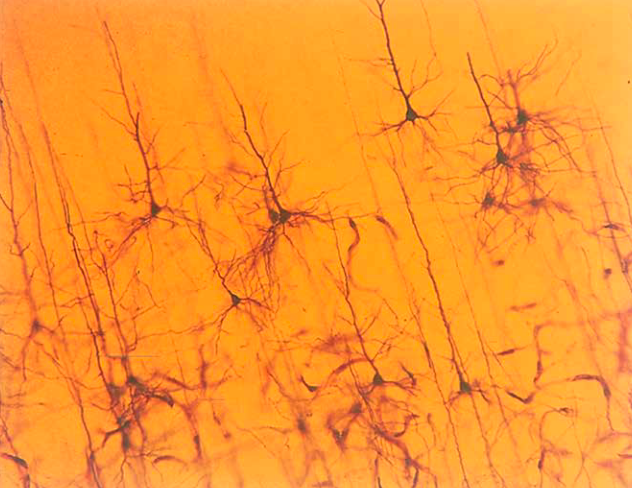

[//]: # (
 
    
    )

## 类脑的时空具身智能概述

李颂元

2024-10-19

<!-- .element: style="font-size:20pt" -->

=== 

<!-- .element: height="200" -->

 *I would say I am someone who doesn’t really know what field he’s in but would like to understand how the brain works. And in my attempts to understand how the brain works, I’ve helped to create a technology that works surprisingly well.*
 
 -- Geoffrey Hinton<!-- .element: style="text-align:right" -->

==

| **人工智能算法**        | **时间** | **神经科学发现**            | **时间**  |
|------------------------|----------|----------------------------|-----------|
| 多层感知机 | 1950s    | 大脑新皮层结构     | 1860s-1950s |
| 卷积神经网络  | 1980     | 猫的视觉机理 | 1962      |
| 递归神经网络  | 1980s      | 大脑的循环突触| 1947 |
| 强化学习   | 1950s-1970s | 强化理论 | 1898      |
| 反向传播算法 | 1986     | 反向神经递质| 1990s |

<!-- .element: style="font-size:25pt" -->
==
<!-- .element: height="300" -->
<!-- .element: height="300" -->

20世纪初知道形态，但不知道是连通还是连接
==

电镜证实是连接 (1950s)

==

<!-- .element: height="500" -->

多层感知机模仿大脑新皮层的多层结构 (1950s)

==

神经元内部的前向和反向传播蛋白

==

<!-- .element: height="500" -->

神经元之间的反向传播神经递质——内源性大麻素

==

小脑是运动中心，神经元数量多于大脑
==

具身图灵测试

Zador et al, Catalyzing next-generation Artificial Intelligence through NeuroAI, Nat. Com., 2023 <!-- .element: style="font-size:18pt;text-align:right" -->
