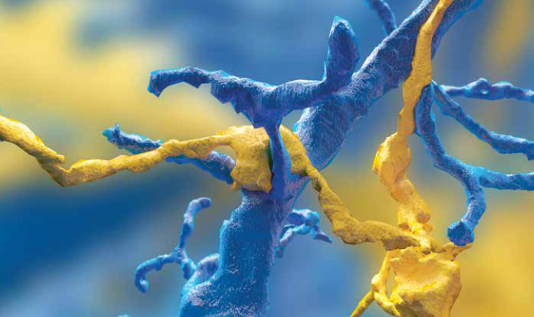

[//]: # (
 
 Language in brain,
 LLM in brain,

 neuronavigation

 NeuroAI

 cerebellum embodied intelligence
    
    )

### CNS Review <!-- .element: width="30" style="position: absolute;" -->
#### Brain-Inspired Navigation & Spatial Intelligence

LI Shaun, WANG Phil

2024-11-07

<!-- .element: style="font-size:20pt" -->

=== 

<iframe width="1280" height="720" src="https://www.youtube.com/embed/-icD_KmvnnM?start=115" title="First Reactions | Geoffrey Hinton, Nobel Prize in Physics 2024 | Telephone interview" frameborder="0" allow="accelerometer; autoplay; clipboard-write; encrypted-media; gyroscope; picture-in-picture; web-share" referrerpolicy="strict-origin-when-cross-origin" allowfullscreen></iframe>

==

*I am someone who just really knows what field he’s in but would like to **understand how the brain works**<!-- .element style="color:#ffde64"-->. And in my attempts to understand how the brain works, I’ve helped to create a technology that works surprisingly well.* <!-- .element: style="float: left; width: 67%; padding-right:1em;  text-align: justify;" -->

 <!-- .element: style="width: 25%" -->

==

### Why Brain-Inspired?

Harness the efficiency and sophistication refined   over **hundreds of millions of years**<!-- .element style="color:#FFED64"--> of evolution
<!-- .element: style="font-size:26pt" -->

==

### Is Brain-Inspired Necessary?

| **AI Algorithms**        | **Time** | **Neuroscience Discoveries**            | **Time**  |
|------------------------|----------|----------------------------|-----------|
| Multilayer Perceptron | 1950s    | Structure of neocortex     | 1860s-1950s |
| Convolutional Neural Network  | 1980     | Cat's visual mechanism | 1962      |
| Recurrent Neural Network  | 1980s      | Recurrent synapses in brain| 1947 |
| Reinforcement Learning   | 1950s-1970s | Reinforcement theory | 1898      |
| Backpropagation Algorithm | 1986     | Retrograde neurotransmitter| 1990s |

<!-- .element: style="font-size:18pt" -->
==

### Two stories
- Multilayer perceptron
- Backpropagation <!-- .element: style="color:gray" -->

==

### Nissl stain & Golgi stain

<!-- .element: height="300" --> 
<!-- .element: height="300" -->

*The gain in brain is mainly in the stain.*

**Neurons communicate by contact or continuity?**  <!-- .element style="color:#FFED64"-->
==

**Neurites in contact, not continuity**<!-- .element style="color:#FFED64"--> by electron microscopy (1950s)

==

<!-- .element: height="500" -->

The multilayer structure of the neocortex (1950s)

==

### Two stories
- Multilayer perceptron<!-- .element: style="color:gray" -->
- Backpropagation 
==

Anterograde and retrograde transport inside neurons with kinesin and dynein

==

<!-- .element: height="500" -->

Retrograde messengers between neurons: Anandamide, NO, CO, H₂S 

===

### Outline
- Introduction<!-- .element: style="color:gray" -->
- Brain-Inspired Navigation
    - Intension
    - Extension
    - Relationship with Spatial Intelligence
- Spatial Intelligence
    - Etymology
    - Examples
    - Relationship with Embodied Intelligence

===
## Brain-Inspired Navigation?
Let's see what the review says about it.

== 

### My Def. of Brain-Inspired Nav.

Navigation technology inspired by neuroscience

<!-- .element: height="250" --> <!-- .element: height="250" -->

Not limited to "brain", but on the entire nervous system
<!-- .element: style="font-size:30pt;color:#ffde64" -->

Spatial Intelligence

Video our

