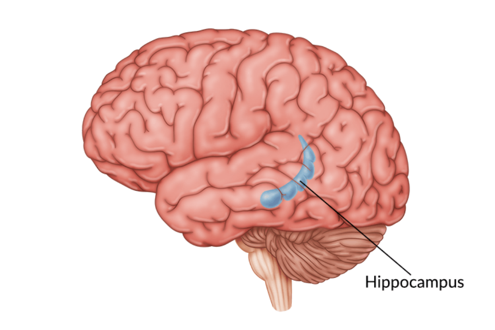

[//]: # (
 
 Language in brain,
 LLM in brain,

 neuronavigation

 NeuroAI

 cerebellum embodied intelligence
    
    )

##### Early Exploration of
#### Brain-Inspired Navigation & Spatial Intelligence

LI Shaun, ZHU Xiangwei

2024-12-09

<!-- .element: style="font-size:20pt" -->

=== 

<iframe width="1280" height="720" src="https://www.youtube.com/embed/-icD_KmvnnM?start=115" title="First Reactions | Geoffrey Hinton, Nobel Prize in Physics 2024 | Telephone interview" frameborder="0" allow="accelerometer; autoplay; clipboard-write; encrypted-media; gyroscope; picture-in-picture; web-share" referrerpolicy="strict-origin-when-cross-origin" allowfullscreen></iframe>

==

*I am someone who just really knows what field he’s in but would like to **understand how the brain works**<!-- .element style="color:#ffde64"-->. And in my attempts to understand how the brain works, I’ve helped to create a technology that works surprisingly well.* <!-- .element: style="float: left; width: 67%; padding-right:1em;  text-align: justify;" -->

 <!-- .element: style="width: 25%" -->

===

### Why Brain-Inspired?

Harness the efficiency and sophistication refined   over **hundreds of millions of years**<!-- .element style="color:#FFED64"--> of evolution
<!-- .element: style="font-size:26pt" -->

==

 <!-- .element: height="600" --> 

===

### What brain-inspired has achieved?

| **AI Algorithms**        | **Time** | **Neuroscience Discoveries**            | **Time**  |
|------------------------|----------|----------------------------|-----------|
| Multilayer Perceptron | 1950s    | Structure of neocortex     | 1860s-1950s |
| Convolutional Neural Network  | 1980     | Cat's visual mechanism | 1962      |
| Recurrent Neural Network  | 1980s      | Recurrent synapses in brain| 1947 |
| Reinforcement Learning   | 1950s-1970s | Reinforcement theory | 1898      |
| Backpropagation Algorithm | 1986     | Retrograde neurotransmitter| 1990s |
<!-- .element: style="font-size:18pt" -->

===

### Two stories
- Multilayer perceptron
- Backpropagation <!-- .element: style="color:gray" -->

==

### Nissl stain & Golgi stain

<!-- .element: height="300" --> 
<!-- .element: height="300" -->

*The gain in brain is mainly in the stain.*

**Neurons communicate by contact or continuity?**  <!-- .element style="color:#FFED64"-->
==

<!-- .element: height="600" -->

==

**Neurites in contact, not continuity**<!-- .element style="color:#FFED64"--> by electron microscopy (1950s)

==

<!-- .element: height="500" -->

The multilayer structure of the neocortex (1950s)

==

Frank Rosenblatt and his Perceptron (1958)

===
### Two stories
- Multilayer perceptron<!-- .element: style="color:gray" -->
- Backpropagation 
==

Anterograde and retrograde transport inside neurons with kinesin and dynein

==

<!-- .element: height="500" -->

Retrograde messengers between neurons: Anandamide, NO, CO, H₂S
===

 

==
### Challenges of Today's AI

- Environments
- Efficiency
- Flexibility

==

### Solution: Neuroscience x AI
Neurocomputing and Embodied Intelligence

 <!-- .element: height="200" -->

==

#### Computational Neuroscience vs. NeuroAI?

===

### Outline
- Introduction<!-- .element: style="color:gray" -->
- Brain-Inspired Navigation
    - Intension
    - Extension
    - Relationship with Spatial Intelligence
- Spatial Intelligence
    - Etymology
    - Examples
    - Relationship with Embodied Intelligence

===

### What is Brain-Inspired Navigation

Navigation technology inspired by neuroscience

==
<!-- .element: height="500" -->

Formation of the neural tube and neural crest

==

A simple reflex

==

#### Navigation technology inspired by neuroscience

Not limited to "brain", but on the entire nervous system
<!-- .element: style="font-size:30pt;color:#ffde64" -->
===

### The Extension of Neuronavigation

<!-- .element: height="250" --> $\quad$ <!-- .element: height="250" --> 

Horizontal $\quad\quad\quad\quad\quad\quad$ Vertical $\quad\quad$
===

### Horizontal: The animals that inspire us

<!-- .element: height="350" -->

Insects, birds, mammals, etc.
==

 <!-- .element: height="500" -->

Sahara Desert ant: Path integration

==

/https://tf-cmsv2-smithsonianmag-media.s3.amazonaws.com/filer/Phenom-Home-bird-flight-631.jpg)

Bird: Multimodal
==

<!-- .element: height="250" --> <iframe width="300" height="250" src="https://www.youtube.com/embed/i9GiLBXWAHI" title="grid cell movie" frameborder="0" allow="accelerometer; autoplay; clipboard-write; encrypted-media; gyroscope; picture-in-picture; web-share" referrerpolicy="strict-origin-when-cross-origin" allowfullscreen></iframe>

Rat: [The grid cell](https://www.numenta.com/blog/2018/05/25/how-grid-cells-map-space/)

==
<iframe width="800" height="600" src="https://www.youtube.com/embed/-7ijI-g4jHg?start=5" title="Bee Dance (Waggle Dance)" frameborder="0" allow="accelerometer; autoplay; clipboard-write; encrypted-media; gyroscope; picture-in-picture; web-share" referrerpolicy="strict-origin-when-cross-origin" allowfullscreen></iframe>

Swarm intelligence: waggle dance
==

<iframe width="1512" height="500" src="https://www.youtube.com/embed/V4f_1_r80RY" title="Flight of the Starlings: Watch This Eerie but Beautiful Phenomenon | Short Film Showcase" frameborder="0" allow="accelerometer; autoplay; clipboard-write; encrypted-media; gyroscope; picture-in-picture; web-share" referrerpolicy="strict-origin-when-cross-origin" allowfullscreen></iframe>

Swarm intelligence: Starlings
===

### Vertical: Levels of analysis and design

<!-- .element: height="450" --> 

===

### Basics of neuroscience

==

<!-- .element: height="500" -->

The cell

==

<!-- .element: height="500" -->

The neuron

==
<!-- .element: height="500" -->

Na/K ion pumps

==
<!-- .element: height="400" -->

Rest potential

==

<!-- .element: height="500" -->

Action potential

==
<!-- .element: height="500" -->

The synapse
==

<!-- .element: height="500" -->

EPSP: Excitatory postsynaptic potential

==

<!-- .element: height="500" -->

IPSP: Inhibitory postsynaptic potential

==
<!-- .element: height="400" -->

The linear part: Synaptic integration

==

<!-- .element: height="400" -->

The non-linear part: G-protein modulation

===

### Vertical: Levels of analysis and design

<!-- .element: height="450" --> 

==

The spiking mechanism
==

 <!-- .element: height="450" --> 

The Epsilon Neural Network on a crossbar

==

 <!-- .element: height="450" --> 

DeepMind: Vector-based navigation (VBN)

*Navigating with grid-like representations in artificial agents, Nature*
<!-- .element: style="text-align: right;font-size:15pt" -->

==

<iframe width="800" height="600" src="https://www.youtube.com/embed/kPCZESVfHoQ?start=5" title="Event-Based Camera vs Standard Camera" frameborder="0" allow="accelerometer; autoplay; clipboard-write; encrypted-media; gyroscope; picture-in-picture; web-share" referrerpolicy="strict-origin-when-cross-origin" allowfullscreen></iframe>

Event-based camera

==

 <!-- .element: height="450" --> 

Event-based camera

==

 <!-- .element: height="450" --> 

Yu et al. *Brain-Inspired Multimodal Hybrid Neural Network for Robot Place Recognition. Sci. Rob.* 2023
<!-- .element: style="text-align: right;font-size:15pt" -->

==

 <!-- .element: height="450" --> 

Delft: A tiny drone

==

<iframe width="800" height="600" src="https://www.youtube.com/embed/J0qh9gu9Tko?start=39" title="Visual Route-following for Tiny Autonomous Robots - Science Robotics" frameborder="0" allow="accelerometer; autoplay; clipboard-write; encrypted-media; gyroscope; picture-in-picture; web-share" referrerpolicy="strict-origin-when-cross-origin" allowfullscreen></iframe>

===

### Vertical: Levels of analysis and design

<!-- .element: height="450" --> 

===

### Spatial Intelligence
Towards cognitive navigation

==
<iframe width="1512" height="688" src="https://www.youtube.com/embed/y8NtMZ7VGmU?start=346" title="With Spatial Intelligence, AI Will Understand the Real World | Fei-Fei Li | TED" frameborder="0" allow="accelerometer; autoplay; clipboard-write; encrypted-media; gyroscope; picture-in-picture; web-share" referrerpolicy="strict-origin-when-cross-origin" allowfullscreen></iframe>

===

<!-- .element: height="400" -->$\quad$
<!-- .element: height="400" --> 

Spatial Intelligence by Howard Gardner in 1983

==
<!-- .element: height="500" --> 

Whether the second form is a rotation of the first

==

 <!-- .element: height="500" --> 

Upstairs or downstairs?

==

 <!-- .element: height="500" --> 

Stereo vision due to binocular disparity?

==

*There is a distance—but a **navigable**<!-- .element style="color:#ffde64"--> one—between this elementary recognition of objects and that ability to trace the relationships among objects that proves central in **spatial intelligence**<!-- .element style="color:#ffde64"-->.*<!-- .element: style="float: left; width: 75%; padding-right:1em;  text-align: left;" -->

 <!-- .element: style="width: 18%" -->

==

Micronesian navigation

===

<iframe width="800" height="600" src="https://reconfusion.github.io/videos/results/co3d_3x5.mp4" title="First Reactions | Geoffrey Hinton, Nobel Prize in Physics 2024 | Telephone interview" frameborder="0" allow="accelerometer; autoplay; clipboard-write; encrypted-media; gyroscope; picture-in-picture; web-share" referrerpolicy="strict-origin-when-cross-origin" allowfullscreen></iframe>

*Wu et al. ReconFusion: 3D Reconstruction with Diffusion Priors, CVPR 2024* <!-- .element: style="text-align: right;font-size:15pt" -->

==

[HourVideo](https://hourvideo.stanford.edu/): the ImageNet of spatial intelligence

==

<iframe width="800" height="600" src="https://wlt-ai-cdn.art/videos/banner_video.mp4" frameborder="0" allow="accelerometer; autoplay; clipboard-write; encrypted-media; gyroscope; picture-in-picture; web-share" referrerpolicy="strict-origin-when-cross-origin" allowfullscreen></iframe>

Li Fei-Fei's [World Labs](https://www.worldlabs.ai/blog)

===

##### Early Exploration of
#### Brain-Inspired Navigation & Spatial Intelligence

LI Shaun, ZHU Xiangwei

2024-12-16

<!-- .element: style="font-size:20pt" -->

===

<!-- .element: height="450" --> 

==

 <!-- .element: height="650" --> 
==

### Q&A: Compare MLP, KAN, SNN

===

### Embodied Intelligence
<!-- .element: height="350" --> 

===

## embody

em-/en- : to make something have a particular quality
<!-- .element: style="font-size:24pt" -->

Compare: empower

word family: embody (v.), embodied (adj.), embodiment (n.)
<!-- .element: style="font-size:24pt" -->

===

<video loop autoplay="" muted="" playsinline="" preload="metadata">
                <source src="https://general-navigation-models.github.io/vint/static/videos/teaser.mp4" type="video/mp4">
            </video>

[ViNT: A Foundation Model for Visual Navigation](https://general-navigation-models.github.io/vint/)

==

[Open X-Embodiment: Robotic Learning Datasets and RT-X Models](https://robotics-transformer-x.github.io/)

==

[Extreme Cross-Embodiment Learning for Manipulation and Navigation](https://extreme-cross-embodiment.github.io/)

===
## Embodied AI $\overset{?}{=}$ Robotics

==
### Embodied agents generalize to ...
- WHERE -- Navigation 
- WHAT -- Manipulation
- WHO -- Cross-embodiment

===

*Many people think that a very abstract activity, like the playing of chess, would be best.  It can also be maintained that it is best to provide the machine with the best sense organs that money can buy, and then teach it to understand and speak English.  This process could follow the normal teaching of a child.  Things would be pointed out and named, etc. Again I do not know what the right answer is, but I think both approaches should be tried.*
<!-- .element: style="float: left; width: 75%; padding-right:1em; text-align: justify;" -->

<!-- .element: style="width: 20%" -->

Alan Turing, *Computing Machinery and Intelligence* (1950)
<!-- .element: style="font-size:16pt" -->

==
### Embodied vs Disembodied 

*Both approaches should be tried.*

Note:( 思维 vs 行为)

==

### Moravec's Paradox

Hard problems are easy; easy problems are hard.

*It is comparatively easy to make computers exhibit adult level performance on intelligence tests or playing checkers, and difficult or impossible to give them the skills of a one-year-old when it comes to perception and mobility* (1988)
<!-- .element: style="float: left; width: 60%; padding-right:1em; text-align: justify;" -->

 <!-- .element: style="width: 30%" -->

==

<!-- .element: height="300" --> $\quad$
 <!-- .element: height="300" --> 
### *Elephants don't play chess* (1990)
Rodney Brooks

==

Paradigms of AI
- Symbolism
- Connectionism
- Actionism

==

不聞不若聞之，聞之不若見之，見之不若知之，知之不若行之，學至於行之而止矣。

——《荀子·儒效》
<!-- .element: style="font-size:18pt;text-align:right" -->
 

紙上得來終覺淺，絕知此事要躬行。

—— 陸游 《冬夜讀書示子聿》
<!-- .element: style="font-size:18pt;text-align:right" -->  

 

知之愈明，則行之愈篤；行之愈篤，則知之益明.

—— 朱熹 《朱子語類》
<!-- .element: style="font-size:18pt;text-align:right" -->

<!-- .slide: style="font-size:24pt" -->
===

Classic experiment by Held and Hein (1963)

==

*We are told that vision depends on the eye, which is connected to the brain.
I shall suggest that natural vision depends on the eyes in the head on a body supported by the ground, the brain being only the central organ of a complete visual system.*
   <!-- .element: style="float: left; width: 60%; padding-right:1em; text-align: justify;" -->

James J. Gibson, *The Ecological Approach to Visual Perception* (1979)
<!-- .element: style="font-size:18pt" -->

==

#### *You can't learn language from the radio.*
Similar metaphor in NLP

==
 $\quad$

### Cognition is embodied
Intelligence emerges in the interaction of an agent with an environment and as a result of sensorimotor activity.

==

### The trend of embodied AI
With a body $\implies$ Embodied

===

## Embodied Turing Test

Ref: [Zador et al.](https://www.nature.com/articles/s41467-023-37180-x)

===

<video loop="" autoplay="" muted="" playsinline="" preload="metadata">
                <source src="https://robotic-pretrained-transformer.github.io/assets/method_animation_v4.m4v" type="video/mp4">
            </video>
            Pretraining: Mask autoencoding

==

<video loop="" autoplay="" muted="" playsinline="" preload="metadata">
                <source src=" https://robotic-pretrained-transformer.github.io/assets/inference_animation.mp4" type="video/mp4">
            </video>

Inference: Autoregressive

===

#### Both Embodied & Spatial  are spatial-temporal
- Embodied Intelligence: Time to Space
- Spatial Intelligence: Space to Time

===

### Coda: Quo vadis?

===

<!-- .element: height="500" --> 

Cognitive Navigation: Connecting hippocampus to cortex
<!-- .element: style="font-size:20pt" -->

==

NavGPT, Discuss before Move

==

*It is only proper to realize that language is largely a historical accident.*  <!-- .element: style="float: left; width: 50%; padding-right:1em; text-align: justify;" -->

 <!-- .element: style="width: 30%" -->

John von Neumann, *The Computer and the Brain* (1958)
<!-- .element: style="font-size:16pt" -->
===

Octopus's camouflage
===

