## From controlling to riding: towards em-intelligent bodies

Introduction of Project Simultaneous Dynamic Estimating and Mounting

Phil Wang, Shaun Li

31, May 2024

===
### Thread

* Cross-pollination: Intelligence and Automation 
* Em-bodied, the consequence
* Way to approach
* the target: in conceptual
* the target: road path

===

### Intelligence and Automation

>an amazing journey: Amundsen & Scott

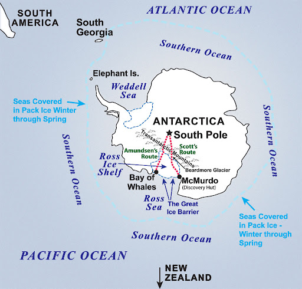 <!-- .element: width="550" -->

==
### Intelligence and Automation

>an amazing journey: Amundsen & Scott

* Control $\rightarrow$ being smart 

* AI $\rightarrow$ connecting to practical

==
### Intelligence and Automation
#### in control engineering

*Cybernetics*

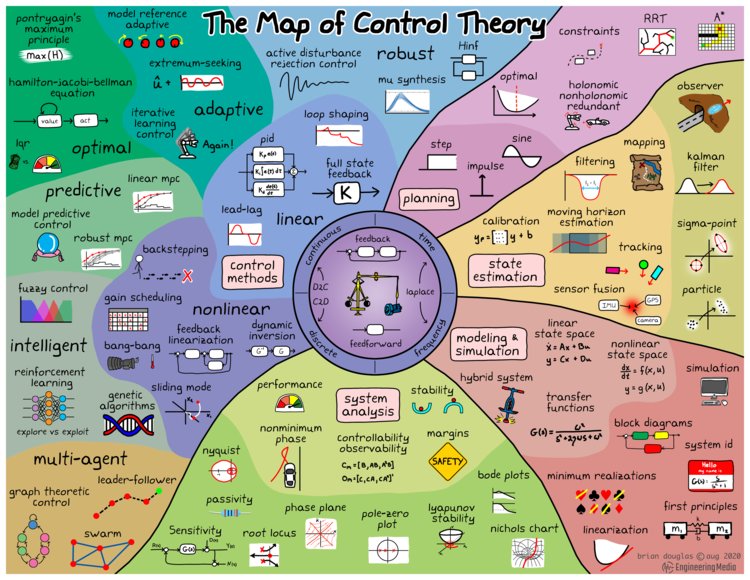 <!-- .element: width="550" -->

==
### Intelligence and Automation
#### AI on machines

*applications*

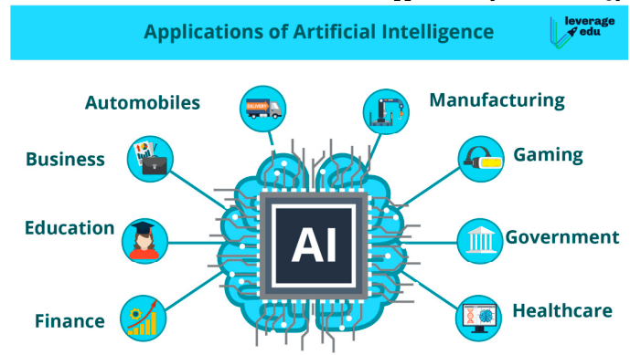 <!-- .element: width="550" -->

==
#### approaching to combination
>why south pole should be the target

* Cybernetics $\rightarrow$ no way to automation

* AI $\rightarrow$ challenging the worst

==
#### approaching to combination
>why south pole should be the target

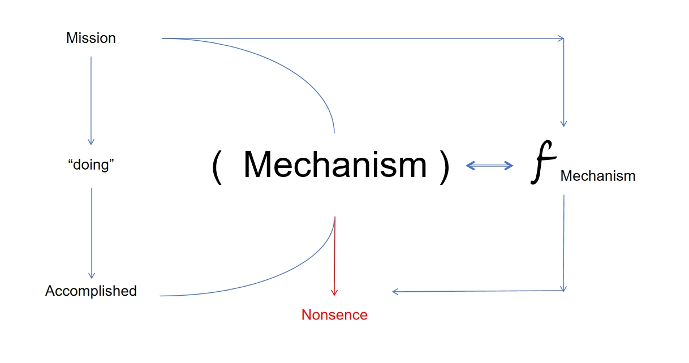 <!-- .element: width="750" -->

==
#### approaching to combination
>why south pole should be the target

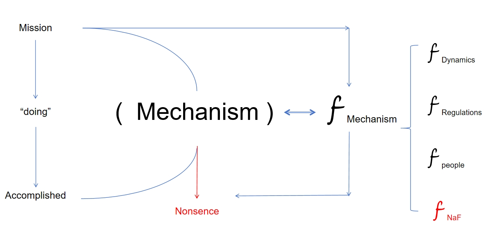 <!-- .element: width="750" -->

==
#### approaching to combination
>why south pole should be the target

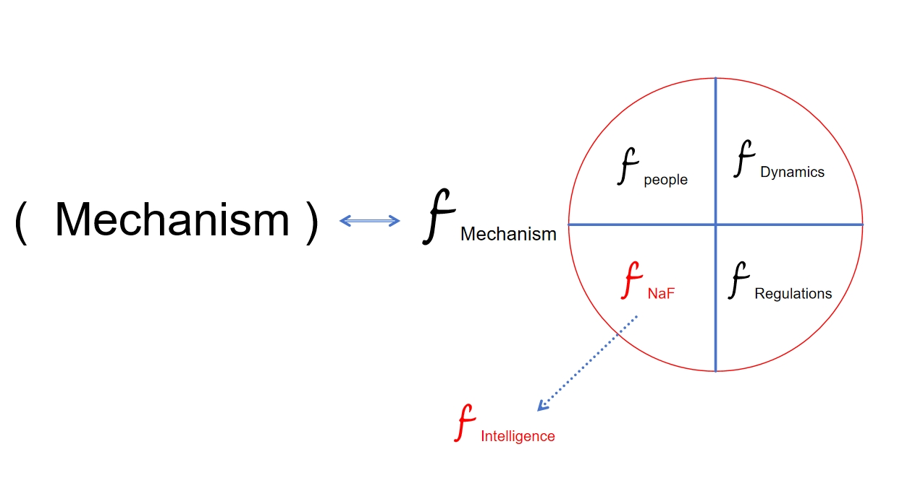 <!-- .element: width="750" -->

==
#### approaching to combination

one consequence o.o

 <!-- .element: width="350" -->

===

### way to approach
>the magnetic pole is easier to find

current trend: 
* Cybernetics $\rightarrow$ Robotics with Intelligence

* AI $\rightarrow$ Embodied in Scenarios

==
### way to approach
#### examples Robotics

* Pushing the Limits of Cross-Embodiment Learning for Manipulation and Navigation

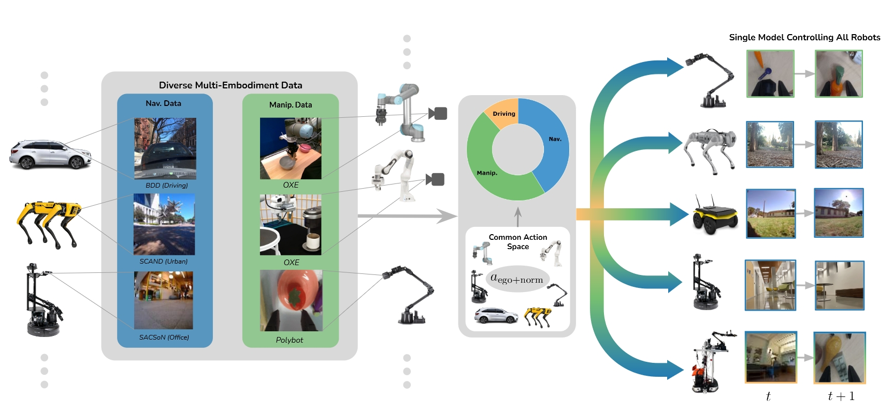 <!-- .element: width="650" -->

[Website](https://extreme-cross-embodiment.github.io/)

<PEAC>

==
### way to approach
#### examples on Drone

* Drone 

* Reaching the limit in autonomous racing: Optimal control versus reinforcement learning
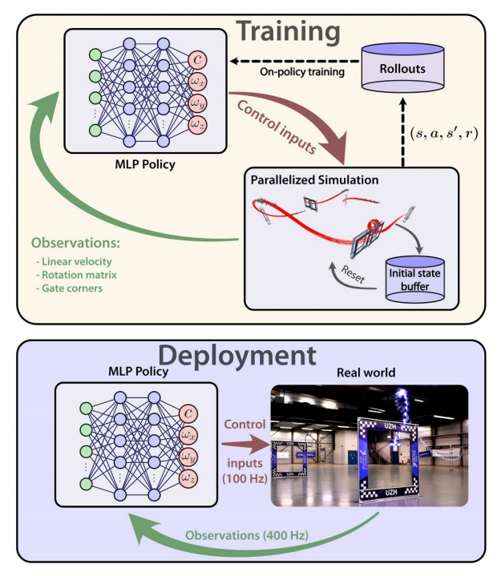 <!-- .element: width="300" -->
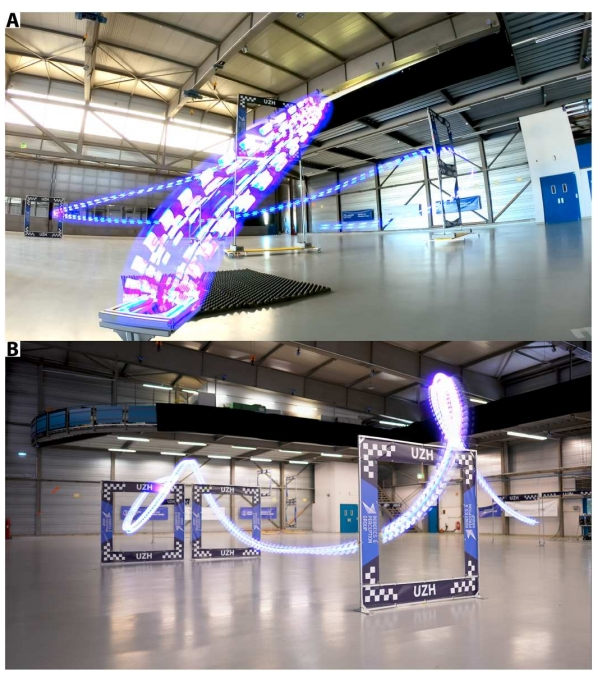 <!-- .element: width="300" -->

<pushing the limits>

==
### way to approach
#### examples

* find more on S.R.

===

### Approaching real embodied

>we are looking for the real south pole, not the magnetic one

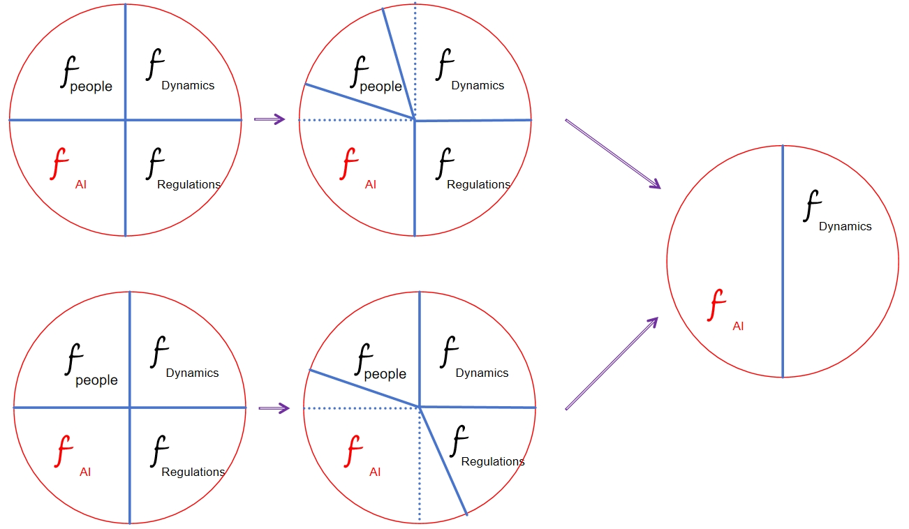 <!-- .element: width="650" -->

==
### Approaching real embodied
#### Statement of Tech Map

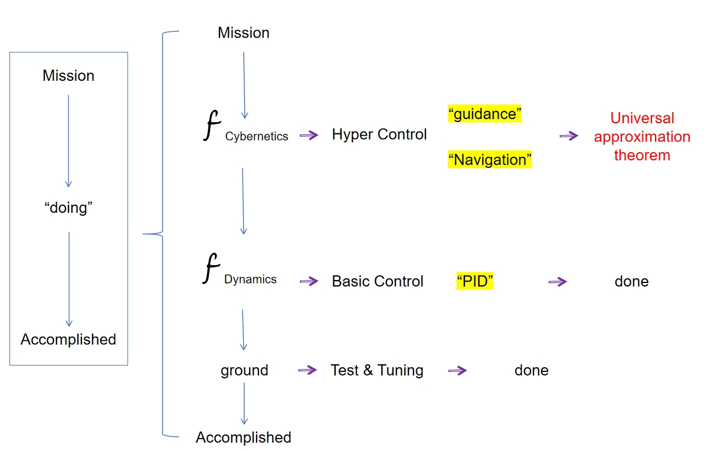 <!-- .element: width="750" -->

==
### Approaching real embodied
#### Statement of Tech Map

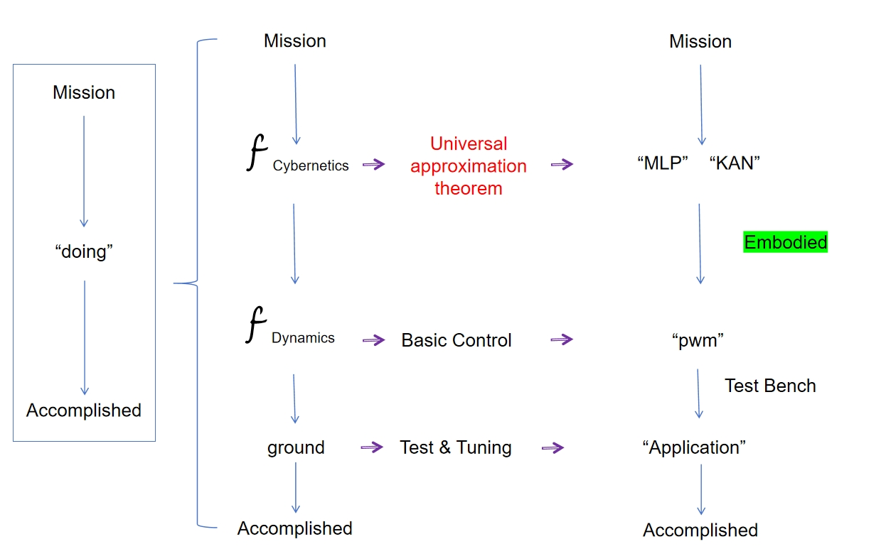 <!-- .element: width="750" -->

==
### Approaching real embodied
#### Out Tech Map

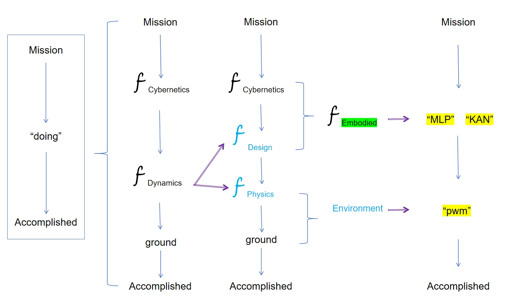 <!-- .element: width="750" -->

==
### Approaching real embodied
#### Out Tech Map -- Embodied!

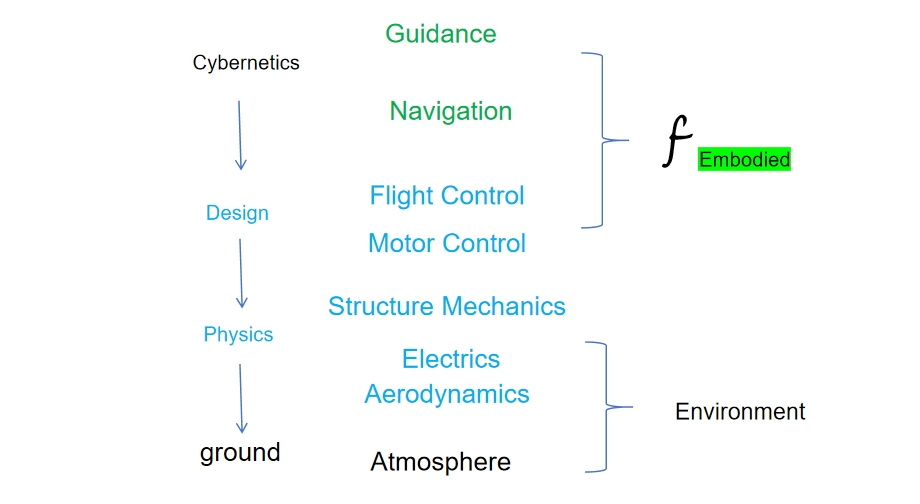 <!-- .element: width="750" -->

=== 

### The Target: In conceptual

>The journey is to the real South Pole

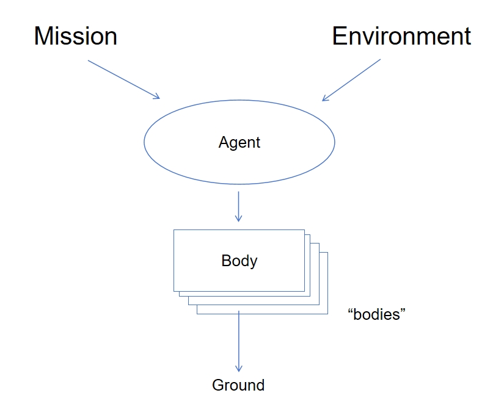 <!-- .element: width="500" -->

==
### The Target: In conceptual
#### S.D.E.M.

*Simultaneous Dynamic Estimating & Mounting*

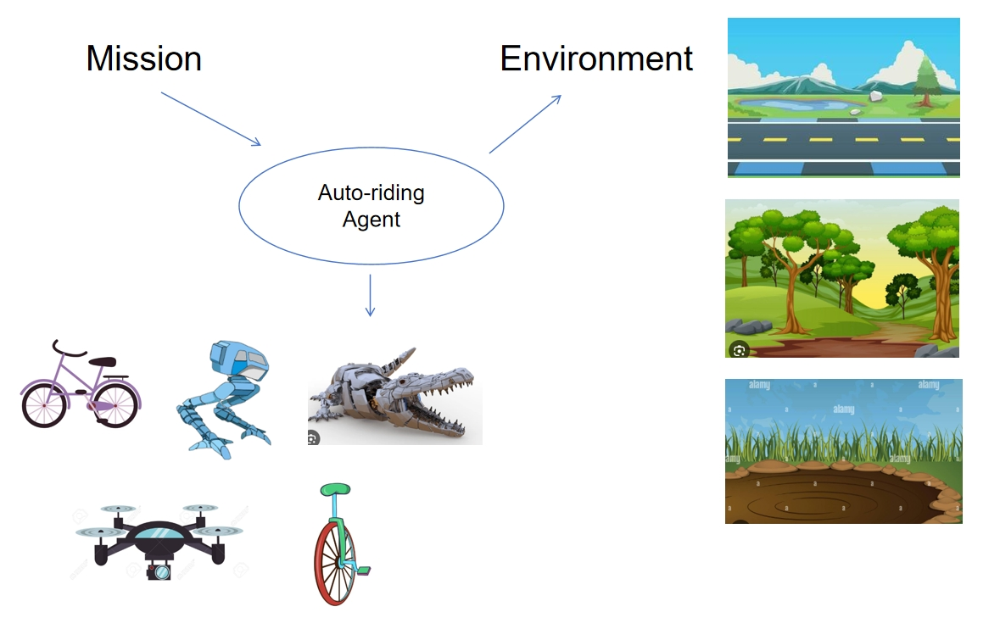 <!-- .element: width="650" -->

==
### The Target: In conceptual
#### S.D.E.M.

*Simultaneous Dynamic Estimating & Mounting*

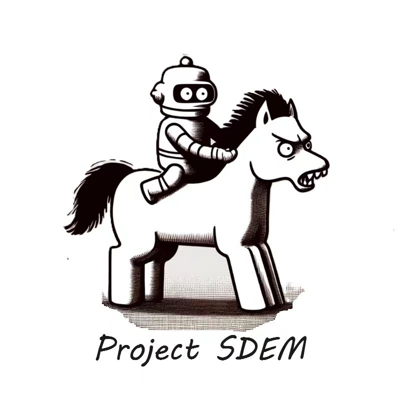 <!-- .element: width="450" -->

===

### Road Path

>Because it is there

Issues
* to be projected
* to be engineered
* to be published
* to be commercialized

==
### Road Path
#### down to business

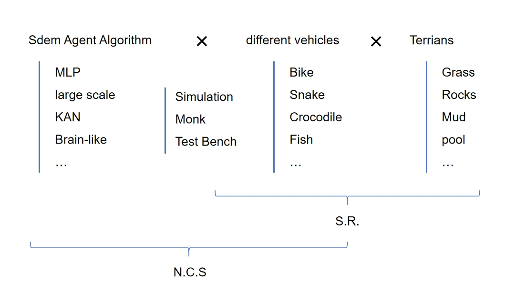 <!-- .element: width="750" -->

==
### Road Path
#### to be commercialized

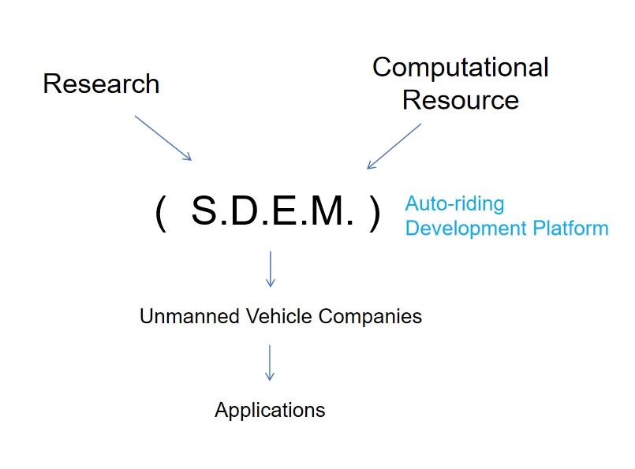 <!-- .element: width="700" -->

===

### Thank you for your attention!

>¡Hasta la Victoria Siempre!

