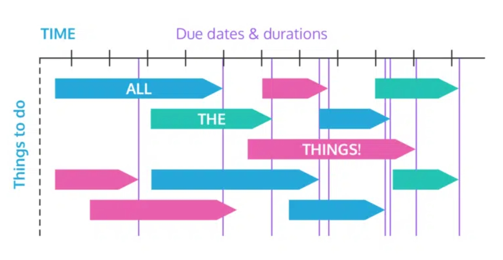

## 2024.6.5-discuss

about Brain-like navi and project delivery

Phil Wang, Shaun Li

5, Jun 2024

===
### Outline

* 针对类脑的直接性科研工作
* 项目release map

===

### 直接性科研工作

* 脑如何导航
* 导航怎么说好坏

==
### 直接科研

* 脑如何导航
	* 解构主义 $\rightarrow$ 神经系统
	* 行为主义 $\rightarrow$ 导航测试

==
### 直接科研

* 导航怎么说好坏

 <!-- .element: width="550" -->

===

### 项目 Release Map

* 基本思路
	* 分模块
	* 确定 Release 时间
	* 跟进，找出卡点，集中解决 

==
### 项目 Release Map

 <!-- .element: width="650" -->

===
### GO Go Go

