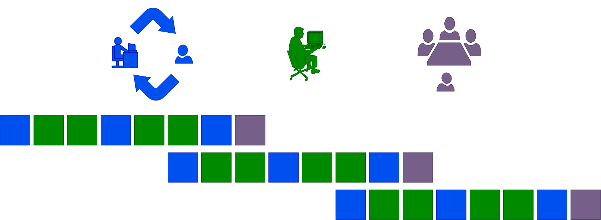
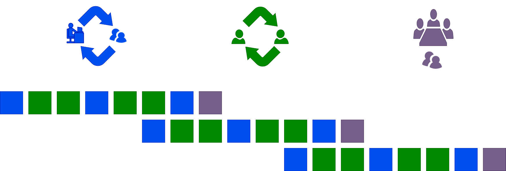

[//]: # (
 
    
    )

### Meta-Seminar
 <!-- .element: style="width: 20%" --> $\quad$
 <!-- .element: style="width:14%" -->

LI Shaun, WANG Phil
<!-- .element: style="font-size:20pt" -->
2024-06-14
<!-- .element: style="font-size:20pt" -->
=== 
#### What's the purpose of a seminar?

==

<!-- .element: style="filter:invert(1)" -->
==

### 教學相長

雖有嘉肴，弗食，不知其旨也。

雖有至道，弗學，不知其善也。

是故學，然後知不足，教，然後知困。

知不足，然後能自反也；知困，然後能自強也。

故曰：「教學相長」也。

——《禮記·學記》
<!-- .element: style="font-size:18pt;text-align:right" -->

==

*I couldn’t reduce it to the freshman level. That means we really don’t understand it.*

-- Richard Feynman <!-- .element: style="font-size:18pt;text-align:right" -->

==

*... all physical theories, their mathematical expressions apart ought to lend themselves to so simple a description that even a child could understand them*

-- Albert Einstein <!-- .element: style="font-size:18pt;text-align:right" -->

==
#### Why the Feynman technique works
An RL perspective

<!-- .element: style="filter:invert(0.93)" -->

#### 
Note: Reinforcement is from psychology

==
### So a seminar 

- helps us understand the topic better
- benefits others and oneself

===

### How do I explain it well?
Rethink your objective function

Note: Explain it to others not to yourself,

because explain it to others 

is to explain it to yourself.

==
### Negative examples
- Muddling through ([Zeigarnik](https://en.wikipedia.org/wiki/Bluma_Zeigarnik) effect)
- Showing off
==

### Presentation Tips
- Sentence -> Phrase
- Statement -> Question
- Monolingual -> Multilingual

==

### What if I still can't do it?
Postdocs will always be there to advise you
- how to choose the topic
- how to learn it
- how to present it

==
### Life cycle and closed loop

<!-- .element: style="filter:invert(93%)" -->

==

Phil and Shaun may have learned more from you than the other way around.

===
### One seminar, one topic.
One topic can involve several papers 

or something else

== 
### CAUTION

 Involving several topics results in 

- a superficial understanding of each topic
- or a lengthy and overwhelming seminar

==
But won't it take too long to complete a round

if only one student is scheduled per week?

===

### Pair Presentation
One topic, two students.

==

==

Pair presentation may be counterintuitive, 

but it works really well.

== 
Pair presentation is not "divide and conquer".
==

### Discuss, discuss, and discuss

- Discuss with your partner
- Discuss with the postdocs
- Discuss in the seminar

==

#### The seminar's title

LIU Gelu$^\dagger$,  YAO Hexiong$^\dagger$, LI Shaun$^*$, WANG Phil$^*$
<!-- .element: style="font-size:20pt" -->
2024-06-14
<!-- .element: style="font-size:20pt" -->
$^\dagger$Equal contribution.  $^*$Corresponding author.
<!-- .element: style="font-size:10pt" -->
<!-- .element: style="font-size:10pt" -->

== 

After each round,

students are reshuffled into new pairs.

===

### Summary 

* Feynman technique
* One topic
* Postdocs: life cycle, closed loop
* Pair presentation

==

费曼学习 一个专题

博后带队 学生结对

<!-- .element: style="filter:invert(93%)" -->
===

So the purpose of the seminar:
- to learn what we want to learn
- to learn from others
- to build a team

A seminar is the core of a research group.

===
 
### LET'S DISCUSS
