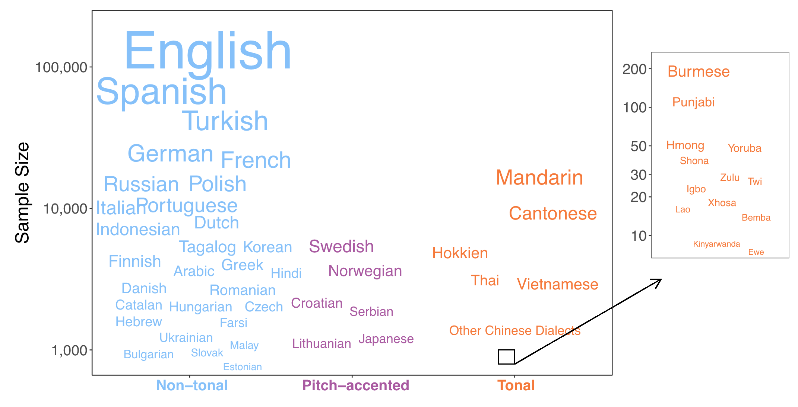
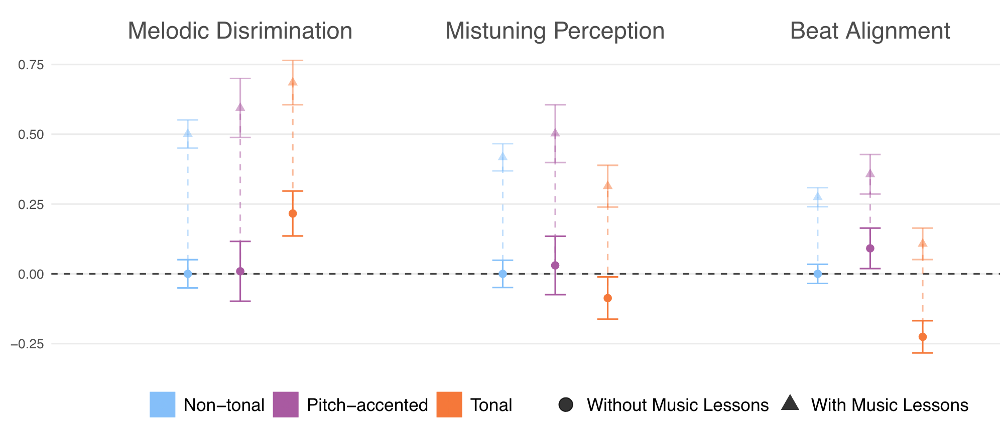
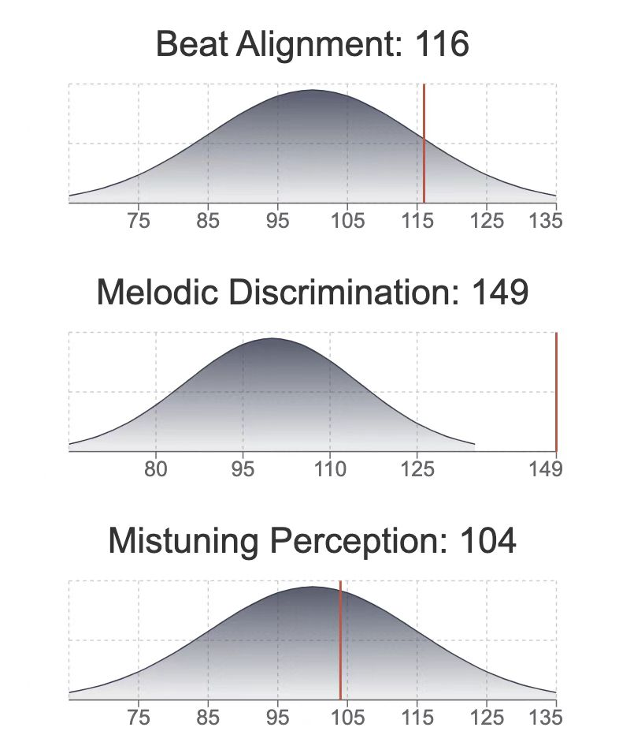

## Melody, Rhythm, and Sound
<!-- .element: style="color: deepskyblue" -->

Understanding the essential features of popular music

LI Shaun, 2023-03-06
<!-- .element: style="font-size:24pt" -->

===

## the Website
https://leizungjyun.github.io/posts/music_and_culture/

===
Participation

===

Melody, Rhythm, Sound

the essential musical elements
<!-- .element: style="color: yellow" -->

==
<iframe width="966" height="543" src="https://www.youtube.com/embed/uQjGlyRm8ek" title="Old Folks at Home, by Stephen C. Foster, 1851." frameborder="0" allow="accelerometer; autoplay; clipboard-write; encrypted-media; gyroscope; picture-in-picture; web-share" allowfullscreen></iframe>

*Old Folks at Home* (1851), Stephen C. Foster 
==

 <!-- .element: width="300"  --> \
Stephen Collins Foster (1826–1864)
<!-- .element: style="font-size:24pt" -->
==
\
blackface transformation from white to "black" (1900)
<!-- .element: style="font-size:24pt" -->
Further reading: Minstrelsy (Chapter 8)
<!-- .element: style="font-size:24pt; color: yellow" -->
==
Original lyrics by Stephen Foster, 1851
<!-- .element: style="font-size:30pt;color:deepskyblue" -->

Way down upon de Swanee Ribber,\
Far, far away,\
Dere's wha my heart is turning ebber,\
Dere's wha de old folks stay.

All up and down de whole creation\
Sadly I roam,\
Still longing for de old plantation,\
And for de old folks at home.

All de world am sad and dreary,\
Eb-rywhere I roam;\
Oh, darkeys, how my heart grows weary,\
Far from de old folks at home!\
...
<!-- .slide: style="font-size:20pt" -->
An example of the ABAB rhyme scheme
<!-- .element: style="font-size:30pt; color: yellow" -->
==
State Song of Florida, as revised in 2008
<!-- .element: style="font-size:30pt; color: deepskyblue" -->
Way down upon the Suwannee River,\
Far, far away,\
There's where my heart is turning ever,\
There's where the old folks stay.

All up and down the whole creation,\
Sadly I roam,\
Still longing for my childhood station,\
And for the old folks at home.

All the world is sad and dreary\
Everywhere I roam.\
O dear ones, how my heart grows weary,\
Far from the old folks at home.\
...
<!-- .slide: style="font-size:20pt" -->
==
<iframe width="966" height="543" src="https://www.youtube.com/embed/09pssl5urg8" title="Old Folks at Home - Beijing Queer Chorus (故乡的亲人 - 北京酷儿合唱团)" frameborder="0" allow="accelerometer; autoplay; clipboard-write; encrypted-media; gyroscope; picture-in-picture; web-share" allowfullscreen></iframe>
Which musical element differs?

== 
*Auld Lang Syne*
<!-- .slide: style="font-size:24pt" -->
<iframe width="966" height="483" src="https://www.youtube.com/embed/W_6Vs8pADrQ" title="Auld Lang Syne - The Choral Scholars of University College Dublin" frameborder="0" allow="accelerometer; autoplay; clipboard-write; encrypted-media; gyroscope; picture-in-picture; web-share" allowfullscreen></iframe>

European influence, verse-chorus form
==
<iframe width="950" height="534" src="https://www.youtube.com/embed/qSIj17xbAyk" title="Stephen Foster&#39;s OH! SUSANNA - Original 1848 Lyrics - Tom Roush" frameborder="0" allow="accelerometer; autoplay; clipboard-write; encrypted-media; gyroscope; picture-in-picture; web-share" allowfullscreen></iframe>

*Oh! Susanna* (1848), Stephen C. Foster 
==
Nonsense verse
<!-- .element: style="font-size:30pt; color: deepskyblue" -->
It rain'd all night the day I left\
The weather it was dry, \
The sun so hot I froze to death\
Susanna, don’t you cry.
<!-- .slide: style="font-size:24pt" -->

==
Racism
<!-- .element: style="font-size:30pt; color: deepskyblue" -->
I jumped aboard de telegraph,\
And trabbelled down de riber,\
De Lectric fluid magnified,\
And Killed five Hundred Nigger
<!-- .slide: style="font-size:24pt" -->
===

## Riff
a melodic fragment that is **short, separated, and often syncopated**
<!-- .element: style="font-size:24pt; color: yellow" -->
Riffs exemplify a shift from melody to rhythm
<!-- .element: style="font-size:24pt;" -->
==
Example

Listen to my clapping and identify the song

==
<iframe width="778" height="580" src="https://www.youtube.com/embed/75RiHJGfyUE" title="Chuck Berry - Maybellene" frameborder="0" allow="accelerometer; autoplay; clipboard-write; encrypted-media; gyroscope; picture-in-picture; web-share" allowfullscreen></iframe>

*Maybellene* (1955), Chuck Berry

==
Melody was the dominant element throughout the 19th century
<!-- .element: style="font-size:26pt;color:deepskyblue" -->

- European influence
- the easiest element to transmit via sheet music and songsters 
- African Americans were on the margins of American society
<!-- .slide: style="font-size:24pt" -->

===
Melody, Rhythm, Sound

the essential musical elements
<!-- .element: style="color: yellow" -->

==

 <!-- .element: width="600"  --> 

==

[Music IQ](https://www.themusiclab.org/quizzes/miq)
==
Major Conclusions
<!-- .element: style="font-size:26pt;color:deepskyblue" -->

- Native speakers of tonal languages have an improved ability to discriminate musical melodies. 
- Relative to speakers of pitch-accented or non-tonal languages, tonal language speakers are also worse at processing the musical beat.

<!-- .element: style="font-size:24pt" -->

==

 <!-- .element: width="800"  --> 
Participants
==

 <!-- .element: width="800"  --> 

Main Results

==

 <!-- .element: width="400"  --> \
My Result

==
<iframe width="966" height="543" src="https://www.youtube.com/embed/drnBMAEA3AM" title="&quot;Do-Re-Mi&quot; - THE SOUND OF MUSIC (1965)" frameborder="0" allow="accelerometer; autoplay; clipboard-write; encrypted-media; gyroscope; picture-in-picture; web-share" allowfullscreen></iframe>
Do-Re-Mi (1965)

==
Doe: a deer, a female deer\
Ray: a drop of golden sun\
Me: a name I call myself\
Far: a long, long way to run\
Sew: a needle pulling thread\
La: a note to follow sol\
Tea: a drink with jam and bread\
That will bring us back to doh

An example of trochee
<!-- .element: style="color: yellow" -->

===
  ## Rhythm Basics

  Downbeat, Upbeat, Backbeat, Offbeat

==

<iframe width="966" height="543" src="https://www.youtube.com/embed/fnlGWpR3rXs?start=248" title="What is the &quot;Backbeat&quot;?" frameborder="0" allow="accelerometer; autoplay; clipboard-write; encrypted-media; gyroscope; picture-in-picture; web-share" allowfullscreen></iframe>

Backbeat, 04:08
==

<iframe width="966" height="543" src="https://www.youtube.com/embed/AA4GtsZHJR0?start=92" title="What is the &quot;Offbeat&quot;?" frameborder="0" allow="accelerometer; autoplay; clipboard-write; encrypted-media; gyroscope; picture-in-picture; web-share" allowfullscreen></iframe>

Offbeat, 01:32

==

Rhythm: the dominant element throughout almost all the 20th century
<!-- .element: style="font-size:24pt;color:yellow" -->

=== 

Melody, Rhythm, Sound

the essential musical elements
<!-- .element: style="color: yellow" -->
==
Since the 1990s, the search for distinctive sounds and sound combinations has come to the forefront

Note:
[rock mucis](https://twitter.com/i/status/1631006358597259275)